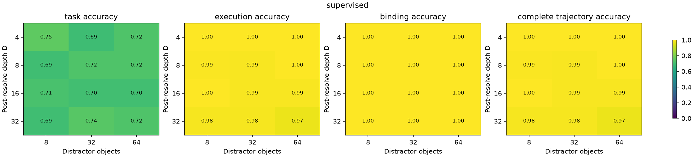
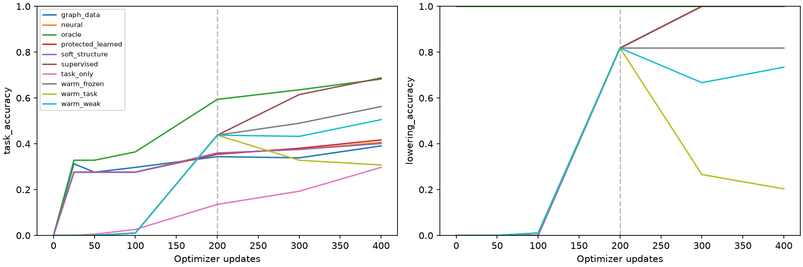

# Stage 5: learned lowering into a protected executable runtime

**The supervised model learned a useful lowering/execution interface, but the full language-to-latent round trip remains partial.** After training on depths 1–4, it obtains **96.88% ± 1.56% exact results and complete semantic trajectories at depth 32 with 64 distractor bindings**. Every correctly lowered trajectory in that clean joint-shift cell executes correctly. Learned output accuracy is only **72.40% ± 2.39%**, chiefly because numeric output lifting remains weak. Held-out surface word order and reduced-supervision maintenance fail substantially.

The completed experiment contains 30 frozen main runs and a separately declared nine-run stronger neural-control supplement. The supplement does not close the execution gap in this small-model, fixed-budget comparison. Values with ± are means and sample standard deviations across three seeds, not population confidence intervals. Counts pool the three seeds.

## What was built and what was learned

The exact interpreter supports immutable `let` bindings, numeric literals, records, arrays, field/index access, pure function definitions/calls, lexical blocks and returns. Names, bindings, values, slots, definitions, invocations, arguments, frames and returned wrappers have distinct runtime identities. Typed primitives validate operations before protected-state updates; rejected calls roll back transactionally. Computed values and return wrappers appear only during actual execution. No generated host-language `eval`, mutation, loops, recursion or closures are present.

The learned experiment uses a narrower interface. A small transformer receives already segmented and ordered clauses containing synthetic operation words and noisy continuous lexical reference features. It selects among seven operations—resolve, field, index, add, subtract, reversed subtraction and multiply—and observable semantic operands. The runtime resolves the selected name in the current scope and applies the operation to the actual current register. Protected identities cannot be overwritten by neural MLPs. Wrong decisions persist or reject; gold state is never restored.

This is learned semantic-selector lowering around supplied semantics. It is **not** learned parsing, scheduling, arbitrary user-function call planning or discovery of lexical-scope algorithms. The exact language supports nested user functions; the learned composition task uses sequential builtins. Output lifting predicts bounded numeric-report, comparison and sign classes, rendered by fixed phrases if desired. It is not free-form language generation.

All neural controls observe the same initial values, types, lexical features, scope/index payloads and directed typed graph. Candidates are shuffled and IDs are not neural features. Equivalent names, field/index selectors and literals share reference keys; supervised loss accepts equivalent selectors. Lookup worlds have matched target/decoy chains with identical structural labels and different leaves, preventing unique-final-field retrieval from bypassing the starting object. [Methods](stage5-methods.md) describe the full implementation and boundaries.

## Protocol and main results

Main source [`2e95c9f`](https://github.com/JacobFV/topoformer/commit/2e95c9ff9403e9a2226a66bb0e875b762cb8736d) was frozen before the sweep. Each variant trains for 400 updates of batch 16; warm variants use 200 supervised updates before their intervention. Training uses depths 1–4 and 8/16 distractor bindings. Evaluation crosses depths 4/8/16/32 with 8/32/64 distractors, plus eight diagnostic conditions, at 64 examples per seed and condition.

Depth excludes initial resolution: D32 has **33 supplied clauses**. N64 means **64 additional distractor bindings**, not a 64-node graph. The shallow cell contains 26–69 candidate nodes, mean 47.02; the joint cell contains 166–489, mean 322.64. The six task families have a fixed mix. Final checkpoints are used without OOD selection.

| Main variant | D4/N8 exact result or neural numeric prediction | D4/N8 output | D32/N64 exact result or neural numeric prediction | D32/N64 output |
|---|---:|---:|---:|---:|
| Oracle lowering + exact runtime | 100.00 ± 0.00 | 75.00 ± 4.13 | 100.00 ± 0.00 | 73.44 ± 1.56 |
| Supervised lowering + exact runtime | 100.00 ± 0.00 | 75.00 ± 2.71 | **96.88 ± 1.56** | **72.40 ± 2.39** |
| Cold answer-only + exact runtime | 3.65 ± 2.39 | 30.73 ± 3.25 | 5.21 ± 1.80 | 39.06 ± 5.63 |
| Warm weak + exact runtime | 76.56 ± 12.79 | 58.33 ± 4.77 | 11.98 ± 5.49 | 29.69 ± 7.81 |
| Warm task-only + exact runtime | 25.00 ± 22.70 | 34.90 ± 15.81 | 1.04 ± 0.90 | 19.27 ± 7.38 |
| Warm frozen + exact runtime | 81.25 ± 13.89 | 61.98 ± 11.93 | 66.15 ± 16.71 | 49.48 ± 15.65 |
| Ordinary neural, graph tokens | 7.29 ± 0.90 | 38.02 ± 2.39 | 8.33 ± 5.49 | 43.23 ± 3.93 |
| Graph-data message passing | 6.77 ± 2.39 | 39.06 ± 1.56 | 6.25 ± 1.56 | 43.75 ± 9.50 |
| Soft structural attention | 7.81 ± 1.56 | 38.02 ± 2.39 | 7.29 ± 3.93 | 43.23 ± 3.93 |
| Protected learned transition | 3.65 ± 3.25 | 40.62 ± 4.13 | 4.69 ± 1.56 | 47.92 ± 7.86 |

All table entries are percentages. Neural numeric predictions are not interpreter executions. Their auxiliary lowerings can be audited through the interpreter, but those counterfactual trajectories are not trajectories of their own computation. Neural controls receive the same lowering supervision and additional numeric-result labels, so weak numeric performance cannot be attributed to withholding those targets.

The original neural models learn the auxiliary selector/operation task very well yet fail to turn those features into accurate arithmetic/state computation. At D32/N64 their selector accuracy is approximately 99.9% and operation accuracy 100%. The direct-selector-read controls below test this remaining retrieval-interface concern; their outcome still does not establish that graph context or message passing cannot work in general.

## Where execution errors now occur

The supervised joint cell has 6,329/6,336 correct selectors and 6,336/6,336 correct operations. Complete lowering, complete trajectory and correct final scalar all coincide at **186/192**. Conditional execution after complete correct lowering is **186/186**; no clean-cell executor error is required to explain these failures. One failed program rejects a schema; the other incorrect outcomes arise from semantic choices. The correct binding probability is 186/192, while output correctness conditional on that event is **137/186 = 73.66%**.

The six families retain exact-result accuracy of 30/30 aliases, 32/33 composition, 30/30 mixed interpretation, 32/33 nested access, 30/33 argument ordering and 32/33 scope. These are small family samples, not precise family-level estimates. Scope success means that learned name selection successfully drives supplied lexical resolution. It does not mean the network inferred which same-name binding instance a scope algorithm should select.

These observations support a narrow architectural result: cold supervised semantic lowering can control exact protected state over substantially longer supplied schedules. Unlike Stage 4's strongest initialized pointer result, the lowerer begins random. Step-zero shallow validation has 3.85% selector accuracy, 18.75% operation accuracy, and zero completed results or outputs. After 400 supervised updates that fixed validation set has perfect lowering/execution and 68.75% output accuracy. The separate shallow final-evaluation set gives the table's 75%; these are different samples, not conflicting measurements.

## Output lifting is the leading clean-condition bottleneck

At the joint shift, 49 of 186 correct supervised runtime results produce an incorrect learned output. Only six programs have incorrect runtime results. Two of those six nevertheless obtain the correct output label: sign and comparison can conceal a wrong scalar. Total output correctness therefore must not substitute for execution correctness.

Supplying the correct scalar directly to the same supervised lifter yields 143/192 correct outputs, versus 139/192 for the complete pipeline. By style:

| Joint-cell style | Pipeline output | Correct-scalar lifting audit |
|---|---:|---:|
| Numeric report | 17/52 = 32.69% | 19/52 = 36.54% |
| Comparison | 59/73 = 80.82% | 61/73 = 83.56% |
| Sign | 63/67 = 94.03% | 63/67 = 94.03% |

For class-frequency context, the pooled joint-cell empirical majority labels occur in 7/52 numeric examples (13.46%), 41/73 comparisons (56.16%) and 32/67 sign examples (47.76%). Shallow frequencies are 11.54%, 54.79% and 47.76%, respectively. These are posthoc empirical frequencies, not trained baseline scores or an OOD-selected predictor. [Regenerated frequency artifacts](results/stage5/main/class-frequencies.json) match the archived paired data hashes.

Even privileged oracle lowering reaches only 16/52 numeric reports, while reaching 62/73 comparisons and 63/67 signs. The substrate does exact arithmetic; the learned report head has not mastered the bounded numerical output map in this budget. The pre-main RBF feature change improved shallow oracle lifting but did not solve it. That declared prior and paired pilot are documented in [methods](stage5-methods.md); no main-run retuning was performed.

## Reducing supervision damages the learned interface

All warm variants share the supervised trajectory through update 200: validation selector accuracy 99.58%, operation accuracy 95.00%, and exact result 81.77%. At update 400:

| Post-warm training | Selector accuracy | Operation accuracy | Validation exact result |
|---|---:|---:|---:|
| Continue full supervision | 100.00% | 100.00% | 100.00% |
| Freeze lowerer, train lifter | 99.58% | 95.00% | 81.77% |
| Auxiliary weight .1 + answer reward | 93.44% | 98.75% | 76.56% |
| Answer reward only | 56.98% | 81.15% | 23.96% |

The frozen comparison makes the maintenance failure concrete: continuing policy updates can damage an existing semantic interface. Small local degradation becomes severe across 33 decisions, yielding 11.46% complete trajectories for warm weak and 0.52% for warm task-only at the joint shift. Freezing preserves 66.15%, but also preserves the imperfect halfway-trained lowerer.

Cold answer-only acquires no complete joint trajectories. Its 39.06% output accuracy coexists with 5.21% exact results and 0.05% selector accuracy. REINFORCE rewards the final lifted label, not numeric-result equality or semantic correctness. Many wrong programs can share the correct comparison/sign label. These runs expose sparse credit and reward non-identifiability as well as optimization difficulty; they do not establish that task-only binding is impossible. The current recipe does not satisfy the requested supervision-reduction milestone.

## Surface generalization and confidence limits

The held-out reordered-template condition is a strong negative result. Supervised selector accuracy remains 849/960, but operation accuracy falls to **396/960 = 41.25%**. Only 2/192 numeric results and 6/192 output labels are correct; 181 programs reject. This is a primitive-recognition failure, despite training on canonical and synonym templates. It rules out describing this stage as robust unstructured-language lowering.

The nominal `renamed` condition is an exact duplicate of D4/N8: its flag is dropped and the same seed/settings regenerate the same batch. Its perfect execution adds no independent evidence for lexical-name generalization. Fresh names and random lexical keys across actual train/test batches support transfer across feature identities, not arbitrary new textual names or learned scope disambiguation.

Medium reference noise reduces correct results to 120/192; high noise reduces them to 4/192. Confidence provides a risk/coverage tradeoff, not recovered reasoning. For the supervised model under medium noise:

| Threshold | Answer coverage | Wrong-result risk among answers | Correct results / all examples | Wrong invoked lowerings |
|---|---:|---:|---:|---:|
| 0 | 160/192 = 83.33% | 40/160 = 25.00% | 62.50% | 65/864 |
| .2 | 111/192 = 57.81% | 21/111 = 18.92% | 46.88% | 33/656 |
| .4 | 39/192 = 20.31% | 3/39 = 7.69% | 18.75% | 4/323 |
| .6 | 2/192 = 1.04% | 0/2 | 1.04% | 0/87 |

These are predeclared threshold points, not an OOD-selected operating policy. At .4, 98 correct lowerings are unnecessarily deferred among 871 correct local decisions. Zero observed risk at .6 is based on only two answers. High-noise .4 yields no answers and therefore undefined answer risk, not perfect accuracy. Actual invoked counts exclude unreachable later steps; hypothetical all-clause gates are separate artifact fields.

With the initial reference erased, no answer is defined. Without a gate, 121/192 programs nevertheless finish, illustrating failure to learn null grounding from valid-only training. Threshold .4 defers 191 and still executes one complete program; .6 defers all. Invalid-schema inputs are rejected 192/192 even at threshold zero, before any valid primitive invocation. This is supplied type safety, not neural understanding of invalidity. The implementation does not gather new evidence or run another inference pass after deferral. Occasional semantic-state recovery in noisy cases is recorded, but no learned recovery mechanism is established.

## Interventions, artifacts and interpretation

Permuting the lowering-to-runtime mapping reduces supervised exact and output accuracy to zero. Corrupting scalar-value edges in both the observable graph and executor world, while retaining clean targets, reduces exact results to 106/192. All semantic selectors remain correct under their clean labels in these interventions. Their generic “execution failure after correct lowering” counters therefore measure deliberately broken correspondence/world agreement, not interpreter defects. Conditional executor reliability claims refer to clean, aligned inputs.

The main sweep took approximately **21.2 minutes** on the linked CPU machine with two threads; process peak RSS reached **1,948.5 MiB**. This includes repeated confidence sweeps and diagnostic interpreter runs. Stored symbolic execution excludes oracle scoring; neural-plus-diagnostic timing is not a kernel profiler. The linked machine, not the constrained local workstation, performed training and large-artifact analysis.

The [main audit](results/stage5/main/audit.json) validates 30 checkpoints and 870 recorded evaluation/curve cells, source/config identity and paired initialization/schedule/data hashes. [Resolved configuration](results/stage5/main/config.json), [compressed raw metrics](results/stage5/main/metrics.jsonl.gz), [aggregate analysis](results/stage5/main/analysis/summary.json), [manifest](results/stage5/main/manifest.json), [runtime review](stage5-runtime-review.md) and [interface review](stage5-interface-review.md) make the result inspectable. Raw rows retain illustrative failure traces; they are not substitutes for aggregate failure denominators. Analysis-source hashes are distinct from immutable training-source hashes.

### Stronger controls: direct semantic reads still do not supply execution

While partial first-seed main results were visible, a separate supplement was declared and frozen at source `4ca8fb9`. It feeds selector-weighted observable memory and operation-probability-weighted instruction features directly into graph-data or protected learned controllers. The privileged version supplies exact semantic operations and uniform mass over equivalent selectors, not a unique gold runtime identity. No exact pointer, arithmetic or scope algorithm is added. All use the same 400-update/three-seed budget. This is disclosed post-launch work, not retroactive preregistration.

| Supplement variant | D4/N8 numeric prediction | D4/N8 output | D32/N64 numeric prediction | D32/N64 output |
|---|---:|---:|---:|---:|
| Learned-selector graph-data | 5.21 ± 0.90 | 35.42 ± 3.25 | 5.21 ± 1.80 | 45.31 ± 7.16 |
| Learned-selector protected state | 4.17 ± 2.39 | 39.06 ± 3.12 | 5.21 ± 1.80 | 44.79 ± 8.61 |
| Oracle-selector protected state | 3.65 ± 3.25 | 35.42 ± 4.77 | 6.25 ± 3.12 | 39.06 ± 4.13 |

The learned interfaces again reach approximately 99.9% local selector accuracy and 100% operation accuracy at the joint shift. The oracle interface is correct by construction. Nevertheless, exact numeric prediction remains 5–6%. Merely making the semantic selector available to these learned transitions does not reproduce the supplied executor under this budget. The gap therefore survives this stronger retrieval control; it is evidence for the benefit of known exact transitions within the tested architecture, not metric-space superiority or a universal comparison against graph networks. These baselines are weak even in-distribution, so the result is not solely an isolated extrapolation advantage.

The optional connection adds no parameters or random draws, and independent seeded comparisons found bitexact unchanged default behavior against frozen main source. The [supplement summary](results/stage5/selector/analysis/summary.json), [config](results/stage5/selector/config.json) and [raw records](results/stage5/selector/metrics.jsonl.gz) retain all nine runs. Internal coverage/data pairing checks pass; the independent cross-main checkpoint/pairing audit is still being finalized at this revision. The supplement took another 4.9 minutes, for approximately 26.1 minutes total recorded run time across both sweeps.

The useful positive result is learned supervised lowering followed by reliable exact computation through the tested structural extrapolation. The full goal remains incomplete: numerical lifting, held-out surface recognition and reduced-supervision stability fail materially, and null confidence supplies abstention rather than reasoning recovery. Those boundaries are now separately measurable. This stage does not justify claims of spontaneous crystallization, autonomous language induction or pretrained-model readiness.
