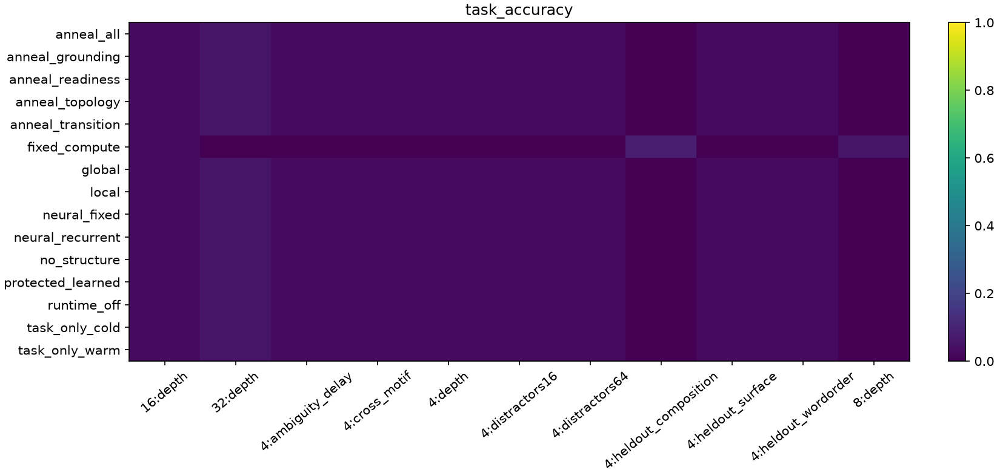
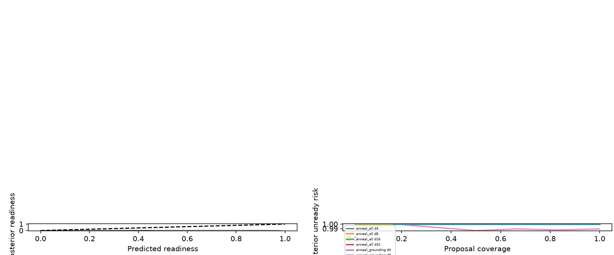

# Stage 6 scientific report

**Status: both main studies complete; bounded negative result.** Stage 6 implements a recurrent current-state workspace, candidate-local typed proposals, protected append-only arithmetic execution and learned return injection. A separate TCN experiment measures public surface-to-semantic decoding. These tracks share a cell and graph schema; an integrated language-controlled runtime has not been demonstrated. See [methods](stage6-methods.md) for interfaces, objectives and limitations.

## Evidence inventory

| Artifact | Protocol | Evidential use |
|---|---|---|
| [TCN wiring pilot](results/stage6/pilots/language/README.md) | 3 seeds × 4 arms, 8 updates, 18 train/9 evaluation constructions | Pipeline/resource validation only |
| [Controlled timing configuration](../configs/stage6-timing.json) | 1 seed × 2 arms, 8 updates | Resource/wiring check only |
| [TCN main configuration](../configs/stage6-language.json) | Frozen source `4c36557`; 3 seeds × 4 arms, 256 updates, 240 train/48 evaluation constructions | Completed; [audited summary](results/stage6/language/summary.json) |
| [Controlled main configuration](../configs/stage6.json) | Config `462a5e3`; 15 arms × 3 seed shards, 256 updates, batch 2, training depths 1–4; final evaluation at 4/8/16/32 | Source `c258785`; completed [audited summary](results/stage6/controlled/summary.json) |

Pilot artifacts remain labeled pilots. They are not pooled with main experiments. No partial main-run metrics are used for conclusions.

## Completed TCN main result: no recurrent or semantic advantage at this budget

All 12 runs completed 256 updates. The [archived study](results/stage6/language/README.md) and [audited summary](results/stage6/language/summary.json) contain all 48 checkpoint rows and 192 seed/arm/checkpoint/renderer cells, including renaming. The source, data, configuration, row identity and producer checkpoint digest checks passed against the frozen source; semantic train/evaluation identities were disjoint and initial states matched across arms within seed. Each cell evaluates 48 heldout constructions. Means ± sample SD below are percentages across three seeds, not uncertainty intervals over independent corpora.

| Arm | English | Spanish | Symbols | Renamed English |
|---|---:|---:|---:|---:|
| Single pass | 22.92 ± 0.00 | 22.92 ± 0.00 | 22.92 ± 0.00 | 20.14 ± 5.24 |
| Recurrent | 14.58 ± 0.00 | 14.58 ± 0.00 | 14.58 ± 0.00 | 13.89 ± 2.41 |
| Graph supervised | 14.58 ± 0.00 | 14.58 ± 0.00 | 14.58 ± 0.00 | 24.31 ± 6.01 |
| Paired surfaces | 17.36 ± 4.81 | 17.36 ± 4.81 | 17.36 ± 4.81 | 21.53 ± 9.39 |

Random-choice expectation is 19.44% in each renderer condition. Spanish is withheld from the first three arms but exposed during paired-surface training; symbols is withheld from every arm. Equal final choice rates across the three ordinary renderers do not establish successful cross-language grounding. The recurrent and graph-supervised arms each finish 8.33 percentage points below single pass (paired-seed SD 0); paired surfaces finish 5.56 points below it (SD 4.81). No recurrent or graph-supervised choice advantage is demonstrated within this 256-update budget. This is a bounded negative result, not evidence that a larger budget or another architecture cannot learn the task.

At step zero, English choice accuracy was 20.14 ± 3.18% for single pass and 19.44 ± 6.70% for every recurrent arm. Renamed English changed from 15.97 ± 4.34% to 20.14 ± 5.24% for single pass; recurrent arms started at 21.53 ± 9.39%. Graph supervision's final renamed score of 24.31 ± 6.01% is a small-corpus observation, not evidence of broad lexical generalization. Full checkpoint/per-lesson values and paired contrasts are retained in the summary.

Whole 64-bit lexical-hash fidelity and exact canonical graph accuracy are **0% for every arm, renderer and recorded checkpoint**. Exact canonical graph equality is a strict conjunction over presence, type, lexical hash and typed edges; its failure alone does not quantify every partial skill. Partial graph scores independently reveal poor relational decoding: final supervised typed-edge precision is below 0.86% in every renderer condition. High node presence precision/recall therefore does not establish semantic grounding.

Final per-example macro graph means (%; seed SDs, defined populations and separately pooled count-based rates remain in the summary):

| Supervised arm | Renderer | Node P / R | Typed-edge P / R | Node type accuracy |
|---|---|---:|---:|---:|
| Graph supervised | English | 91.77 / 91.11 | 0.630 / 62.30 | 54.45 |
| Graph supervised | Spanish | 90.70 / 90.63 | 0.650 / 61.33 | 50.73 |
| Graph supervised | Symbols | 91.46 / 90.34 | 0.635 / 61.39 | 52.86 |
| Graph supervised | Renamed English | 90.42 / 91.73 | 0.619 / 62.74 | 53.39 |
| Paired surfaces | English | 95.90 / 79.69 | 0.730 / 49.08 | 51.85 |
| Paired surfaces | Spanish | 95.35 / 81.88 | 0.713 / 50.14 | 51.67 |
| Paired surfaces | Symbols | 96.86 / 78.92 | 0.854 / 51.90 | 50.95 |
| Paired surfaces | Renamed English | 94.68 / 85.67 | 0.719 / 52.42 | 52.00 |

Unsupervised decoder precision is undefined for some seeds that predict no nodes/edges. The summary retains nulls and defined-example counts; it does not replace them with zero or silently use three seeds for those means. Node-type and lexical metrics are scored at gold positions. These output-decoder measurements say nothing about protected execution because this language track has no runtime integration.

The [reproduced failure appendix](stage6-language-failures.md) gives six exact public prompts/options and archived wrong predictions across both graph-supervised arms, all three lessons and all four renderer conditions. For example, the English binding prompt explicitly binds D to alice, but the graph-supervised seed-7 checkpoint predicts erin. These examples are drawn from censored first-five-error buffers; repeated answers cannot establish a frequency shortcut or a full prediction distribution.

## Bounded frozen-checkpoint diagnostic

A separate [cost and return-use profile](results/stage6/profile/notes.md) contains 24 rollouts from final local checkpoints: three seeds × depths 4/32 × two examples × free/oracle-minimal modes, against source `c258785`. This completed small sample is not a replacement for the main controlled grid. All 12 free rollouts halted at two microsteps, with no correct exact numeric result or complete task output. All 12 oracle-minimal rollouts obtained the correct exact numeric result, while complete learned task output was wrong in all 12. This separates exact execution from successful output reconstruction in the sampled cases.

Mean category wall times for the privileged minimal trace (milliseconds per rollout, six examples per depth):

| Depth | Recurrent cell | Exact session | Event adapter | Other |
|---|---:|---:|---:|---:|
| 4 | 26.864 | 0.157 | 2.941 | 31.377 |
| 32 | 181.253 | 1.470 | 32.638 | 823.459 |

“Other” includes public input construction, initialization, output adapters, instrumentation and privileged auxiliary losses/audits. Concurrent training shared the host, no warmup was excluded, and free/oracle modes do different work. These measurements are not production throughput or a general neural-versus-symbolic efficiency result. Low free-policy cost reflects early failure, not efficient successful computation. The main runner records overall time, microsteps and event counts; only this bounded diagnostic instruments separate categories. Its [raw profile](results/stage6/profile/profile.json) retains source/checkpoint/input hashes and category-sum checks.

## Completed controlled main: acquisition and output reconstruction failed

All 45 seed/arm runs completed 256 updates. The [summary](results/stage6/controlled/summary.json) and [compact results](results/stage6/controlled/key-results.json) cover all **780 declared evaluation rows, 11,520 training rows and 225 checkpoints**, with complete `economy_v1` coverage and matching source/checkpoint integrity checks. Source is `c258785`; analysis is `3434f17`. The three parallel seed shards took approximately 27.2 minutes wall time together, as reported by the coordinator. Final depth cells contain 12 examples per seed (36 pooled); percentages below are means ± sample SD over the three seeds.

| Arm | Task, depth 4 | Task, depth 8 | Task, depth 16 | Task, depth 32 | Microsteps |
|---|---:|---:|---:|---:|---:|
| `neural_fixed` | 2.78 ± 4.81 | 0.00 ± 0.00 | 2.78 ± 4.81 | 5.56 ± 4.81 | 1 |
| `neural_recurrent` | 2.78 ± 4.81 | 0.00 ± 0.00 | 2.78 ± 4.81 | 5.56 ± 4.81 | 2 |
| `runtime_off` | 2.78 ± 4.81 | 0.00 ± 0.00 | 2.78 ± 4.81 | 5.56 ± 4.81 | 2 |
| `no_structure` | 2.78 ± 4.81 | 0.00 ± 0.00 | 2.78 ± 4.81 | 5.56 ± 4.81 | 2 |
| `protected_learned` | 2.78 ± 4.81 | 0.00 ± 0.00 | 2.78 ± 4.81 | 5.56 ± 4.81 | 2 |
| `local` | 2.78 ± 4.81 | 0.00 ± 0.00 | 2.78 ± 4.81 | 5.56 ± 4.81 | 2 |
| `global` | 2.78 ± 4.81 | 0.00 ± 0.00 | 2.78 ± 4.81 | 5.56 ± 4.81 | 2 |
| `fixed_compute` | 0.00 ± 0.00 | 5.56 ± 4.81 | 2.78 ± 4.81 | 0.00 ± 0.00 | 80 |
| `anneal_grounding` | 2.78 ± 4.81 | 0.00 ± 0.00 | 2.78 ± 4.81 | 5.56 ± 4.81 | 2 |
| `anneal_topology` | 2.78 ± 4.81 | 0.00 ± 0.00 | 2.78 ± 4.81 | 5.56 ± 4.81 | 2 |
| `anneal_transition` | 2.78 ± 4.81 | 0.00 ± 0.00 | 2.78 ± 4.81 | 5.56 ± 4.81 | 2 |
| `anneal_readiness` | 2.78 ± 4.81 | 0.00 ± 0.00 | 2.78 ± 4.81 | 5.56 ± 4.81 | 2 |
| `anneal_all` | 2.78 ± 4.81 | 0.00 ± 0.00 | 2.78 ± 4.81 | 5.56 ± 4.81 | 2 |
| `task_only_cold` | 2.78 ± 4.81 | 0.00 ± 0.00 | 2.78 ± 4.81 | 5.56 ± 4.81 | 2 |
| `task_only_warm` | 2.78 ± 4.81 | 0.00 ± 0.00 | 2.78 ± 4.81 | 5.56 ± 4.81 | 2 |

Every final arm except `fixed_compute` has zero exact lane-0 runtime accuracy at all four depths. `fixed_compute` obtains one numerically correct register out of 36 at depths 8 and 32 (2.78 ± 4.81%), and none at depths 4/16. **No autonomous evaluation cell at any checkpoint has an exact reference trajectory.** Numeric equality in a bounded value range does not establish correct lowering or execution; complete transition-set/semantic-decision audits remain separate. `task_given_exact` is null where no exact result occurs.

The [independent lowering audit](stage6-lowering-audit.md) regenerates every public/evaluation and training-data digest from frozen code without model inference. Across final primary depth/OOD conditions, 78,559 of 84,744 logged proposals name recognized task destinations, but only 24 have fully correct identity, primitive and ordered binding. Of 1,215 committed transitions, all 1,215 compute the correct arithmetic for their actual operands. Yet **0/1,111 executions at recognized task destinations have the correct ordered operands**; 104 others target supplied dead destinations. No final primary example completes the correct transition set, so task accuracy conditional on a complete correct trajectory is null. Supplied destination capacity makes high ID recognition a weak diagnostic. These reused condition-examples are audit populations, not independent samples.

The [prediction-agreement audit](results/stage6/controlled/prediction-agreement.json) confirms that all final primary depth examples have identical numeric/decision predictions to local for every other arm except fixed compute (which matches only 2/12 seed×depth cells). The complete-evidence `neural_fixed`/`neural_recurrent` pair ends with identical task scores; recurrent compute gives no final advantage here. Progressive local/global/structure-off/learned-runtime controls also fail to acquire a useful free execution policy. Except for fixed compute, recurrent arms stop at the hard minimum of two microsteps, before the ordinary third-frame context cue arrives. The local arm injects no events; warm task-only injects 0.33 events per example on average but still has no correct final runtime result. These are failure modes, not evidence that exact semantics, structure or candidate locality cannot help an acquired policy.

A [recorded seed-0 depth-4 failure](results/stage6/controlled/failure-examples.json) makes the boundary concrete: step 1 defers two same-destination proposals with readiness ≈0.522; step 2 emits with probability 0.879 before acting. It outputs (−1, false) instead of (−7, true), with no result register. The same example under minimal oracle actions has exact protected result −7 after eight passes but outputs (0, false).

Fixed compute uses all 80 passes, injecting means of 2.69/3.03/3.33/3.42 events at depths 4/8/16/32 without a correct trajectory. At depth 4, its 5,688 runtime responses comprise 5,418 deferrals, 97 executions, 97 duplicates, 44 unavailable-or-nonnumeric refusals and 32 conflicts. Formal executions are therefore not evidence of semantically correct proposals. All passes obey the post-event recurrence invariant. For the local arm, all 72 actual runtime responses at each anchor depth are deferrals, across 36 examples.

Readiness is poorly calibrated on free proposals: local Brier scores are 0.5194 at depth 4 and 0.5409 at depth 32. At score threshold 0.8, proposal coverage is 64/144 and 72/144 respectively, with posterior-unready risk 1.0 in both. This calibration population includes predictions at the stopping pass, which are scored but never executed; it must not be confused with the actual runtime-response population. The fixed-compute Brier is much lower (0.0443/0.0503 at the anchors), but accepted-proposal posterior-unready risk is still 1.0; a low aggregate Brier under many negatives does not establish useful readiness. Local/global final task and execution outcomes match, so candidate-local benefit is not demonstrated. Projection overlap is approximately 0.125 in these failed policies; that scalar alone does not establish differentiated candidates or quantify interference.

Final local return-drop/shuffle/wrong-value and graph-permutation/removal probes leave task outcomes unchanged at both anchors. Return interventions have **zero effective event support** here, so the result is uninformative about causal reintegration, not robustness. Flat graph outcomes under a failed policy likewise do not establish general irrelevance of structure. Lowering readiness to 0.5 produces 24 executions and 24 duplicate responses across 36 examples at each anchor, but still no correct exact result or trajectory; increasing it to 0.95 leaves the policy stalled. These fixed probes do not rescue acquisition.

All seven controlled OOD conditions are present. Local task accuracy is 1/36 for lexical surface, word order, cross motif, 16/64 distractors and ambiguity delay, and 0/36 for heldout composition. Every condition has zero exact runtime accuracy and two-step stopping. Stable poor scores under perturbation are not generalization evidence.

### Oracle execution separates symbolic correctness from learned readout

Both oracle modes force the full correct transition trajectory and comparison in **36/36 examples at each anchor depth**. Their stopping time is supplied. Exact state correctness does not survive as an accurate learned answer:

| Privileged diagnostic | Depth | Microsteps | Exact numeric / comparison / trajectory | Learned joint task | Task given exact |
|---|---:|---:|---:|---:|---:|
| Minimal trace + post-return pass | 4 | 8 | 36/36 each | 1/36 | 1/36 |
| Minimal trace + post-return pass | 32 | 36 | 36/36 each | 1/36 | 1/36 |
| Full unroll | 4 | 80 | 36/36 each | 0/36 | 0/36 |
| Full unroll | 32 | 80 | 36/36 each | 0/36 | 0/36 |

Encoder versus next-recurrent-workspace roundtrip diagnostics further separate initial encoding from retained content. Values below are seed means; each stage has 324 event observations at depth 4 and 2,340 at depth 32, shared by minimal/full diagnostics:

| Depth | Encoder value MAE | Workspace value MAE | Encoder operation accuracy | Workspace operation accuracy | Encoder / workspace type accuracy |
|---|---:|---:|---:|---:|---:|
| 4 | 2.648 | 3.052 | 93.83% | 41.36% | 100% / 85.80% |
| 32 | 3.583 | 6.054 | 93.93% | 11.67% | 100% / 27.69% |

This supports a learned reintegration/readout failure under the privileged diagnostic, alongside the independent free-policy acquisition failure. It does not prove that one component alone caused failure. The bounded cost profile above samples fewer examples and therefore reports 0/12 minimal-oracle task success rather than the complete grid's 2/72.

### Auxiliary withdrawal does not establish forgetting

All four independent anneals, all-auxiliary annealing and cold/warm task-only controls completed. Annealing uses 64 full-weight, 128 decay and 64 zero-weight updates; warm task-only uses 128 supervised then 128 task-only updates. Their final task scores match the failed local baseline. Local depth-4 task means at checkpoints 0/64/128/192/256 are 0/5.56/2.78/8.33/2.78%, with zero exact runtime accuracy throughout. Because a useful free interface was not acquired first, these results establish neither successful self-maintenance nor forgetting of an acquired interface. The [weight curve](results/stage6/controlled/figures/weight_transition-curve.png), [teacher-forcing curve](results/stage6/controlled/figures/auxiliary_teacher_forcing_rate-curve.png) and [task-loss curve](results/stage6/controlled/figures/loss_task-curve.png) document objective withdrawal separately from behavior.

## Seven requested experiments: implementation versus evidence

| Requested experiment | Implemented comparison | Result and boundary |
|---|---|---|
| 1. Recurrent latent-depth benefit/adaptive compute | Complete-evidence neural fixed/recurrent pair; learned halt; forced 80-step arm | No final recurrence gain; adaptive policies stop early; forced compute does not acquire correct trajectories |
| 2. Privileged semantic supervision | Actual TCN public text with hidden graph loss | Low choice accuracy, zero exact canonical graph; no joint runtime experiment |
| 3. Rewrite trajectories versus answer-only learning | Controlled scalar transition traces, supervised/task-only arms and exact oracles | Oracle trajectories exact; autonomous trajectories fail. General TCN graph rewriting remains unsupported |
| 4. Candidate-specific crystallization | Local/global gates; overlapping candidates, ambiguous evidence and independent operations | No learned local advantage; readiness/routing diagnostics do not establish meaningful candidate separation |
| 5. Symbolic reintegration | Typed return → recurrent update → downstream comparison → output; frozen probes and oracles | Architectural chain works under oracle actions, but learned output fails; free event probes lack treatment support |
| 6. Supervision removal | Four independent anneals, all-auxiliary anneal, cold and warm task-only | Protocol completed; no previously successful free interface to test maintenance of |
| 7. Entire heldout surface families | TCN symbols withheld for all arms; Spanish withheld in three arms; controlled lexical/order tests | No broad surface generalization established; paired Spanish exposure and bounded renaming are disclosed |

## Requested capability and metric coverage

“Measured” means the completed protocol reports the metric; it does not imply successful acquisition. Unsupported capabilities remain explicit.

| Capability or metric | Coverage | Boundary |
|---|---|---|
| Four distinct phases reused over microsteps; current state only | Architectural/tests | No latent-history cache; unroll reuses parameters |
| Distributed workspace and overlapping candidate routes | Architectural/tests; overlap measured | Output slots do not define thoughts; overlap alone does not measure interference |
| Role-specific grounding/null and typed structural bias | Architectural/tests; entropy/null measured | Detailed grounding margin/head edge-mass metrics are not established by current artifacts |
| Candidate primitive, ordered operands, destination and readiness | Measured | Learned proposals; supplied memory/IDs and clause segmentation |
| Readiness calibration, lowering and refusal populations | Measured; binding acquisition failed | Independent audit separates identity/primitive/ordered binding and actual-operand arithmetic; refusal is not task correctness |
| Exact primitive arithmetic and formal validation | Architectural/tests; runtime result measured | Fixed scalar subset; task correctness is independently scored |
| Concurrent independent proposals, conflicts and idempotence | Architectural/tests; event populations measured | Same-snapshot append-only transitions |
| General graph rewrite library, arbitrary scope mutation, undo | Unsupported | Canonical graph compiler and scalar transition library are narrower |
| Non-destructive event injection and post-return recurrence | Architectural/tests; roundtrips measured | Learned output need not preserve exact symbolic values |
| Causal return-channel contribution | Frozen interventions measured | Later actions may change; no fixed-future-execution estimand |
| Adaptive halt and task-to-emit gradient | Architectural/tests; halt distributions measured | Hard bounds and soft priors remain supplied; training uses hazard surrogate |
| Neural/symbolic cost decomposition | Bounded diagnostic measured | 24 rollouts only; privileged audit overhead and concurrent-host timing prevent throughput claims |
| Discrete primitive acquisition from task reward | Task-only controls measured | REINFORCE surrogate does not imply successful acquisition |
| Independent grounding/topology/transition/readiness annealing | Implemented and measured | Zero support is distinct from merely decayed support; cold/warm separated |
| Structure-off and protected learned-return controls | Implemented and measured | Learned values retain protected typing/writes, with no exact arithmetic fallback |
| Depth 8/16/32, controlled motif/composition transfer | Measured; no transfer established | Bounded synthetic arithmetic, not arbitrary program generalization |
| Actual TCN surface-to-graph/choice performance | Measured; bounded negative result | Canonical decoder; no graph isomorphism or lexical string generation |
| TCN multilingual/renaming generalization | Measured; no broad generalization established | Spanish exposure is arm-dependent; reused bounded renamed vocabulary |
| TCN learned graph driving protected runtime | Unsupported | Separate tracks; no end-to-end language-controlled execution |
| Multi-token autoregressive language output | Unsupported | One bounded answer/choice; token clock is an architectural interface |
| Autonomous cognition or unrestricted reasoning | Unsupported | Neither architecture nor these bounded benchmarks establishes such claims |

## Verification and targeted next steps

The coordinator reports full remote regression at controlled source `c258785`: **452 tests passed plus 6 subtests in 5.60 seconds**. A later isolated full run at `955fc8f`, including analyzer `3434f17`, passed **454 tests plus 6 subtests in 4.89 seconds**, also reported by the coordinator. The [independent review](stage6-review.md) records the final inference/training emission-boundary correction and protected learned-value checks. This is implementation evidence, not learned-performance evidence; the report author did not rerun the remote suite.

Final conclusions must distinguish what was constructed, what survived architectural tests, what was learned under teacher forcing, what the free policy executed, and what the workspace correctly emitted. Exact protected semantics do not transfer exactness to learned readout. Failure to acquire useful autonomous proposals, generalize, preserve returned values or stop appropriately will be reported as a result.

The [preservation audit](stage6-preservation.json), recorded in `955fc8f` against checked commit `0abc5a5`, verifies identical Git blobs for 352 baseline files, including 30 source files, 25 tests, 16 configurations and 219 result artifacts. The only modified pre-existing files are README (Stage 6 usage) and pyproject (vendor package data). New Stage 6 files are outside that comparison.

The immediate next experiment should establish acquisition on a small fixed set before adding architectures or expanding capability claims. Isolate and overfit ordered primitive/argument/destination predictions, readiness and stopping on shallow examples; verify a free policy completes them. Separately test event-value preservation and output reconstruction under minimal oracle traces, with heldout values and context reversals. Only after both interfaces work should frozen event interventions test causal use, and only after free success should annealing test maintenance. For TCN, first isolate choice learning and presence/type/edge/lexical decoder objectives on a small training set, then retest heldout constructions and renderers. These are proposed follow-ups, not additional experiments performed for this report.
