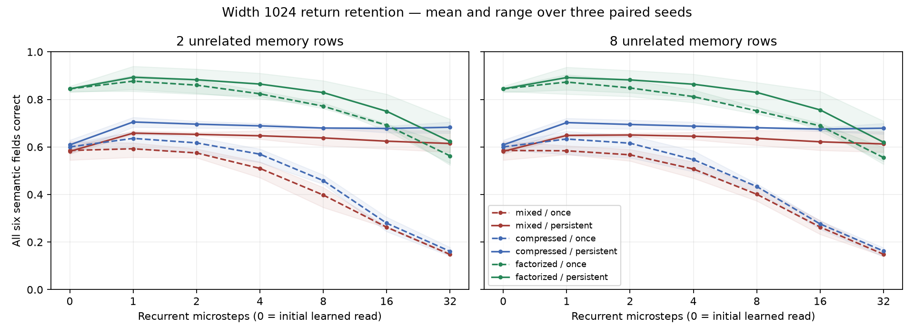
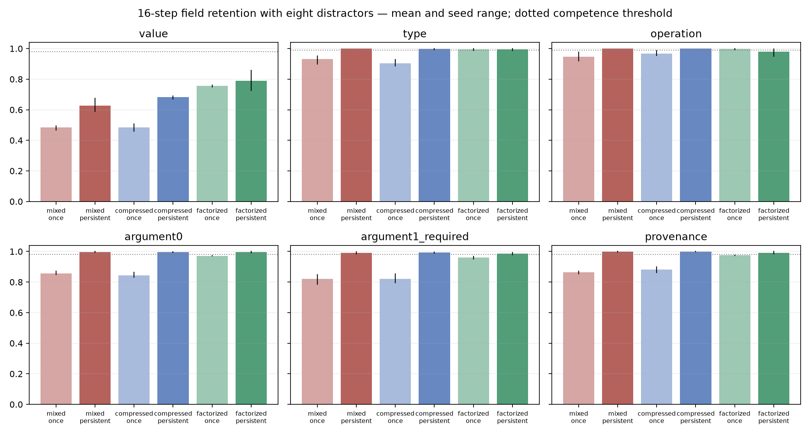

# Stage 8: isolated symbolic-return interface

All 18 prescribed width-1024 runs completed. **None passes the full retention gate.** Factorized memory substantially improves immediate semantic reconstruction within this matched experiment, while persistent access helps retention. Exact scalar decoding remains below criterion, and factorized persistent memory still degrades outside the trained recurrent horizon. No downstream-use or composition experiment was started.

## Design and supplied priors

Every model has a 1024-wide, six-row workspace and the same four recurrent attention/MLP blocks. Separate learned workspace heads decode value, type, primitive, ordered argument identities, and provenance. Perfect typed return events are supplied; this experiment does not learn operation construction or execution. Heads never directly read event fields. Random nonce identity keys remain 32-dimensional external observations; the neural workspace is 1024-dimensional throughout.

- **Mixed:** six full-width field encodings summed into one memory token, 55,947,403 parameters.
- **Concat:** six disjoint facet encoders totaling 1024 coordinates, concatenated into one token, 55,854,360 parameters.
- **Facet:** the same encoders and parameter count as concat, exposed as six typed memory tokens. Allocated KV coordinates are 6144 rather than 1024. This is parameter matched to concat, not memory-token or attention-cost matched.
- Each encoding is independently tested with **once** access (initial learned read only) and **persistent** access (initial read plus memory access each microstep). All shared backbone/readout tensors initialize identically for paired seeds. Concat/facet have identical complete initial state dictionaries.

The concat arm already factorizes fields before compression. It must not be described as an unfactorized baseline. The mixed arm is Stage-7-like at width 1024, but six workspace field queries and training differ from Stage 7; this is not a controlled width-only comparison. Persistent exact storage is architectural. Its integrity does not count as learned retention.

## Protocol and acquisition separation

The timing probe used two updates and is feasibility evidence only. A separate fixed-set study then trained all six arms on the same 32 events for 300 updates: every arm reconstructed 32/32 complete events at both zero and one microstep. Fresh 128-example validation joint accuracy was only 0–3/128. This proves fitting capacity, not generalization.

The main study trained each of three paired seeds and six arms from scratch for 1000 updates on fresh batches of 32 events (32,000 optimizer examples per run), cycling 0/1/2/4 microsteps. Each validation/test cell has 512 fresh events with 2 or 8 unrelated memory rows, evaluated at 0/1/2/4/8/16/32 microsteps. Validation and test data seeds are disjoint. Evaluation is chunked at 64. Zero microsteps means after the initial learned cross-attention read, before any recurrent block. Initialized held-out zero/one-step metrics are recorded before training.

`acquisition_counts` in the fresh main manifest is a probe of the initial training batch; it is **not** the separate fixed-set acquisition result. Every training loss, prediction, target, config, source hash and checkpoint hash is retained. Checkpoints remain on the linked machine.

## Joint semantic accuracy

Test means over the three initialization seeds, with eight unrelated memory rows. These are descriptive means, not pooled competence decisions.

| Encoding | Access | 0 steps | 1 step | 16 steps | 32 steps |
|---|---|---:|---:|---:|---:|
| mixed | once | 58.53% | 58.40% | 26.30% | 14.84% |
| mixed | persistent | 58.14% | 64.84% | 62.17% | 61.26% |
| concat | once | 60.03% | 63.35% | 27.60% | 16.21% |
| concat | persistent | 60.87% | 70.25% | 67.51% | 67.90% |
| facet | once | 84.44% | 87.30% | 68.88% | 55.53% |
| facet | persistent | 84.44% | 89.19% | 75.59% | 61.98% |

Factorized persistent memory is strongest at one step (89.19%) and at 16 steps (75.59%) in these means. At 32 steps, concat persistent reaches 67.90% while facet persistent falls to 61.98%. Factorized tokens therefore improve acquisition without establishing uniformly superior long-horizon retention.

## Field decomposition at 16 steps

| Encoding/access | Value | Type | Primitive | Arg0 | Required arg1 | Provenance |
|---|---:|---:|---:|---:|---:|---:|
| mixed/once | 48.37% | 93.23% | 94.73% | 85.61% | 82.05% | 86.46% |
| mixed/persistent | 62.76% | 100.00% | 100.00% | 99.74% | 99.11% | 99.87% |
| compressed/once | 48.50% | 90.49% | 96.74% | 84.44% | 82.21% | 88.15% |
| compressed/persistent | 68.23% | 99.74% | 100.00% | 99.67% | 99.28% | 99.87% |
| factorized/once | 75.52% | 99.54% | 99.67% | 97.20% | 96.14% | 97.46% |
| factorized/persistent | 79.04% | 99.54% | 97.98% | 99.54% | 98.63% | 99.15% |

Facet persistent value accuracy is 79.04%, value MAE is 0.243 on the half-unit scalar grid, and 93.82% of predictions lie within half a unit. Errors are often numerically close but still semantically wrong under exact-value scoring. Concat persistent preserves categorical fields and identities near ceiling yet reconstructs exact values only 68.23% of the time. Thus the scalar interface remains limiting even when reference/type preservation works. Factorized persistent primitive retention also falls to 97.98% at 16 and 95.25% at 32, so value quantization is not the only extrapolation failure.

## Interventions and lifecycle diagnostics

Test joint accuracy at 16 steps with eight unrelated rows:

| Encoding/access | Correct event | Dropped event | Wrong value | Released at step 8 | Overwritten at step 8 | Unrelated-row sign flip |
|---|---:|---:|---:|---:|---:|---:|
| mixed/once | 26.30% | 0.07% | 0.98% | 26.30% | 0.00% | 25.78% |
| mixed/persistent | 62.17% | 0.00% | 1.82% | 58.46% | 6.12% | 62.30% |
| compressed/once | 27.60% | 0.00% | 0.91% | 27.60% | 0.00% | 27.02% |
| compressed/persistent | 67.51% | 0.07% | 1.04% | 57.55% | 6.18% | 67.58% |
| factorized/once | 68.88% | 0.00% | 0.00% | 68.88% | 0.00% | 68.88% |
| factorized/persistent | 75.59% | 0.00% | 0.72% | 72.72% | 0.39% | 75.33% |

Dropped/wrong-event interventions destroy reconstruction relative to original facts, supporting dependence on the supplied return. Logs also score the actually supplied corrupted facts separately. This is **not** evidence of downstream reasoning or Gate D: the only learned task here is semantic reconstruction.

Release/overwrite changes only the protected record; tests verify it does not mutate free workspace at the transition. Release does not require magical erasure of previously learned facts. Overwrite is scored against the replacement event and remains poor: correct storage replacement does not imply the workspace adopts the new event. Lifecycle commands were not in the training curriculum, so these results are an explicit out-of-distribution diagnostic, not a test of a trained overwrite policy. Unrelated activity here means random memory rows, not a second concurrently learned task.

## Gate decisions and reproducibility

All 18 runs fail the prespecified 16-step validation gate on the full two-distractor-condition matrix: type/primitive >99%, value and identities >98%. Required arg1 excludes unary absent operands; 512 denotes episodes per cell, not 512 required binary operands. Raw count denominators are retained. Means cannot rescue a failed seed. Exact-value accuracy blocks every arm, and some arms fail additional fields.

Independent review reconstructed all 1008 evaluation rows (516,096 episode-evaluations), confirmed every count and all 18 gate failures, and matched the config plus five source hashes. Raw JSONL files are losslessly gzip-compressed.

No return-use training, repeated crystallization, supervision withdrawal or autonomous recomposition was attempted. The observations support better acquisition and selective benefits of persistent semantic access at width 1024; they do not demonstrate a fully competent return interface.

Runtime: 22.24 minutes summed across 18 sequential runs on NVIDIA GB10 / Torch 2.14 CUDA 13. Peak CUDA allocated memory: 1.313 GB. Seven remote mechanical tests passed before main training.

Raw/config/source manifests: [main](results/stage8/return-main/manifest.json), [fixed-set acquisition](results/stage8/return-acquisition/manifest.json), [timing](results/stage8/return-timing/manifest.json). [Summary](results/stage8/return-main/summary.json), [failure examples](results/stage8/return-main/failures.json), and regeneration scripts `stage8-return-summarize.py` / `stage8-return-plots.py` preserve the analysis trail.
