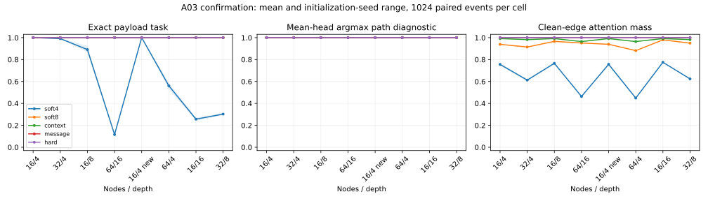
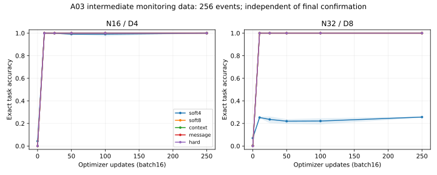

# A03: finite structural bias can preserve the correct argmax and still lose the payload

## Findings

Across three frozen confirmation seeds, soft attention initialized at structural strength8, structured address context, message passing and hard attention all solve every clean confirmation example. This includes N64/depth16 after training at N16/depth1–4. The softer strength4 model solves only11.59% on that joint shift despite a100% mean-head argmax path diagnostic. Overriding its frozen structural strengths to8 restores100% task accuracy in every seed without retraining.

This is a replicated repair of finite-bias mixing, **not an advantage over competitive graph interfaces**. Message passing reaches the same accuracy with roughly half the measured forward time. The experiment supplies graph identities and the reverse execution schedule; it does not learn program planning, language grounding or pointer semantics.

## Protocol and supplied mechanisms

[The frozen protocol](a03-protocol.md) specifies seeds201/202/203, five arms,500updates, batch16, width1024 and1,024 fresh examples per final cell. Every arm receives the same directed typed graph, immutable random node keys,16-class node payloads, start address and ordered relation sequence. Each relation is a permutation. A common programmed reverse schedule propagates suffix values over all nodes, with common privileged intermediate-value supervision. Runtime data contains neither the answer nor gold intermediate states. Reserved adjacent relation composition(2,2), larger graphs and longer paths are held out from training.

The context baseline retrieves every graph-supplied successor address using a learned cosine matcher initialized with a known identity-coordinate prior. It is structured address retrieval, not an ordinary transformer parsing adjacency prose. Hard singleton attention and normalized message passing have identical clean routing operators. Their agreement is not independent evidence for two different learned algorithms. Exact pointer execution is a programmed reference, distinct from learned payload propagation/readout.

`soft4` and `soft8` name trainable initial strengths. Final ranges across seeds/relations/heads are4.0096–4.0249 and7.9922–8.0005. The evaluation override8 is exactly fixed. Confirmation source is27fc238; all configs, initial-state hashes, source receipts and lossless compact outcomes accompany the raw archive. Intermediate monitoring uses separate256-example events and no checkpoint selection; final confirmation is evaluated only at update500.

## Clean confirmation

Percent exact payload accuracy, preserving all seeds. Every other confirmed arm is100% in all three seeds in each row.

| Nodes / depth | soft4 seed201 | seed202 | seed203 | soft8 / context / message / hard |
|---|---:|---:|---:|---:|
|16 /4|100|100|100|100 each|
|32 /4|98.73|99.61|98.93|100 each|
|16 /8|86.62|92.29|88.38|100 each|
|64 /16|12.01|11.91|10.84|100 each|
|16 /4, reserved composition|100|100|100|100 each|
|64 /4|56.64|58.69|52.93|100 each|
|16 /16|27.05|25.78|24.12|100 each|
|32 /8|29.98|29.30|31.45|100 each|

At the primary N64/D16 condition, soft8 minus soft4 is+88.41 percentage points; paired event-bootstrap95% interval+86.91 to+89.88 points. Seed differences are+87.99,+88.09,+89.16 points. Soft8 differs by zero observed errors from every strong baseline. A zero-width empirical bootstrap interval for perfect paired agreement is not proof of population equivalence or a rare-error guarantee. Seeds reuse the same1,024 events; they are initialization replicates, not3,072 independent graphs.

All arms begin with poor learned payload decoding. By10updates, soft8/context/message/hard already score100% on both monitoring conditions, whereas soft4 remains around25% at N32/D8. There is no measured sample-efficiency advantage for soft attention in this easy supplied-routing regime.

## Frozen intervention and failure localization

At N64/D16, all three soft4 mean-head argmax paths are correct, but average clean-edge read mass is approximately.463 versus.951 for soft8,.964 for context and1 for hard/message. Task accuracy conditional on a correct diagnostic path is therefore still only12.01/11.91/10.84%. The argmax trace is not the actual multihead computation; the model uses weighted value mixtures.

The prospective frozen soft4→strength8 intervention repairs901/902/913 wrong cases to correct and loses zero correct cases at N64/D16. At N16/D8 it repairs137/79/119 cases, again losing none. No encoder, update, readout or checkpoint changes. This directly establishes that changing compatibility strength is sufficient for these observed errors. It does not uniquely identify every nonlinear dynamical detail.

A restricted mathematical fixture explains why correct argmax is insufficient: with equal content scores, a permutation P and uniform matrix J, the soft read is `W=αP+(1−α)J`, where `α=(exp(λ)−1)/(exp(λ)+N−1)`. D such linear reads retain destination contrast proportional toα^D. This is an exact matrix identity under stated assumptions, not multiplication of empirical correctness probabilities or a complete model of the trained network. The N64/D16 examples visit14.97 distinct nodes on average (range8–17), so recurrent paths need not be simple paths.

## Interventions and topology dependence

Consistent node permutations preserve final task outputs and diagnostic routes after coordinate restoration. Independent auditing found one changed intermediate soft4 payload argmax in seed203 among1,048,576 node/time entries; all other arms had zero such changes. Numerical boundary sensitivity is plausible but unverified without retained logits. We do not claim bitwise invariance of every intermediate output. Setting soft strength to zero reduces N16/D4 task accuracy to18.07/18.55/18.95% for soft4 and16.89/15.92/20.70% for soft8. Other arms ignore this flag: their duplicate cells are no-op checks, not graph-removal ablations.

Wrong degree-preserving topology and mismatched graph identities sharply reduce accuracy. At N16/D4, all strong arms score12.99% for wrong topology,14.26% for identity mismatch, and42.97% after25% missing edges with self fallback. At N64/D16 the corresponding strong-arm scores are6.54%,8.20%,7.71%. Missing or wrong edges can remove information needed to identify the clean destination; these results demonstrate dependence, not a guarantee that soft routing should recover inaccessible facts.

Adding25% spurious edges yields mean N64/D16 accuracy25.78% soft8,25.42% context,26.33% message and26.01% hard, with all seeds retained in the raw analysis. No robust soft advantage appears. The weaker soft4 sometimes scores higher under wrong/missing topology because it mixes payload information broadly; that does not imply successful recovery of the clean path. Clean-edge and supplied-edge masses are separately reported so adherence to a wrong graph is not mistaken for correctness.

## Compute and search effort

All arms allocate4,241,449 parameters. At N64/D16, forward seconds per1,024 cases average1.093 soft4,1.112 soft8,.586 context,.536 message and1.112 hard. These correspond to about1.086ms per correct example for soft8,.572ms context and.523ms message; soft4 costs roughly9.2ms per correct example because most answers fail. Timings are CUDA-forward-only; full process receipts include training, evaluation, startup and export. They are measurements on the same GB10, not sparse-kernel speedup claims.

Peak allocated CUDA memory across runs is approximately242MB soft,174MB context,172MB message and243MB hard; peak process RSS is about2GB. Device capacity is not process allocation. Autograd participation and final nonzero-gradient counts are preserved separately; unused allocated parameters and zero-gradient singleton Q/K do not count as acquired computation. [Dominant MAC accounting](compute-accounting.md) explains why message passing has less work despite allocated parameter equality.

Exploration comprised A01 five seed101 arms and A02 three seed102 arms plus three frozen interventions; confirmation comprised15 models across three fresh initialization seeds. Every trained model received8,000 procedural graph draws; canonical uniqueness was not deduplicated and is not asserted. Exact search histories, failed soft4 outcomes and validation selections remain visible. Full attention-track GPU process occupancy through A03 is302.48seconds, including profiles and exports; A03 itself is229.48seconds. CPU analysis/auditing is separate.

## Interpretation and next decision

- **Programmed:** explicit row identity, typed functional graph, reverse relation schedule, known-key context prior, exact pointer reference.
- **Learned:** payload encoding/update/readout and soft content projections/strengths; context projections remain trainable.
- **Measured attention mechanism:** finite logit bias can dilute recursively propagated values despite correct diagnostic argmax; a frozen strength change repairs the observed task failure.
- **Not established:** unique programmable-attention superiority, learned planning, arbitrary latent grounding, calibration for execution, or autonomous composition.

The next informative task should give content compatibility a necessary role: choose among several typed neighbors using fresh public attribute codes. It must retain a strong dynamic neighbor-attention baseline and exact address-gather reference. Repeating functional routing with another weak graph-as-data comparator would add little knowledge.

Independent raw-metric/provenance review completed in reviewer commit `e20e787`: all456 recorded cells (276 final cells plus180 monitoring cells), paired intervals, event correspondence and all15 durable checkpoint hashes verified. See [independent confirmation summary](../review/A03-confirmation-summary.json). Compact exports reconstruct task/path metrics; aggregate attention mass is audited for bounds/means because full attention tensors are intentionally not redundantly retained. All historical source/results remain unchanged. No attention GPU process remains running.
