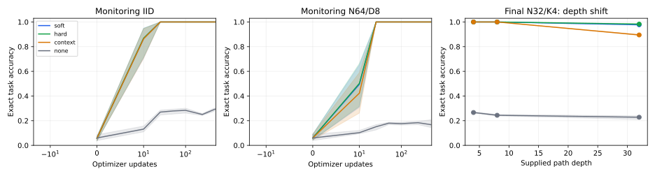
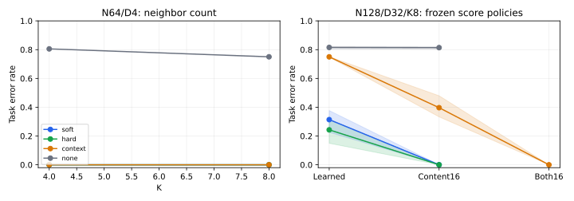

# A06: learned selection, finite averaging, and a strong baseline tie

Three paired initialization seeds confirm content-dependent relational computation in the supplied interface. All three graph interfaces acquire fresh code matching, but their original soft read distributions lose value accuracy on long paths even while diagnostic route maxima stay correct. Prospectively frozen concentration interventions repair the tested long-path conditions for **all three**, including the strongest keyed context baseline. There is no measured unique advantage for graph-biased attention.

## Primary confirmation

Train N32/K4 and supplied path depths1–4 for1000updates. Final joint shift N128/K8/D32 uses1024fresh shared events, never used for selection. All numbers below are exact final payload accuracy. Original learned scales are retained;16 is an inference intervention selected on prior development, not learned automatically or tuned on these confirmation events.

| Interface/policy | Seed601 | Seed602 | Seed603 |
|---|---:|---:|---:|
| Soft graph bias, learned content scale |77.44%|66.11%|62.30%|
| Exact-gather neighbor attention, learned content scale |85.06%|73.63%|68.46%|
| Keyed neighborhood context, learned scales |24.90%|24.90%|25.20%|
| No graph |19.53%|17.97%|17.87%|
| Soft bias, content16 |100%|100%|100%|
| Exact gather, content16 |100%|100%|100%|
| Keyed context, content16 only |52.05%|66.70%|62.21%|
| Keyed context, address16 and content16 |100%|100%|100%|

The repaired graph arms also attain100% all-node values and complete suffix-value trajectories on this cell. Original joint-task seed means are68.62% soft,75.72% gather and25.00% context. All original graph arms have100% mean-head argmax path diagnostics: correct route maxima do not establish accurate transported values. These diagnostics are not causal proof of each head's executed trajectory.

Soft content16 repairs231/347/386 original errors with zero correct→wrong cases. Mean gain31.38percentage points, shared-event bootstrap95% interval[29.17,33.85]. Gather gain24.28points[22.27,26.30]. Context both16 repairs769/769/766errors, gain75.00points[72.53,77.28]. The bootstrap resamples event indices jointly across the three fixed seeds; it does not pretend3072independent graphs were observed. Seed variation is visible above. Zero observed errors do not establish universal or one-in-a-thousand reliability. Tied empirical accuracy is not proof of equal population performance.

## Acquisition and transfer

All graph arms and seeds reach100% on the two256-event monitoring cells (IID and N64/D8) by25updates and remain there. This is400graph presentations with dense all-node suffix supervision, not400individual target decisions. Every final unchanged graph arm is100% on IID, N64/D4, N32/D8, N64/D8, reserved relation composition, N64/D4/K8 and N128/D4. At N32/D32/K4, unchanged means are97.72% soft,98.27% gather and89.49% context; content16 repairs all three to100% in every seed. Only the joint size/depth/K shift exposes the context address concentration bottleneck after content sharpening.

Bands show observed seed ranges, not confidence intervals. Depth32 is extrapolation because training ends at4. Fresh continuous attribute codes test a shared matching rule under explicit semantic coordinate features. Reserved compositions are new supplied schedules, not learned planning.

## Controls and limits

On paired IID instruction swaps,884/1024terminal identities and828/1024payload answers change. All graph arms/seeds answer100% correctly, including both changed subsets. Supplying a wrong instruction instead reduces agreement with the original answer to19.14%; agreement with the actually supplied computation is separately exported. Removing content discrimination drops task accuracy to~16.5% and route diagnostics near zero. Consistent node permutation preserves final scores. Wrong regular topology gives15.63% clean-target task; permuted identity correspondence21.29%. These are reliance controls: the missing correct connection is not necessarily identifiable from remaining public information.

Zero structural strength reduces the soft arm to26.07% IID; it is a documented no-op in hard/context modes, not removal of their graph input. Fixed-K masks cannot honestly test variable-degree edge deletion by padding absent neighbors; those corruptions are omitted here. A03 supplies separate corruption evidence under its different functional-graph contract.

**Missing baseline:** this campaign does not include a competitive ordinary transformer parsing graph tokens without supplied neighborhood addressing. The equal-information comparisons here are structured keyed neighborhood retrieval and exact-gather learned message attention. They are strong engineering alternatives, but do not answer every graph-as-data comparison requested in the broader campaign.

The v2 graph family supplies blockwise bijections so N/K identities remain distinct after the first step. Its noncoalescence audit is in `a05-v2-generator-audit.json`. The superseded v1 confirmation draft was never run after its generator-only audit exposed coalescence. Do not reinterpret old v1 D8 results as proof of arbitrarily deep identity preservation.

## What is supplied and what is learned

| Component | Status |
|---|---|
| Typed directed graph, ordered instruction path, reverse execution schedule | Supplied public structure and execution schedule |
| Node/token correspondence and immutable identity coordinates | Explicit supplied grounding |
| Repeated attribute code representation | Public continuous features, randomized each graph |
| Code-conditioned Q/K matching and payload propagation/classification | Learned from suffix-value labels; no route targets |
| Hard neighbor address selection | Programmed retrieval; learned selection among those neighbors |
| Keyed address prior | Identity-initialized trainable matching plus supplied neighborhood mask |
| Content/address scale16 | Frozen engineered inference policy chosen in development |
| Attention maximum path | Posthoc diagnostic |

Changing address concentration affects both retrieved attributes and payloads. The intervention supports two finite mixing boundaries; it does not isolate value readout alone or prove an arbitrary latent representation loses information. No evolving latent semantic grounding, language induction, autonomous plan construction or cognitive claim follows.

## Compute and search effort

All arms allocate4,306,986parameters and workspace width1024. Last-update nonzero-gradient tensor parameter totals differ: soft4,298,793; gather/no-graph4,298,769; context4,306,962. These count nonzero tensor participation, not functional capacity. Each arm/seed sees16,000generated training graphs; unique canonical graphs are not deduplicated and are not falsely reported as measured unique count.

Mean GPU forward seconds per1024joint-stress events under successful policies: soft3.639, gather3.680, context4.074. At100% accuracy this is3.55/3.59/3.98milliseconds per correct example in the measured batched workload. Original soft/gather/context consume about5.30/4.87/15.89milliseconds per correct example when using ratio of mean measured time to mean correct count. No meaningful speed superiority is established by the small soft/gather timing difference. Dense value products remain; no sparse-compute claim is made. Context's extra address read adds work despite equal allocation. Full per-cell timing, peak CUDA allocation and process RSS remain in manifests.

A06 process occupancy:117.94+113.82+123.55=355.31seconds. Coordinator release-to-completion receipt wall is462.00seconds, including serial scheduling and CPU export-fetch gaps. Attention-track total through A06 is890.50seconds. This includes development/profiles, not just successful confirmation. Prior search examined functional routing strength4/8 and size adjustment, content-selector v1 then audited/versioned v2, and a frozen2×2address/content concentration diagnostic. No further scale was searched after this protocol froze.

## Decisions and evidence

| Claim | Decision | Evidence |
|---|---|---|
| Fresh content-dependent selection under supplied graph/schedule | passed_restricted | All-seed IID and several isolated shifts100% |
| Unchanged learned-scale deep interface | failed | All graph arms fail the registered98% joint-shift threshold |
| Frozen sharpness policy deep interface | passed_restricted | Soft/gather content16 and context both16 have100% task and suffix results, each seed |
| Unique programmable-attention benefit | not established | Strong gather/context reach same observed accuracy |
| Ordinary graph-token transformer comparison | not_run | Baseline absent; no claim made |
| Learned planning/semantic induction/autonomous composition | not_run | Supplied boundaries and separate contracts |

Raw compact predictions/targets and all outcomes: `research/results/campaign-01/attention/a06/`. Reproduction: frozen `b993a44`, configs `campaign-a06-{mode}-{seed}.json`; analysis `research/tools/campaign_selector_confirmation_analysis.py`, plots `campaign_selector_plots.py`. Durable checkpoints on GB10: `/home/brandonin/topoformer-campaign01/attention/a06/{seed}/{mode}/checkpoint.pt`. Ten CPU mechanical tests passed before execution. Independent raw/provenance audit completed: all405 monitoring/final cells, all12 checkpoint hashes, matched initialization tensors and shared populations verified. See `research/campaigns/extended-01/review/A06-confirmation-audit.json` and per-run audits.

No attention GPU jobs remain. Close this branch at the measured concentration mechanism and strong-baseline tie. The next direct-attention question should add a genuinely different computational interface or predicted grounding contract, not tune this simple benchmark until soft bias wins.
