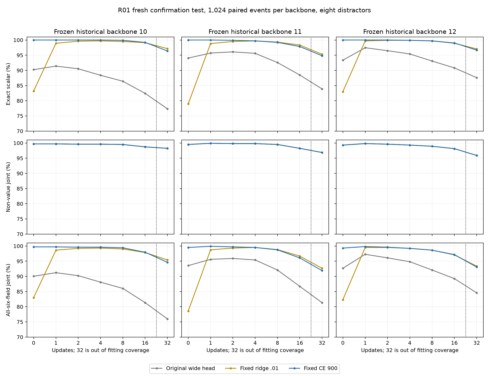
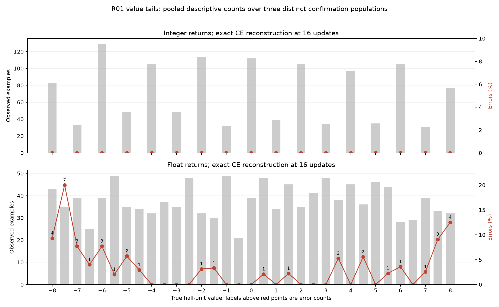

# R01 confirmation: broad contract fails on one backbone

**The declared 0–16 scalar contract fails.** CE refitting confirms large gains over the original scalar heads, but backbone 11 reaches only 1000/1024 (97.66%) on both sixteen-step validation cells. All models and recipes were frozen before evaluation; this result is retained rather than repaired by excluding sixteen steps.

Three historical wide backbones (10/11/12) received independent fresh fitting/calibration/validation/test populations. Backbone 10 was also used during development. Every CE consumer used exactly 900 updates at learning rate .003; ridge .01 was fixed. There was no confirmation checkpoint selection. Each fitting pool contains 4,096 events and 24,576 delay/event rows; each evaluation partition contains 1,024 events per backbone. All 33 half-unit labels are represented.

CE exact scalar counts with eight distractors:

| Backbone | Partition | 0 | 1 | 2 | 4 | 8 | 16 | 32 |
|---|---|---:|---:|---:|---:|---:|---:|---:|
| 10 | Validation | 1024 | 1024 | 1024 | 1024 | 1024 | 1018 | Not exposed |
| 11 | Validation | 1024 | 1024 | 1024 | 1024 | 1017 | 1000 | Not exposed |
| 12 | Validation | 1024 | 1023 | 1022 | 1022 | 1019 | 1013 | Not exposed |
| 10 | Test | 1024 | 1024 | 1024 | 1024 | 1023 | 1016 | 987 |
| 11 | Test | 1024 | 1024 | 1023 | 1021 | 1016 | 1002 | 971 |
| 12 | Test | 1024 | 1024 | 1024 | 1023 | 1021 | 1014 | 990 |

Every entry has denominator 1,024. Within a backbone and partition, events are paired across consumers, recurrence and distractor conditions; across backbones the confirmation event sets differ. The worst two/eight-distractor validation counts are respectively 1018, 1000 and 1012 for backbones 10, 11 and 12. A >=98% cell requires at least 1004 correct. All 0–8 cells exceed that threshold, but these posthoc restricted observations do not rewrite the prospective contract or authorize composition.

All three CE consumers fit 4096/4096 scalars at sixteen steps in the fitting population. For backbone 11's two-distractor validation cell, all 24 mistakes occur among float-typed returns (381/405); integer405/405 and boolean214/214 are exact. Absolute numerical error totals39.5 over those 24 failures. This is a fresh-context tail, not failure to fit the observed finite training set. Other field predictions remain unchanged by construction.

Ridge remains strong after recurrence but poor at the initial read. In the eight-distractor final test, its sixteen/thirty-two counts are 1015/995, 1007/976 and 1013/994 across backbones 10/11/12. Zero-step counts are only852/809/850. No representation or phase-conditioned head was added.

## Decision

Proceed to R02 development on the selected failing backbone 11, explicitly acknowledging failure-driven selection. Compare nested fresh 4,096/8,192/16,384-event fitting pools at fixed 900 CE updates, with a common fresh calibration/validation population and unchanged original-head warm-start. This separates increased semantic-context diversity from additional optimizer exposure. Inspect training fit, value/type/operator support, margin and distance tails before changing decoder architecture. Original confirmation events will not select R02.

Do not promote a returned-fact-use task yet. A later narrowed consumed interface would require a new prospective scoped contract and fresh validation. The original historical six-field criteria are also retained.

## Resources and audit

Process occupancy was95.90 seconds including initialization/export; inner per-backbone runs took31.995/31.218/31.120 seconds. Raw predictions preserve all fields, exact group counts, logits, class support and fitted coefficients. Local artifacts are under research/results/campaign-01/returns/r01-confirmation; immutable large caches/weights remain at gb10-direct:~/topoformer-campaign-01/returns/r01-confirmation/{10,11,12}.

Independent raw audit verified all396 cells and the fixed recipe, reproducing the failing seed11 gate. Independent CPU replay verified all396 logit cells with zero argmax differences, train-only normalization, split separation, and every checkpoint/readout/cache hash. Cross-run audit found no overlap among18 profile/development/confirmation populations totaling27,840 distinct event identities. These experiments concern a supporting learned scalar interface, not programmable attention or autonomous reasoning.

