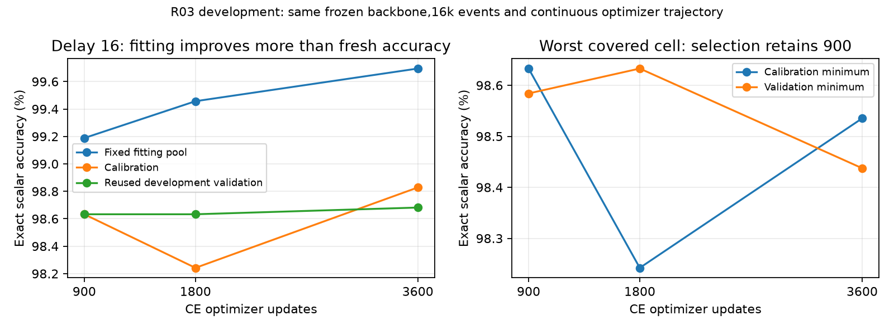

# R03: additional readout optimization does not reliably improve fresh accuracy

The exact R02 trajectory was reproduced at 900 updates: parameter difference zero, prediction difference zero on all cached splits, and identical visited-row bitset. Continuing the same optimizer and random generator improves fixed-pool fit but does not reliably improve calibration or exploratory validation. The registered worst-cell calibration rule retains **900 updates**.

| Updates | Fit at delay 16 / 16,384 | Worst calibration / 1,024 | Worst validation / 2,048 | Validation delay 16, eight distractors / 2,048 |
|---|---:|---:|---:|---:|
| 900 | 16,251 | 1,010 | 2,019 | 2,020 |
| 1,800 | 16,295 | 1,006 | 2,020 | 2,020 |
| 3,600 | 16,334 | 1,009 | 2,016 | 2,021 |

Calibration totals across twelve correlated cells are 12,250, 12,236 and 12,248; validation totals are 24,483, 24,488 and 24,501. These secondary totals do not override worst-cell selection. Validation was reused from R02 for development, not claimed as a new confirmation.

All remaining delay-16 validation errors are float-valued returns. With eight distractors, float counts are 796, 796 and 797 / 824; integer and Boolean counts remain perfect. Better fixed-set fit therefore does not establish broad float-tail reliability. Delay 32 was absent throughout. The backbone and non-value heads remain unchanged; this experiment concerns a learned workspace consumer, not programmable attention or complete semantic retention.

The single shared 1,024-input categorical head has 33,825 parameters. Its pool contains 16,384 distinct events and 98,304 delay-specific rows, with 230,400 / 460,800 / 921,600 optimizer presentations. External process occupancy was 17.38 seconds, including initialization and export; peak CUDA allocation was 1,208,889,856 bytes. This is optimization exposure on frozen features, not further recurrent-backbone training.

Next: freeze the development-selected **16,384-event, 900-update** recipe for fresh three-backbone confirmation (R04). Neither the failed R01 confirmation nor this reused development validation is promoted into an execution authorization. Independent audit passed all 90 raw cells, cached-logit replay and exact step-900 agreement with R02 (reviewer commits 3bc6566/7970609).

[Manifest](../../../results/campaign-01/returns/r03-development/manifest.json.gz), [raw predictions](../../../results/campaign-01/returns/r03-development/predictions.json.gz), and [process receipt](../../../results/campaign-01/returns/r03-development/process.json) retain all endpoints. Remote coefficients and lossless logits remain under `~/topoformer-campaign-01/returns/r03-development/`; immutable feature provenance points to R02.

