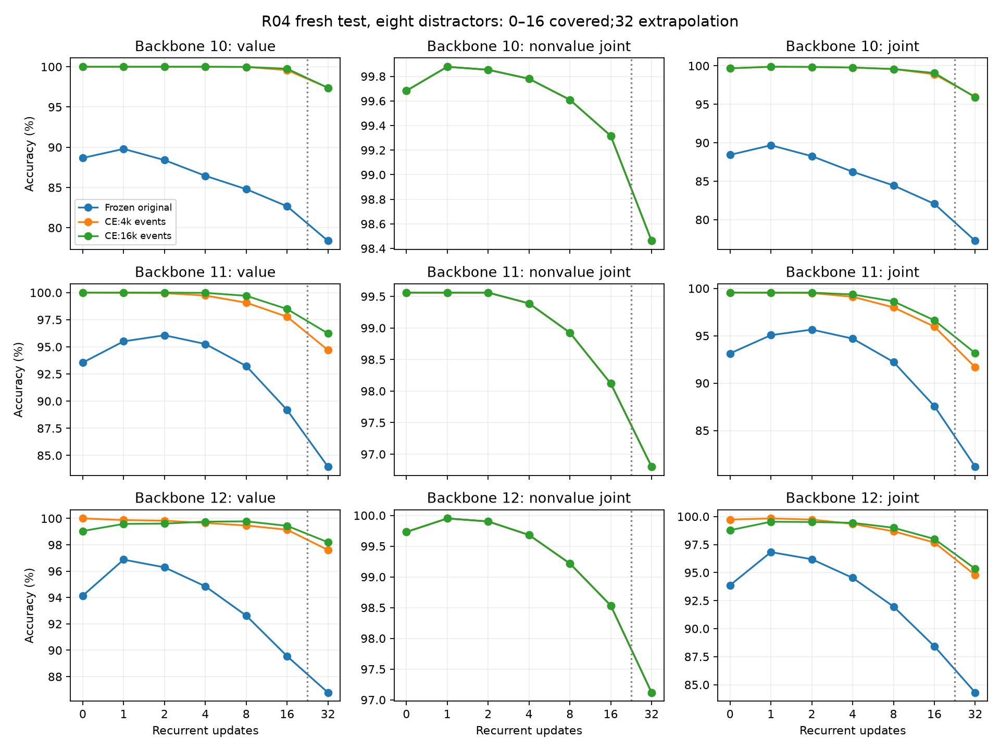
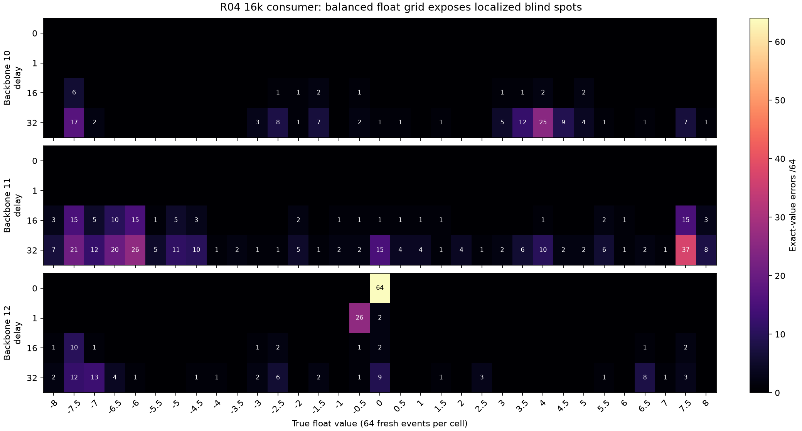

# R04: diversity improves a restricted scalar interface, with a whole-class blind spot

The fixed 16,384-event / 900-update consumer passes the prospective **aggregate scalar contract** across all 36 covered validation cells. The paired 4,096-event consumer again fails backbone 11 at sixteen steps. This is a fresh-context result for the registered return mixture and finite 33-value domain; the separately stratified grid exposes important failures hidden by the aggregate.

| Frozen backbone | Worst validation, 4k fit | Worst validation, 16k fit | Test 16, 16k fit, eight distractors | Test 32, 16k fit, eight distractors |
|---|---:|---:|---:|---:|
| 10 | 4,077 | 4,079 | 4,086 | 3,989 |
| 11 | 3,990 | 4,038 | 4,034 | 3,942 |
| 12 | 4,055 | 4,049 | 4,073 | 4,022 |

All denominators are 4,096. The registered cutoff is 4,015. Worst cells are sixteen-step except backbone 12's 16k arm, whose worst cell is zero-step ingestion. Covered delays are 0/1/2/4/8/16 with two/eight distractors. Delay 32 is final-test extrapolation, excluded from fitting and selection. No recipe was selected from confirmation outcomes.

## Balanced values reveal why the scope matters

The separate diagnostic selects 64 untouched generator events for each legal type/value pair, yielding 2,112 float, 1,088 integer and 128 Boolean events per backbone. It preserves every operand witness and identity key. At sixteen steps the 16k consumer recovers **2,095 / 2,112**, **2,025 / 2,112** and **2,091 / 2,112** float values. Backbone 11 therefore remains weak on a uniform float grid.

More sharply, backbone 12 maps **all 64 float-zero returns to −0.5 at zero steps**, while integer and Boolean zero do not share that failure. At one step, 26 float −0.5 returns map to −1.0. The aggregate contract can pass while an entire rare type/value stratum fails. No uniform-value or uniform-subtype claim is warranted. These outcomes are retained, not used to modify the consumer after confirmation.

## Matched comparison and remaining limits

Both fitted consumers start from the same original frozen head, use the same 1,024-dimensional features and 33,825 parameters, and receive 230,400 optimizer presentations. The 4k pool is a true prefix of the captured 16k pool. Training-only normalization is fitted separately to each pool; larger diversity also reduces repeat exposure per distinct row. Backbone and non-value heads remain byte-identical. At sixteen steps, in-pool scalar fitting is perfect for all three 4k arms; the 16k counts are 16,364 / 16,384, 16,247 / 16,384 and 16,341 / 16,384. Perfect small-pool fit did not ensure fresh reliability.

All six fresh validation and all six fresh test sixteen-step cells in the 16k arm also meet the numerical inherited per-field thresholds: type/primitive above 99%, scalar and required identities above 98%. Full joint test accuracy remains approximately 96.63–99.15%. This is a new scoped measurement, not an edit to historical failed gate registries or proof of complete semantic reliability across types/values, recurrence lengths or lifecycle interventions. The original backbone and short-pool failures remain visible in raw records.

The three backbone initializations are historical 10/11/12; 10 and 11 informed development. Readout fitting and evaluation populations are fresh and independent between runs. Each run reuses the same underlying evaluation events across delays, distractors and heads; these are paired observations, not independent expanded sample counts. The balanced diagnostic is a different prevalence distribution and is never substituted for the primary population.

External process occupancy was **398.23 seconds** including capture, fitting and lossless export; peak CUDA allocation was 1,499,566,592 bytes. All 432 raw cells, paired correct/wrong outcomes, per-value/type/operator groups and full-precision logits are retained. Independent audit passed all 432 raw/cache/weight/logit cells, all 9,984 regenerated balanced event witnesses, and 36-population disjointness. This experiment concerns learned access to persistent return semantics; it does not test programmable attention.

Next is a separately frozen, narrow returned-fact-use study on the unchanged registered mixture, contingent on independent audit. It must retain the stratified failure report and causal wrong/drop/swap controls. No general composition or autonomous policy is established here.

[Summary and paired counts](../../../results/campaign-01/returns/r04-confirmation/summary.json), [process receipt](../../../results/campaign-01/returns/r04-confirmation/process.json), and per-backbone raw predictions/manifests under the same result directory provide the verification path. Large immutable features, logits and readouts remain at `~/topoformer-campaign-01/returns/r04-confirmation/{10,11,12}/`.

