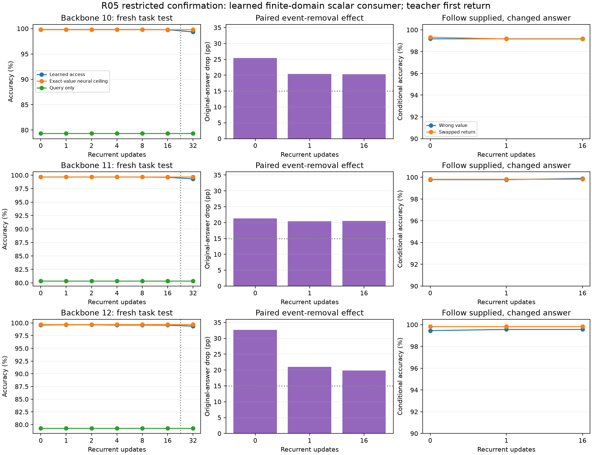

# R05 confirmation: causal use passes in the registered finite comparison domain

The frozen learned scalar interface supports a subsequent learned decision on all three fresh confirmation populations. Every covered validation cell exceeds 98%, and the prespecified causal checks pass. This is a **restricted learned closed-vocabulary scalar-consumer result**, not autonomous symbolic reasoning or a repair of the underlying exact-value tails.

| Historical backbone | Worst covered validation /4,096 | Query-only validation /4,096 | Test delay 16 /4,096 | Test delay 32 /4,096 |
|---|---:|---:|---:|---:|
| 10 | 4,080 | 3,229 | 4,087 | 4,069 |
| 11 | 4,081 | 3,209 | 4,080 | 4,068 |
| 12 | 4,076 | 3,266 | 4,078 | 4,070 |

Test columns use eight distractors. Covered validation includes 0/1/2/4/8/16 and two/eight distractors: 36 cells across the three populations, all above the 4,015 cutoff. Test 32 was captured after all consumer fits and excluded from selection. Each row has 4,096 unique validation events and a separate 4,096-event test population, reused across delays/distractors/arms; expanded cell counts are not independent sample counts.

## Causal use, with the public prior visible

Dropping the return before ingestion lowers original-answer accuracy by **19.87–32.62 percentage points** across tested delays 0/1/16 and the three runs. Learned clean improvement is at least 99.75% of the matched exact-value-neural-comparator versus query-only improvement. The denominator is positive in every cell. The analytical query-only ceiling is 79.41%; query-only accuracy around that level is expected and is not leakage.

For wrong-value interventions, supplied-fact answers are correct on at least 861 /868 answer-changing cases; swapped-return counts are at least 589 /594 in their weakest cell. Supports vary by population (wrong:868/912/915, swap:594/599/639), all above256. Both original and supplied labels, actual swapped types/operations, and paired uncertainty are saved. The results support dependence on the supplied return rather than memorization of the original answer. They do not show learned scheduling or another exact symbolic invocation.

## Why high binary accuracy does not repair scalar precision

At test delay16, the scalar accessor is wrong on15/67/14 examples for backbones10/11/12, yet the learned decision is correct on15/65/14 of those. An explicitly diagnostic exact comparison of the accessor's argmax value gives the same counts. Most scalar mistakes therefore do not change the answer under the sampled threshold; this is not evidence that exact information was recovered downstream.

Boundary-conditioned performance is weaker. On the same test cells, equality cases score93/97,87/97 and107/114; true-value-minus-threshold0.5 cases score118/121,112/117 and117/125. These are descriptive small-support strata, not replacements for the registered gate. Balanced full-grid decision scores at sixteen steps are3,312/3,328,3,308/3,328 and3,299/3,328. R04's whole float-zero scalar failure remains unrepaired. Do not infer uniform numerical precision from the mixture-scoped decision result.

The task has33scalar labels,33threshold values and two polarities. A finite learned decision table remains a compatible explanation. Generalization here concerns new nuisance identities/contexts and, separately, recurrent length; it does not concern unseen numerical classes, ranges or new operators.

## Frozen comparison and provenance

All return backbones/accessors remain fixed. New comparators are35→1024→2 GELU networks with38,914parameters. Learned and exact-value arms use2,000updates (512,000presentations); query-only uses its development-selected1,000updates (256,000presentations). They share initial weights and the common sampling-stream prefix, but final optimizer exposure is not equal. No confirmation calibration outcome changes an endpoint.

Each run fits8,192fresh events across six delay states. Historical backbone11 informed development; the confirmation uses new consumer seeds and event populations across historical backbones10/11/12. Initial operation results are teacher supplied. Exact-value one-hot is privileged only in the labeled neural ceiling, never the learned-access arm.

External process occupancy was352.54seconds, including all capture, fitting and export. All513raw cells, cached accessor/consumer inputs, scalar scores, logits, coefficients and source/config/checkpoint hashes are retained. Independent audit completion is pending. Any further composition decision belongs to the coordinator and must preserve this narrow contract; historical failed scalar/interface gates remain unchanged.

[Gate decisions](../../../results/campaign-01/returns/r05-confirmation/gates.json), [process receipt](../../../results/campaign-01/returns/r05-confirmation/process.json), and per-run predictions, paired summaries and signed-margin groups are under the same result directory. Immutable trained comparators are at `~/topoformer-campaign-01/returns/r05-confirmation/{10,11,12}/learned.pt`; their byte hashes are recorded in the gate file and manifests.

