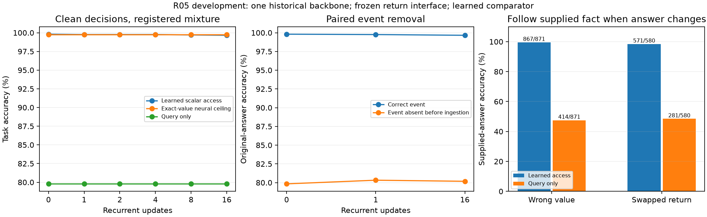

# R05 development: a learned comparator uses the frozen scalar interface

The narrow learned closed-vocabulary scalar-consumer interface is acquired on development backbone 11. It answers the existing threshold/polarity query from the frozen R04 accessor's 33 softmax features, with no exact scalar bypass. This is not autonomous symbolic orchestration or a claim that the original recurrent workspace learned a second computation.

| Delay | Learned correct /2,048 | Exact-value neural comparator /2,048 | Query-only /2,048 | Dropped-return original-answer accuracy /2,048 |
|---|---:|---:|---:|---:|
| 0 | 2,044 | 2,043 | 1,634 | 1,635 |
| 1 | 2,043 | 2,043 | 1,634 | 1,645 |
| 16 | 2,041 | 2,043 | 1,634 | 1,642 |

The learned comparator's covered-delay validation cells range from 2,041 to 2,044 /2,048, identically for two/eight distractors here. Its relative gain over query-only is approximately 99.51–100.24% of the matched exact-value comparator gain. Values slightly above 100% are reported without clipping and do not establish superiority over an oracle: both comparators are separately trained neural models.

Dropping the event before ingestion lowers original-answer accuracy by 19.43–19.97 percentage points. No existing latent information was erased. Wrong-value interventions produce 867–868 correct supplied-fact answers among 871 answer-changing cases; swapping a complete valid return produces 571–574 among 580. The learned output follows the actually supplied fact rather than merely retaining the original answer. All prospective development checks pass; paired descriptive uncertainty and all original/supplied labels are retained in the raw summary.

Query-only validation accuracy is 79.79%, consistent with the analytically declared 79.41% no-return Bayes ceiling. Its above-chance behavior is expected from the public value distribution. The threshold amendment from 20 to 15 percentage points was committed before any profile/training outcomes, following that analytical observation model; history and rationale remain explicit.

Balanced full-grid decision counts are 3,317 /3,328 at ingestion, 3,313 at one step and 3,308 at sixteen steps. A binary query can be insensitive to an incorrect neighboring scalar, so these task scores do not repair or invalidate R04's scalar class failures. No uniform-value reconstruction claim follows.

All three comparator architectures have 38,914 parameters and a 1,024-wide hidden layer. Each received 512,000 optimizer presentations over the same 8,192 events and six delay states. Calibration selected learned step 2,000, query-only 1,000 and exact-value 2,000 from six registered checkpoints per arm. The unused query-only optimization tail still counts toward compute/exposure. Backbone and accessor were frozen; no delay-32 data was captured.

External process occupancy was 68.97 seconds; peak CUDA allocation 446,848,000 bytes. This is one development backbone with fresh nuisance contexts, not a main three-seed result. Independent audit passed all 126 raw cells, cached actor/accessor/consumer replay, endpoint selection and causal thresholds (reviewer 01cd887); no exact-value leakage was found in the learned consumer. Next: freeze these endpoints for three-backbone fresh confirmation, preserve the actual mixture, evaluate causal and balanced conditions separately, and include delay 32 only after fitting as extrapolation.

[Raw predictions](../../../results/campaign-01/returns/r05-development/predictions.json.gz), [manifest](../../../results/campaign-01/returns/r05-development/manifest.json.gz), [paired summary](../../../results/campaign-01/returns/r05-development/summary.json), and [process receipt](../../../results/campaign-01/returns/r05-development/process.json).

