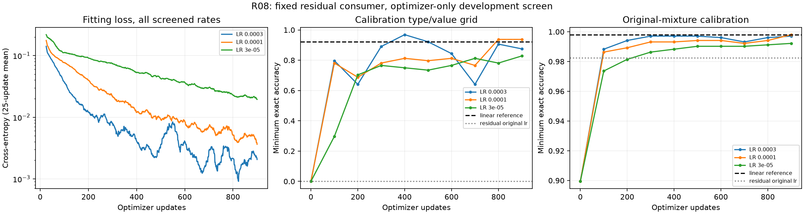
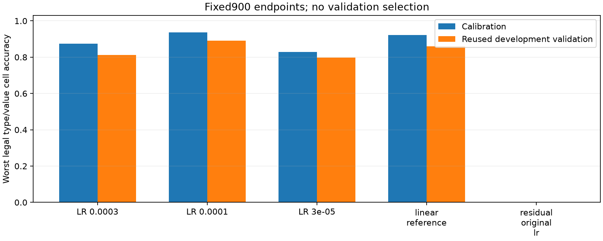

# R08: optimizer sensitivity explains much of the nonlinear readout failure

Reducing the residual readout learning rate removes R07's severe ingestion failure. The fixed calibration rule selects.0001, whose worst calibration-grid cell is60/64 versus59/64 for the strong linear reference. Reused development validation moves from55/64 to57/64. This is a small, exploratory tail improvement, not uniform exact reconstruction or confirmed nonlinear superiority.

| Fixed900 readout | Mixture calibration minimum /1024 | Grid calibration minimum /64 | Mixture validation minimum /4096 | Grid validation minimum /64 |
|---|---:|---:|---:|---:|
| Linear reference | 1022 | 59 | 4088 | 55 |
| Residual original LR.003 | 1006 | 0 | 4032 | 0 |
| Residual LR.0003 | 1021 | 56 | 4090 | 52 |
| **Residual LR.0001, selected** | **1022** | **60** | **4085** | **57** |
| Residual LR.00003 | 1016 | 53 | 4073 | 51 |

Selection used only the final900 calibration-grid minimum, then minimum mixture calibration, then declared rate order. The selected head passes the prospective development advancement condition: strictly improve the worst calibration-grid cell while keeping every mixture calibration cell≥98%. Validation is reported without changing the selection; notably its aggregate mixture minimum is slightly worse than linear. LR.0003 has better aggregate validation but worse grid minimum and was not selected.

Minimum accuracy on the actual balanced fitting pool is16,368/16,384 for.0003,16,348 for.0001, and16,245 for.00003, versus16,358 for linear and15,998 for the original.003 residual head. The selected optimizer does not uniformly dominate training acquisition either. The evidence supports optimizer sensitivity of this larger consumer, not a universal capacity advantage or absence/presence proof for any particular semantic information.

## Controlled scope

The three screened heads share the exact initial residual function, R06 balanced training cache, train-only normalization, batch stream, architecture, and fixed900 updates. Each receives230,400 optimizer presentations and has1,117,250 parameters. Only learning rate changes. The linear and original-rate residual references are frozen R07 checkpoints. No encoder, memory, backbone, recurrent horizon, objective, or sampling population changes. All non-value predictions remain fixed and all full-joint outcomes are archived.

R06 populations are reused development data. The screen adds three recipes to the cumulative search record; no fresh confirmation or new initialization is involved. Delay32 is absent. The audited R04/R05 consumers and composition dependencies remain unchanged. Fresh paired confirmation with adequate per-stratum support would be needed before promoting the selected tail improvement.

External process occupancy was43.54seconds, peak CUDA allocation1,208,889,856bytes. No extension was run. Independent audits bc6d3a9 and 900e2dd verify all 210 raw cells, final calibration selection, all 210 frozen-feature CPU decoder predictions, checkpoint hashes, and unchanged references.

[All rates and every type/value cell](../../../results/campaign-01/returns/r08-development/summary.json), [raw predictions](../../../results/campaign-01/returns/r08-development/predictions.json.gz), [manifest and complete curves](../../../results/campaign-01/returns/r08-development/manifest.json.gz), [process receipt](../../../results/campaign-01/returns/r08-development/process.json), and [prospective protocol](R08-protocol.md).

