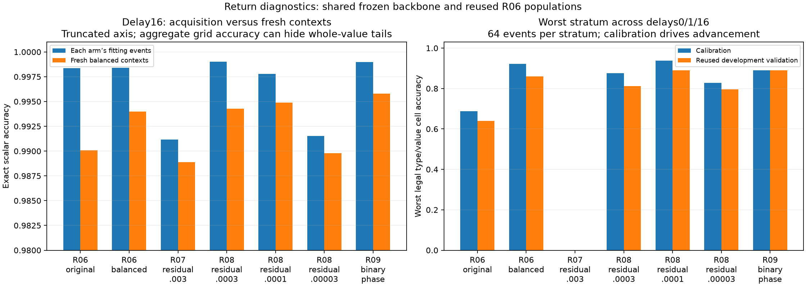

# Return interfaces: confirmed restricted competence and unresolved exact boundaries

The campaign established two useful restricted interfaces: a learned exact-value readout on the registered return mixture (R04), and a learned consumer that uses those returned-value scores for a binary comparison (R05). It did not establish uniformly reliable reconstruction across every legal value/type stratum. Subsequent diagnostics localized sensitivity to fitting diversity, optimizer settings, and consumer phase without producing a robust uniform-value repair.

The confirmed R04/R05 checkpoints remain frozen for C01. R06–R09 are exploratory diagnostics and do not replace them. No return training job is active; no further decoder experiment is scheduled by this track.

## Claims and evidence

| Question | Evidence | Supported conclusion and limit |
|---|---|---|
| Can a fresh consumer recover values from a frozen wide workspace? | R01 development looked strong, but backbone11 confirmation failed at delay16: 1000/1024 in both distractor conditions. | Readout acquisition is feasible; the first selected recipe did not meet its complete contract. |
| Does fitting diversity help? | R02 fixed900-update fits with4096/8192/16384 events reached worst development accuracy2004/2014/2019 of2048. R03 extra1800/3600 exposure improved fitting but did not improve the calibration-selected recipe. | Broader nuisance coverage helped this interface more consistently than extra passes through that particular pool. This is not a general scaling law. |
| Does the16k recipe survive fresh events and three historical backbones? | R04 minimum validation counts4079/4038/4049 of4096; all36 covered scalar cells pass≥98%. | **Restricted original-mixture scalar contract passes**, at delays0–16 and two distractor counts. Backbone seeds10/11/12 are historical, not three newly trained unseen initializations. |
| Is the R04 pass uniform across values? | Backbone12 misclassified all64 float-zero ingestion examples in the balanced diagnostic. Delay16 balanced float counts2095/2025/2091 of2112. | **No uniform-value pass.** Aggregate accuracy can conceal a whole legal class. Historical failed gates remain unchanged. |
| Can a new neural consumer causally use returned values? | R05 minimum validation4080/4081/4076 of4096; all36 cells pass≥98%. Dropped returns reduce original-answer accuracy19.87–32.62 percentage points; wrong/swapped controls follow supplied facts on the changed-answer subset. | **Restricted learned scalar-consumer contract passes.** This is a finite-domain score consumer after an oracle first return, not autonomous recurrent orchestration. |
| Does R05 success imply exact reconstruction? | At test16, accessor mistakes15/67/14; binary answers remain correct on15/65/14 of those mistakes. | No. Threshold decisions often tolerate a neighboring wrong scalar. Near-threshold and balanced conditions remain weaker. |
| Does balanced fitting repair tails? | R06 worst grid calibration44→59/64 and validation41→55/64; original-mixture minimum4076→4088/4096. | Useful development improvement from an explicitly supplied sampling prior. Both fresh control and balanced fits already recover float zero, so balancing cannot receive credit for that particular repair. |
| Does more decoder capacity solve the problem? | R07 residual MLP worsened fitting and fresh outcomes; worst grid0/64. R08 lower rates remove that collapse; selected.0001 reaches calibration60 versus59/64 and validation57 versus55/64. | Optimizer sensitivity is substantial. The remaining nonlinear advantage is small, exploratory, and not confirmed. |
| Does an ingestion/recurrent phase contract solve the tail? | R09 calibration grid59→57/64 fails advancement, although validation55→57 and mixture4088→4090/4096 improve slightly. | Binary phase conditioning has mixed effects; it does not establish a general repair. |

## What is supplied and what is learned

The public event contains exact value, type, primitive, ordered identities and provenance. The fixed Stage11 backbone supplies a1024-wide, six-row workspace with six persistent facet-memory tokens. Training and evaluation retain exact primitive witnesses and immutable event identities. Runtime arithmetic is not relearned or scored as neural reasoning here.

The scalar interface learns a33-class readout over half-unit values from−8 through8. R04 learns from workspace features; it does not copy the exact value into its output. R05 consumes33 learned score probabilities plus a public threshold/polarity query through a separate35→1024→2 MLP. The learned path never receives the gold scalar. Exact-value and query-only consumers are labeled controls. The task remains compatible with learning a finite33×33×2 decision table; unseen numerical-range generalization is not tested.

R06 supplies balanced legal type/value training frequencies. R09 supplies a public zero-versus-positive-delay selector. Neither is a learned discovery. The larger residual consumer changes capacity and optimization geometry; equal sampled rows do not make its FLOPs or parameter count equal to a linear head.

## Mixture accuracy and exact boundaries

The primary generator mixes40% integer,40% float,20% Boolean returns. The separately balanced diagnostic gives64 fresh nuisance instances to each of52 legal type/value pairs. It changes prevalence, not program semantics; witnesses remain exact. These populations answer different questions and must not be pooled into a uniform-value claim.

At delay16 on the same balanced validation events, scalar errors are20 for R06 balanced linear,37 for R07 residual.003,17 for R08 selected.0001, and14 for R09 phase linear. **Every error in each of these four cells is a neighboring half-unit value.** For R09, the remaining errors include six−7.5→−8, one−7.5→−7, and three−8→−7.5 cases. Low absolute error therefore coexists with failed exact-value strata; it is not a substitute for exact reconstruction.

These counts localize the boundary problem but do not establish its mechanism. A consumer may lack sufficient fitting coverage, have an unsuitable decision boundary, or receive overlapping late-state features. The current diagnostics do not prove information absence. Worst-cell comparisons based on64 examples are also noisy and multiply selected across strata. R08's one-example calibration gain and two-example validation gain are not grounds for a superiority claim.

The figure uses the same R06 development populations for all plotted diagnostics. The original-mixture control is scored on its own fitting pool; the other fitting bars use the balanced pool. These are paired reused observations, not independent replications. All fields, joint counts and scalar-error distances are retained in the [machine-readable comparison](../../../results/campaign-01/returns/synthesis/comparison.json).

## Learning and search record

| Experiment | Explicit search or comparison |
|---|---|
| R01 | Four ridge regularizations and11 CE checkpoints including initialization; selected.01 and900 updates. Fresh three-backbone confirmation failed. |
| R02 | Three nested fitting-pool sizes at fixed900 updates; failing backbone11 was deliberately selected for diagnosis. |
| R03 | One replayed16k trajectory at900/1800/3600 endpoints; calibration retained900. |
| R04 | Frozen4096 versus16384 fitting recipes, three paired historical backbones, fresh populations; no confirmation tuning. |
| R05 | Three consumer arms, six checkpoints each in development; fixed confirmation endpoints learned/oracle2000 and query-only1000. Final optimizer exposure differs and is disclosed. |
| R06 | Two fitting populations, same900 updates; one selected historical backbone12. |
| R07 | One new residual-capacity recipe plus exact linear replay, fixed900. |
| R08 | Three smaller learning rates with fixed900 endpoints; frozen original-rate and linear references. Calibration selects.0001. |
| R09 | One binary-phase consumer plus exact shared replay, fixed900. |

All unsuccessful recipes remain reported. R06–R09 reuse development data and cannot be treated as fresh confirmations. The cumulative campaign selection history matters: there is no claim of an unsearched single-shot improvement.

[Every R08 fitting/calibration curve](../../../results/campaign-01/returns/r08-development/optimizer-curves.png) and [every endpoint's grid minimum](../../../results/campaign-01/returns/r08-development/optimizer-grid-minima.png) remain visible, alongside the [R02 diversity report](R02-report.md), [R03 exposure report](R03-report.md), [R04 confirmation](R04-report.md), and [R05 confirmation](R05-confirmation-report.md). Reports link raw predictions, event support, source/config/state hashes, and process receipts.

## Compute and provenance

External process occupancy, including initialization, feature extraction, fitting, evaluation and export, totals **1,356.67 seconds (22.61 minutes)** across this return track. CPU audits/plots and inherited Stage9/11 training are excluded from that campaign occupancy. Profile/main segments are separately recorded in the registry; no paid compute or dependency upgrade was used.

The inherited selected backbone was originally trained for32,000 event presentations in Stage9 and continued for32,000 in Stage11. Its wide continuation consumed164,896 recurrent-example microsteps. R04's selected readout adds230,400 optimizer rows from16,384 events at six delays. R05's learned consumer adds512,000 presentations from8192 events at six delays. Full-study process costs include other arms and extraction; they must not be passed off as pure selected-checkpoint training costs or omitted from comparisons with newly initialized controls.

Each reported main confirmation preserves three historical backbone seeds and fresh fitting/evaluation populations. Width remains1024. Coefficient/cache replay independently verifies the learned paths. R01–R09 raw/provenance audits are complete. R09 audits c3a01f8 and 9e7884f verify all84 raw and84 cached CPU cells, shared-head replay, paired sampling and hashes. No independent audit changes the scope of an experimental claim.

## Next questions, not scheduled recipes

A future preregistered study could distinguish substantially larger balanced fitting diversity from an objective that explicitly treats neighboring numeric boundaries. Either would need new calibration/confirmation populations, adequate support per value/type, unchanged original-mixture evaluation, and a strong retained linear reference. A numerical-boundary objective would introduce a different prior and must be labeled accordingly.

Do not add another decoder merely to chase a worst-cell threshold. The present useful frontier is the confirmed restricted R04/R05 interface plus an explicit inventory of its exact-value limitations. C01 continues with those immutable interfaces; no exploratory return head is substituted into it.
