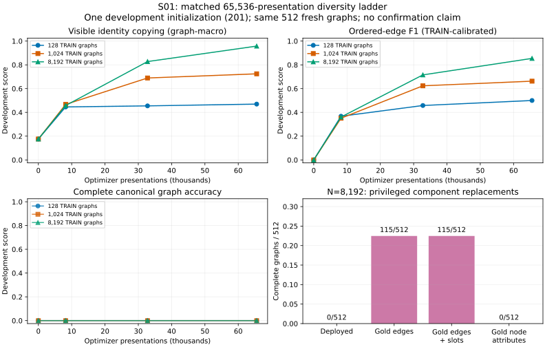

# S01 development: semantic diversity and acquisition

The matched-exposure ladder is in progress. This is development evidence from one initialization, not a confirmation result. No reserved-confirmation prediction has been made.

## Data and contracts

The unchanged unification generator produced9,728 alpha-distinct constructions from9,954 candidates (226 duplicates), split8192 TRAIN /512 development /1024 reserved confirmation. Nested TRAIN128/1024/8192 prefixes share the same development split. The lossless compact cache was checked against the inherited compiler targets on every construction. A separate audit compares complete canonical target signatures, not just alpha keys: all9,728 public inputs are distinct and no incompatible public-target mapping was observed. This finite audit does not prove global identifiability.

All examples use the known English renderer,28 observed lexical token types,30–37 graph nodes and54 or64 public tokens. Finite non-copy labels remain the supplied ontology constants parent/unify/null. Entity identities must be copied from the public input. Canonical targets interleave occurrence-specific identifier nodes and shared entity nodes introduced at first mention, so canonical output positions depend on visible alias patterns. The task includes learning that allocation convention; failure does not establish a general limitation of neural recurrence.

Every actor has57,853,781 parameters, workspace width1024, eight workspace rows, four blocks reused twice and128 node queries. Inputs are public text/copy inventory only. Each development arm receives65,536 optimizer presentations with the same initialization201, optimizer/objectives and first128 TRAIN calibration subset. Node presence and edge decoding remain predicted. Frequency controls are trained separately on each arm's entire prefix and use no text features; fixed canonical output-position/copy-index priors remain.

## Completed arm:128 unique TRAIN constructions

| Presentations | Visits/graph | TRAIN exact raw/cal | TRAIN copy | TRAIN typed-edge F1 raw/cal | DEV exact raw/cal | DEV copy | DEV typed-edge F1 raw/cal | DEV ordered-edge F1 calibrated |
|---|---|---|---|---|---|---|---|---|
| 0 | 0 | 0/128 /0/128 | .1730 | .0011 /.0000 | 0/512 /0/512 | .1760 | .0011 /.0000 | .0000 |
| 8192 | 64 | 0/128 /0/128 | .7439 | .2980 /.6286 | 0/512 /0/512 | .4459 | .2738 /.5743 | .3676 |
| 32768 | 256 | 0/128 /0/128 | .9939 | .6272 /.8497 | 0/512 /0/512 | .4547 | .4878 /.6010 | .4580 |
| 65536 | 512 | 0/128 /0/128 | 1.0000 | .7216 /.8907 | 0/512 /0/512 | .4697 | .5450 /.6281 | .5001 |

Final TRAIN node presence, node type, finite values and exact identity copies are all perfect:4357/4357 nodes/types,3264/3264 copies and1093/1093 categorical values. Yet complete recovery is zero. A privileged archived intervention replacing only predicted edges with gold yields126/128 complete graphs under both decoders; two graphs retain slot errors. Replacing any other single field leaves zero. This localizes the fixed-set acquisition deficit mainly to edges, without claiming that an edge head can already learn the required mapping.

Development errors remain broad:417/512 graphs have exactly correct node presence;13367/17337 node types and6074/12972 copies are correct. No graph has all copies correct. All single-component replacement ceilings, including jointly replacing all node attributes, remain0/512. Train calibration improves edge component F1 but does not solve semantic transfer. The128-prefix frequency control also has0/512 complete graphs and mean copy accuracy.3784.

All128 constructions were visited exactly512 times, totalling3,892,224 optimizer tokens. Measured optimizer time487.10 seconds differs from complete external process occupancy603.831 seconds, which includes imports, cache preparation, calibration, all exports and process exit. PeakCUDA allocation1,225,695,232 bytes; process RSS high-water3,572,004 KiB. Source2c7e987, external launcherfef09e9. Raw checkpoints remain immutable remotely; compressed calibration arrays, raw predicted/target graphs, curves, hashes and occupancy receipt are committed.

## Next decision

Complete the prespecified1024/8192 matched-exposure arms before choosing an extension or frontend comparison. The last N128 interval improves ordered-edge F1 but not complete graphs; it is not evidence that more128-example repetitions are preferable to diversity. Initial data support and field-specific localization justify continuing the ladder. No architecture change, confidence policy, runtime composition or confirmation claim follows from this arm.

CPU residual-edge localization on the final N128 TRAIN archive finds most calibrated errors in `argument` (595 false positives,718 false negatives) and `refers_to` (347 false positives,426 false negatives). Raw decoding instead overpredicts heavily:3,925 argument and3,180 refers-to false positives. Threshold calibration substantially reduces false positives but leaves both ranking/association errors. Counts by predicted/gold endpoint kind are retained in `edge-errors-u8192.json`; no inference schema mask is introduced. This supports the separately registered S02 frozen learned-node readout diagnostic, not a claim that calibration alone fixes graph acquisition.

## Second matched-exposure arm:1,024 constructions

The second arm completed65,536 presentations (64visits per construction), same initialization hash and first128 TRAIN calibration examples. Full external occupancy646.974s; training489.891s; peakCUDA1,225,695,232bytes; processRSS3,526,128KiB. Width1024 and57,853,781parameters unchanged. Corpus diversity differs; epochs deliberately differ under the matched-presentation design.

| Presentations | N128 DEVcopy | N1024 DEVcopy | N128 DEVcalibrated orderedF1 | N1024 DEVcalibrated orderedF1 |
|---:|---:|---:|---:|---:|
|8,192|.44585|.46729|.36761|.35098|
|32,768|.45473|.68934|.45800|.62365|
|65,536|.46973|.72444|.50009|.66262|

All cells remain0/512 complete development graphs. At the final N1024 checkpoint, calibrated typed-edgeF1=.72231 versus N128=.62806. TRAIN128 diagnostic copy=.97485 and calibrated typed/orderedF1=.81246/.75439; complete graphs0/128. This TRAIN sample is a shared diagnostic subset, not all1,024 training graphs.

Final development node presence is exact506/512, with17,341 predicted versus17,337 gold nodes; kind15,207/17,337, copy9,345/12,972, values4,363/4,365. Only2/512 have every copied identity correct. Thus stronger average edge/copy performance has not produced complete canonical recovery. This is encouraging evidence for data diversity under fixed exposure, not semantic-transfer competence. The prespecified8,192-construction arm remains pending; no frontend change or confirmation-set inference follows from this intermediate comparison.

Endpoint-kind breakdown further narrows N128 TRAIN failures: calibrated argument FP403/FN718 occur between legitimate `pred→ident` kinds; refers-to FP253/FN426 between legitimate `ident→entity` kinds. Some invalid-kind false positives coexist, but a type-only mask would leave major association errors. This is a posthoc count diagnostic, not a tested mask intervention.

## Completed matched-diversity ladder

The8,192-construction arm completed65,536presentations (8visits each),3,872,144optimizer tokens,496.955soptimizer time and665.953sfull occupancy. All three initialization hashes match exactly. Its final DEVcopy=.95768, calibrated typed/orderedF1=.83892/.85424; TRAIN128 diagnostic copy=.96101 and F1=.84073/.85346. All final raw/calibrated completegraph counts remain0.

| TRAIN diversity | Presentations | Visits/graph | DEVcopy | DEVtypedF1(cal) | DEVorderedF1(cal) | DEVcomplete |
|---:|---:|---:|---:|---:|---:|---:|
|128|65,536|512|.46973|.62806|.50009|0/512|
|1,024|65,536|64|.72444|.72231|.66262|0/512|
|8,192|65,536|8|.95768|.83892|.85424|0/512|

At32,768presentations the8,192arm already reachedDEVcopy.82755/orderedF1.71544, so its final interval improves these by.13013/.13880. This meets the prespecified exposure-extension criterion. The selected next experiment should preserve this optimizer trajectory and increase exposure, rather than attribute residual errors to an underpowered frontend before acquisition plateaus. No reserved confirmation outcome has been inspected.

Final8,192-arm DEVpresence is exact511/512, kind16,738/17,337 (205complete sequences), copy12,399/12,972 (214complete sequences), and values4,365/4,365. Remaining exact-graph failure cannot be inferred from averageF1 alone. The data show useful fresh component acquisition under greater canonical diversity, while whole-graph competence remains unmet. This is one development initialization; paired confirmation of a selected claim remains required.

Aggregation note: summary copy accuracy is the mean of per-graph identity-copy accuracies, matching the frozen runner. Fieldwise numerator/denominator counts are pooled across graphs and need not equal that macro average. EdgeF1 is pooled from edge counts. No marginal accuracies are multiplied to infer joint correctness.

The independent replacement audit (`../review/S01-n8192-replacements.json`, review commit e20e787) finds that replacing predicted edges with gold raises fresh completegraphs from0/512 to115/512; replacing both edges and slots gives the same115/512. Replacing any other single component or all node attributes yields0/512. TRAIN128 corresponding ceilings are24/128 for gold edges and26/128 for gold edges+slots. These are privileged diagnostic ceilings, not deployable performance or proof that another component is learnable. They nevertheless show that exact node attributes/slots now jointly support complete recovery in a substantial subset when edges are supplied, unlike the smaller-diversity arms. Continued acquisition of the existing architecture is justified before a frontend replacement.

Plot generated by `src/topoformer/campaign_semantics_plot.py` with Matplotlib from immutable development curves and independently reconstructed replacement counts; no additional neural inference.
