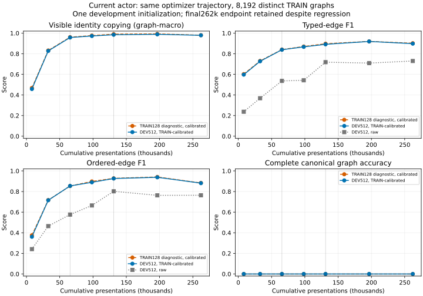

# S04: fixed-endpoint exposure continuation to262,144presentations

The final endpoint still reconstructs0/512complete development graphs, and several component metrics regress relative to the declared midpoint. Preserve that endpoint; neither the better midpoint nor the earlier S03model is substituted as this experiment's result. No further automatic exposure extension is authorized.

| Cumulative presentations | DEVcopy (graph-macro) | DEVtypedF1 raw/cal | DEVorderedF1 raw/cal | DEVexact raw/cal |
|---:|---:|---:|---:|---:|
|131,072|.98442|.71833/.89140|.80217/.92627|0/512,0/512|
|196,608|.98835|.70934/.91932|.76299/.93797|0/512,0/512|
|262,144|.97916|.72962/.89797|.76380/.88138|0/512,0/512|

Final TRAIN128 diagnostic copy=.98024, calibrated typed/orderedF1=.90227/.88337, complete0/128. Final DEVpresence511/512 exact, kind17,098/17,337 (357complete sequences), copy12,697/12,972 (376complete sequences), all4,365finite values correct. Marginal averages and complete-field counts can move differently; no independence or forgetting probability is inferred.

This is a nonmonotonic optimization curve under the fixed current-actor recipe, not proof that neural recurrence cannot represent the structure. The matched-diversity S01 result still shows major acquisition gains, and S03's earlier exposure gain remains valid. The endpoint now warrants a focused alternative to the text-access path rather than more unconstrained repetition. S06 is separately preregistered; it does not replace these outcomes or prove a bottleneck before comparison.

Source d743464 and frozen S04config b2b17c2 continued exactly from S03: initial raw/calibrated prediction/threshold replay matched, inherited AdamWsteps16,384, first resumed public instance indices and sampled-pair hashes matched cloned checkpoint state. Same8192TRAIN graphs,512DEV, current actor width1024,8workspace rows,57,853,781parameters, losses and calibration policy. No confirmation predictions.

This tranche added131,072presentations and989.09583optimizer seconds; full occupancy1242.52490seconds. Cumulative presentations262,144, visits32each, unique8192, optimizer tokens15,488,576. PeakCUDA1,224,941,568bytes; processRSS3,774,196KiB. Immutable checkpoint hashes and full raw/calibration/curves are under `research/results/campaign-01/semantics/s04-current-n8192-262k-dev201`. Independent reconstruction requested.

The plot preserves raw/calibrated decoding separately, plots the fixed final endpoint, and labels the TRAIN128diagnostic subset versus DEV512. Dotted vertical boundaries mark separately authorized continuation tranches; they do not represent optimizer restarts or independent seeds.
