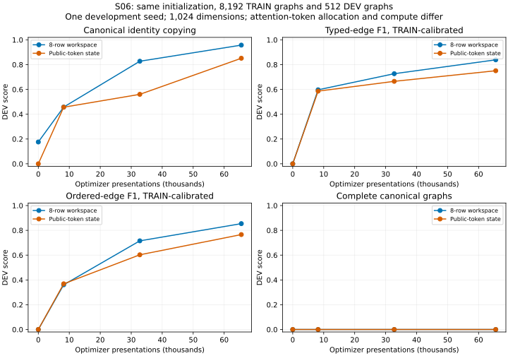

# S06: public-token recurrent state did not improve acquisition

At the declared 65,536-presentation endpoint, changing the original eight-row workspace to recurrent public-token states underperforms the matched S01 actor. Both reconstruct zero complete development graphs. This is one development initialization and one unchanged optimization recipe, not a general ranking of text encoders or a capacity impossibility claim.

| Endpoint, same TRAIN 8,192 / DEV 512 | Canonical copy | Typed F1 raw / calibrated | Ordered F1 raw / calibrated | Complete raw / calibrated |
|---|---:|---:|---:|---:|
| S01 eight-row workspace | .95768 | .53647 / .83892 | .57624 / .85424 | 0/512 / 0/512 |
| S06 public-token state | .85169 | .39932 / .75098 | .47932 / .76606 | 0/512 / 0/512 |

At 8,192 presentations the two paths are similar; at 32,768 S06 copy is .56048 versus .82756, and calibrated ordered F1 is .60282 versus .71544. The fixed final checkpoint is retained. There is no automatic exposure extension or selection of a better intermediate result.

## Localization

S06's final TRAIN diagnostic subset has zero complete graphs out of 128, copy .85819, and calibrated typed/ordered F1 .75436/.76599. DEV exact presence is 509/512. Node-type correctness is 15,958/17,337 (41 complete type sequences); identity copying is 11,006/12,972 (15 complete copy sequences); finite scalar labels are all 4,365 correct. These pooled counts and graph-macro copying are different statistics.

Replacing only all edge labels with gold recovers 1/512 complete DEV graphs, versus 115/512 in S01 at matched exposure. Other single-component replacements and replacement of all node attributes recover zero; TRAIN replacement ceilings are all zero. These privileged archived diagnostics localize overlapping errors, not deployable performance or proof that any component is impossible to learn.

Applying the predeclared, unchanged S05 equality contract to predicted presence/type/copied identities raises calibrated `refers_to` F1 from .27176 to .67587, but leaves complete DEV graphs at zero. Only 1/512 predicted reference sets becomes exact. Even gold reference edges alone recover no complete graphs. Thus this path's deficit is not solely the identity-reference bookkeeping relation. The programmed rule remains separate from learned primary metrics.

## Experimental contract and cost

Source `d6cb503`, main configuration freeze `13f43e3`: width 1,024; four unchanged blocks reused twice; public-state lengths 54 or 64 instead of eight learned workspace rows. Total parameters 57,853,781; active parameters 57,845,589 because the original eight initial rows remain allocated but unused. The common initial weight hash exactly matches S01. All graph heads, losses, training curriculum, data, seed 201, optimizer, and TRAIN-only calibration policy are unchanged. Public text is the only actor input. Gold sampled graph positions choose loss rows after latent computation.

The model sees 8,192 distinct constructions, eight presentations each, 3,872,144 optimizer tokens. Optimizer time is 547.46958 s; full process occupancy including evaluation/export is 697.93803 s, below the 900 s cap. Peak allocated CUDA memory is 1,225,826,304 bytes; maximum process RSS is 3,794,192 KiB. The earlier S01 optimizer/full times are 496.9547/665.9528 s. These are measured costs with different attention allocation, not a FLOP-matched comparison. Device capacity is unavailable from GB10's `nvidia-smi` memory field.

Raw predictions, TRAIN calibration scores/targets, field counts, failure localization, source/data/checkpoint hashes, and full occupancy receipt are in `research/results/campaign-01/semantics/s06-token-n8192-dev201`. The separate programmed-reference diagnostic is in `s06-token-identity-diagnostic`. Immutable checkpoints remain on the configured GB10 archive. Independent reconstruction has been requested.

## Scope of the next question

A CPU audit establishes that the existing copy objective intentionally sends every repeated identifier to its first visible occurrence. It teaches identity equality, while occurrence-specific ordered graph nodes remain distinct. That is a valid contract, not a demonstrated labeling error. In this narrow English corpus, canonical identifier occurrences match visible occurrence order in all 8,704 inspected TRAIN/DEV graphs. S07 separately tests occurrence-specific privileged copy supervision on the ORIGINAL actor; it does not combine the unsuccessful S06 path change.

The corpus contains 8,192 distinct TRAIN equality/reference patterns but only two ordered semantic-tree shapes, both also represented in DEV, all structural depth three. Fresh alpha-distinct constructions are therefore not unseen tree motifs or deeper programs. Neither this experiment nor S07 tests programmable attention directly; they investigate a supporting learned surface-to-graph interface. Reserved confirmation examples remain unevaluated.
