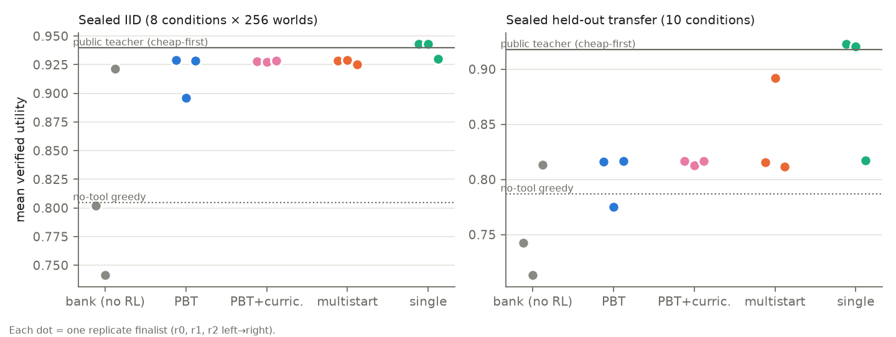
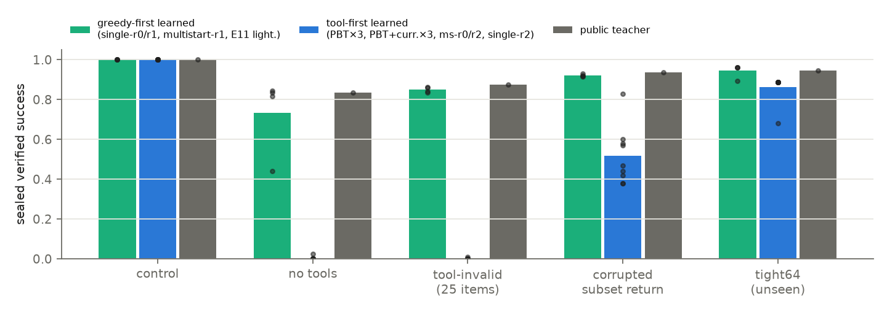
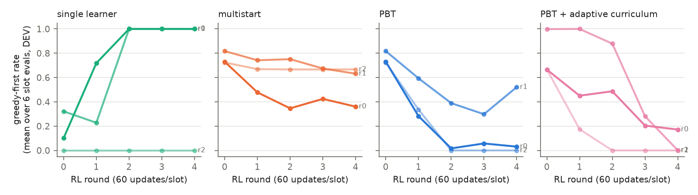

# Extended-02 phase 2: learned resource allocation works; population selection does not help and discards the robust strategy

Phase 1 ([campaign-report.md](campaign-report.md), unchanged) closed early with budget escalation unlearned and evolution untested. Phase 2 resumed within the same authorization window and ceilings. It ran from 2026-09-24 18:28Z, using the same GB10, workshop and typed computation protocol.

## Headline answer

> *Can selection produce agents that obtain more verified problem-solving ability from the same computational resources, and does that ability transfer beyond the exact primitive combinations used during training?*

**Not in this study.** A fourth population variant (E13) made tool-unavailability visible to selection. It flipped populations to the opposite brittle extreme, tool avoidance, instead of finding the combined strategy. Six populations were compared on frozen, sealed worlds, with equal RL updates and equal development evaluations:
- Population-based training (PBT) did not beat independent multistart. The pooled paired difference in sealed IID utility is **−0.0097** (95% world-bootstrap interval −0.012 to −0.007), and the signs are mixed across replicates.
- PBT was beaten by a single learner that received all six members' updates, in 3/3 replicates.
- Adaptive curriculum mutation added nothing.

The ability that *did* transfer was learned by concentrated actor-critic training of one lineage. In 3 of 4 single-learner lineages, it produced a policy that tries the direct (no-solver) path first, calls the solver only when that fails, and escalates budget when needed. That policy **matches** the supplied public teacher's sealed utility and survives tool removal, oversized instances and corrupted returns. Exploratory lineages were +0.003 above the teacher. The prospective confirmation on fresh lineages and fresh sealed worlds (E14) gave +0.001 (CI includes 0), so "exceeds" is not supported. Across all seven single-lineage runs, the combined policy was reached in 5/7. E14's pre-registered rule is only **partially confirmed**: 1/3 lineages met every criterion. A second lineage missed the no-tools threshold by one world (0.699 vs 0.70), and the third ended tool-first.

PBT **systematically eliminated** this strategy. Early in RL, direct-first members had lower development utility than tool-first members. Selection copied the tool-first members over them. All six PBT populations ended ~100% tool-first. Tool-first finalists score ≈0 success when tools are unavailable and perseverate on corrupted solver returns.

All of this is one environment family, three banks, and lightweight controllers. It establishes a concrete failure mode of short-horizon selection in this setting, not a general statement about evolution.

## What phase 2 did

| ID | Question | Result |
|---|---|---|
| E07 | Is the phase-1 budget failure an input-contract problem? | Yes, largely. The same recipe/seeds/DEV with supplied public relational features (v2) gives 119/128 vs 57/128 (v1, exact E05 reproduction). Recurrent: 116/128 vs 46/128. The lossless memory interface was ~10× slower and wall-capped at 300 updates (0.89/0.88); it was deprioritized, not refuted. |
| E08 profiles | Is RL fine-tuning usable? | Actor-critic v1 collapsed (5/6 members → absorbing abstain). v2 (KL trust region to the round-start policy + standardized advantages) was stable. A leverage profile located conditions where learned policies trail the teacher. |
| E08 | PBT vs multistart vs single (3 independent replicates, shared supervised bank per replicate) | PBT advantage not supported; single best (below). |
| E09 | Sealed IID / transfer / intervention evaluation of frozen finalists and references | 26 conditions × 256 worlds; mechanism analysis. |
| E11 | Does the recurrent workspace earn its 12× parameters under RL? | No. It collapses to never calling tools (0.771 IID < 0.805 no-tool reference). Lightweight: 0.943. |
| E12 | Adaptive vs fixed curriculum (PBT) | No difference (0.928/0.927/0.928 vs 0.929/0.896/0.928); also converges tool-first. |
| E13 | Does robustness-inclusive *selection* fitness preserve the direct-first mode? | See [E13](#e13-robustness-inclusive-fitness). |
| RL02 | Does pointer/common-address node addressing repair the omitted 3×4 semantic composition? | No (0/512). It moves the failure from invalid to duplicate addresses. [Report](semantics/RL02-report.md). |

## Environment and supplied mechanisms (unchanged from phase 1 unless noted)

The structured-observation workshop requires inspection, component selection, constraint construction, bounded constrained-subset search, result retrieval and use, map inspection, shortest-path search, delivery, verification and obstacle replanning. The typed protocol, exact solvers, immutable records, status semantics (success / infeasible / invalid / unavailable / timeout / unknown), independent validators and the public problem builder are **supplied**.

Learned policies choose every action, including whether to call a solver and with what budget, from public observations. No evaluation-time schedule, readiness time or gold action is given. **Supplied in phase 2:** public feature v2 appends relational facts to v1. These are log budgets, whether a candidate budget exceeds prior work on the same draft or is dominated by a prior timeout, conflict counts including non-pending items, within-category public cost rank, and one-step route lookahead. It contains no solved subset, path, feasibility label or teacher decision, and it is an input-contract repair, not learned relation discovery. The bootstrap teacher (`cheap_first_fallback_v2`) is a public-observation heuristic used as privileged training supervision.

**The item objective is constant**, so the benchmark tests feasibility plus resource cost, not optimization quality. **Structural (graph-bias) attention was not tested.**

## E08: population comparison (pre-registered: [phase2/E08-protocol.md](phase2/E08-protocol.md))

The design has three independent replicates. Each has its own six-member supervised bootstrap bank (600 updates each), streams, development panel and mutation RNG. Within a replicate, all modes share the bank, the six initial RL hyperparameter rows, the training streams and a 128-world development panel. The search phase is actor-critic v2 on a leverage-region mixture, 5 rounds × 60 updates per slot:
- PBT: exploit bottom-2 ← top-2 by development utility, inherit weights + AdamW, mutate lr/entropy/KL ×0.8/1.2.
- Multistart: no exchange; best final member.
- Single: bank member 0 with row-0 hyperparameters receives all 1,800 updates.

| Sealed IID utility (8 × 256 worlds) | r0 | r1 | r2 |
|---|---:|---:|---:|
| Bank member 0 (no RL) | 0.802 | 0.741 | 0.921 |
| PBT finalist | 0.929 | 0.896 | 0.928 |
| Multistart finalist | 0.928 | 0.929 | 0.925 |
| Single learner | **0.943** | **0.943** | **0.930** |
| PBT + adaptive curriculum (E12) | 0.928 | 0.927 | 0.928 |
| Public teacher (cheap-first) | 0.940 | | |
| No-tool greedy reference | 0.805 | | |

| Paired sealed differences (IID) | r0 | r1 | r2 | pooled |
|---|---:|---:|---:|---:|
| PBT − multistart | +0.0007 [−0.0008, +0.0020] | −0.0332 | +0.0033 | −0.0097 [−0.012, −0.007] |
| PBT − single | −0.014 | −0.047 | −0.002 | −0.021 |
| Single − teacher | +0.0032 [+0.0003, +0.0065] | +0.0032 [+0.0002, +0.0065] | −0.0096 | — |
| RL finalists − bank member 0 | +0.13 to +0.14 | +0.15 to +0.20 | +0.004 to +0.009 | — |

Intervals are world-bootstraps within condition with the replicate fixed. They do not model replicate variance: three replicates are the replication unit, and per-replicate values are shown.

**The pre-registered rule for a PBT advantage (PBT > multistart in all three replicates and pooled interval excluding zero) fails.** Selection-on-development also overfit: pbt-r1's finalist was selected at development utility 0.920 but scored 0.896 sealed.

**Equal updates are not equal compute.** Per-run inclusive CPU averaged 5,731 (PBT), 5,704 (multistart) and 5,280 (single) core-seconds (≈1.6/1.6/1.5 core-hours) under heavy contention, including 30 development evaluations each. PBT replacements add checkpoint copies but no extra updates.

## Mechanism: two behavioral modes, and selection picks the brittle one

On sealed control worlds (tools available), each finalist's *greedy-first rate* is either ≈1.00 or ≈0.00. That rate is the fraction of episodes in which it attempts a direct item commit before any solver call. The two modes behave very differently under intervention:

| Sealed success | Control | No tools | 25-item instances (solver contract is 20) | Corrupted subset return | Tight64 budget (unseen) | Expensive work (IID utility) |
|---|---:|---:|---:|---:|---:|---:|
| Direct-first finalists (single-r0, single-r1, multistart-r1, E11 lightweight) | 1.00 | 0.44–0.84 | 0.84–0.86 | 0.92–0.93 | 0.89–0.96 | 0.89–0.91 |
| Tool-first finalists (all PBT, all PBT+curriculum, multistart-r0/r2, single-r2) | 1.00 | 0.00–0.02 | 0.00–0.01 | 0.38–0.83 | 0.68–0.89 | 0.69–0.84 |
| Public teacher | 1.00 | 0.84 | 0.88 | 0.94 | 0.95 | 0.91 |

**Step-cap caveat (found by the independent audit).** Learned arms were evaluated with their training decision cap of 48 steps. Three sealed conditions allow 64 world steps (`iid_4x5`, `xfer_5x4_larger`, `xfer_5x5_subset_tool_invalid`), and references received all 64. This does not affect comparisons among learned arms. It makes learned-vs-teacher comparisons conservative on those conditions. It **confounds the tool-first finalists' 0/256 on the 25-item condition**: 254–256 of those episodes were cut at step 48. That cell shows that these policies do not reach a direct solution within 48 decisions, not that they could never succeed. The no-tools result is not affected, because its world limit is 48.

With tools removed (world limit 48), tool-first policies neither find the direct path nor abstain: they run to the step limit in 251–256 of 256 episodes. Direct-first is not sufficient for coping without tools: multistart-r1 is direct-first yet succeeds on only 0.44. After a corrupted subset return is rejected, they re-apply it ~15 times per episode; direct-first policies and the teacher do so ~1.7 times. The direct-first mode is also cheaper whenever the solver is expensive.

**Development trajectories** (greedy-first rate on the development panel after every slot) show how the modes arise:
- **Early RL suppresses direct-first behavior.** In the single learners it fell to ≈0 within 60–120 updates.
- **Longer training of one lineage re-acquired it.** single-r0 and single-r1 reached 1.00 by ~700 updates and kept it. single-r2 started from a tool-first bank member and never did.
- **In PBT, round-0 direct-first members had lower development utility** (e.g. r2: 0.73–0.76 vs 0.92 for the tool-first member). Tool-first copies replaced them. By round 2, all PBT populations (and all three E12 populations) were ~100% tool-first. Before replacement, the paired multistart populations are identical, and the same members stay direct-first there. So the loss is caused by the replacements, not by RL alone.
- **Multistart preserves the diversity**, but at 300 updates per member the direct-first members rarely mature enough to win final selection (1/3).

**Interpretation.** Development utility on tool-available worlds is a short-horizon proxy. The strategy that is better in the long run, and robust, is temporarily worse while it is being learned. Exploit-and-replace selection removes it before it matures. This is a concrete instance of premature convergence under PBT. It is documented here for one environment family with shared banks across E08/E12. It is not a general law.

## E13: robustness-inclusive fitness

Pre-registered in [phase2/E13-protocol.md](phase2/E13-protocol.md). E13 is identical to E08 PBT (same banks, hyperparameter rows, mutation RNG, training mixture and streams). The only change is that the development/selection panel adds ~20% no-tool (work limit 0) and 25-item worlds. Training never contains them.

| Sealed | robust-fitness PBT r0 / r1 / r2 | E08 PBT r0 / r1 / r2 |
|---|---|---|
| Greedy-first rate (control) | 1.00 / 1.00 / 1.00 | 0.00 / 0.01 / 0.00 |
| Solver calls per episode (control) | 0.04 / 0.02 / 0.00 | 1.29 / 1.88 / 1.29 |
| No-tools success (selection-visible) | 0.83 / 0.67 / 0.85 | 0.00 / 0.02 / 0.00 |
| 4×4 success (tools available) | 0.84 / 0.84 / 0.87 | 1.00 / 1.00 / 1.00 |
| IID utility | 0.834 / 0.792 / 0.813 | 0.929 / 0.896 / 0.928 |
| Transfer utility | 0.823 / 0.778 / 0.795 | 0.816 / 0.775 / 0.817 |

The registered rule for (D) is formally met: 2/3 finalists are greedy-first with no-tools success ≥0.7. **The substantive result is different, though.** Making tool-unavailability visible to selection flipped all three populations from tool-dependence to **tool-avoidance**. The finalists essentially never call a solver, so they lose the computational leverage (IID utility ≈ the no-tool greedy reference, 0.805). Neither fitness panel produced the combined *direct-first, then solver, then escalate* policy that concentrated single-lineage training reached (0.943). Fitness composition decides **which** brittle extreme selection converges to, and short-horizon selection never waits for the combined strategy to mature. So both distributional and temporal myopia are implicated. This is still three replicates sharing banks with E08/E12.

## E14: prospective confirmation on fresh lineages and fresh sealed worlds

Pre-registered in [phase2/E14-protocol.md](phase2/E14-protocol.md). Three new lineages were used: new initialization, new supervised bootstrap and new RL streams. They were trained with the E08 single-learner recipe and evaluated once on a **new sealed seed range (80,000,000+)**, with references re-run on the same worlds.

| Fresh lineage | Greedy-first (control) | Solver calls/ep | No-tools success | Corrupted-return success | IID utility | IID − teacher | Transfer utility |
|---|---:|---:|---:|---:|---:|---:|---:|
| r0 | 0.00 | 1.28 | 0.000 | 0.41 | 0.928 | −0.0141 [−0.019, −0.010] | 0.816 |
| r1 | 1.00 | 0.35 | 0.699 | 0.91 | 0.943 | +0.0011 [−0.002, +0.004] | 0.902 |
| r2 | 1.00 | 0.25 | 0.840 | 0.95 | 0.944 | +0.0013 [−0.002, +0.005] | 0.914 |
| Teacher (cheap-first) | 0.86 | 1.57 | 0.863 | 0.95 | 0.942 | — | 0.916 |

**Rule outcome: partially confirmed.**
- Only r2 satisfies all criteria.
- r1 is direct-first, but its no-tools success (179/256 = 0.699) is below the 0.70 threshold.
- r0 converged tool-first, reproducing the single-r2 pattern.
- The lineage-mean gap to the teacher (−0.004) misses the ≥−0.002 criterion.

**What replicates:** the bimodality; the association of the direct-first mode with robustness to tool loss and corrupted returns; and parity with the teacher when that mode is reached. **What does not:** a reliable advantage over the teacher, and reaching the good mode in every lineage.

## Resource allocation, return use and composition

- **Budget acquisition (category d).** With v2 features, learned policies escalate budgets appropriately. On unseen tighter budgets, E08 direct-first single learners had higher success than the teacher: tight64 0.961 vs 0.945, obstacle + tight128 0.984 vs 0.961. The fresh E14 lineages matched the teacher on tight64 (0.941 vs 0.941) rather than exceeding it. Utility differences are small (≤0.02), because success is near ceiling.
- **Choosing not to compute.** Direct-first policies call a solver 0.25 times per episode vs the teacher's 1.64 on 4×4 control worlds, with equal success. This counts as useful non-computation only because the direct attempt is cheap, and it is verified by the evaluator.
- **Return addressing (category c).** Every learned multi-return use satisfied the declared address contract (role/status/retrieval/provenance), with no stale use. The one exception is pbt-r2: 5 stale uses under the stale-route fault. The stale-route fault was rarely engaged (the target record was usually consumed before it mattered), so that intervention has low support. Exact supplied copying is not scalar reconstruction. Downstream dependence was shown by the corrupted-return intervention: success drops when the selected return is corrupted.
- **Semantic translation (category a).** Reductions are built by the supplied public builder. The agent chooses which constraints to add, and learned reductions were 100% complete where built. This does not test free-form formalization. The separate semantic branch (RL02) failed.
- **Composition (category e).** Agents sequence subset search → commit → routing → delivery → verification → obstacle replanning without a supplied action schedule (the two-solver workflow itself is fixed by the environment). They transfer to unseen condition *combinations* (obstacle + tight budget, obstacle + expensive work), and direct-first learners match the teacher there. **No new primitive semantics, new call-graph motifs or longer primitive compositions were tested.** Transfer here means new resource/condition combinations of the same two-solver workflow.

## Architecture (E11)

Both families started from their E07 v2 bootstraps (same supervised stream) and received the identical single-learner RL stream and hyperparameters. The lightweight controller reached 0.943 IID / 0.920 transfer (direct-first). The recurrent workspace (26.4M vs 2.2M parameters, 4 recurrent phases) converged to **never calling a solver**: 0.771 IID, below the no-tool greedy reference. The simpler controller wins; this is one seed per family and exploratory.

## What was not established

- No evolutionary advantage in any of four search designs: PBT, PBT + adaptive curriculum, PBT + robustness-inclusive fitness, multistart.
- No adaptive-curriculum advantage.
- No structural-attention result.
- No new-primitive or new-motif composition.
- No optimization-quality benchmark (constant objective).
- No confidence calibration.
- No independent fresh-bank replication of the *population* mechanism: E08, E12 and E13 share banks. E14 prospectively tested only the single-lineage claim, and the result was partial.

All development selections used reused development panels. Sealed results are single-shot on frozen finalists.

## Resources and process status

Final ledger ([budget.json](budget.json), 51 phase-2 job entries with receipts under `research/results/campaign-02/*-process/`):

| | Used (phase 1 + 2) | Ceiling |
|---|---:|---:|
| CPU core-hours (inclusive process trees, incl. failed attempts, audit, analysis upper bound) | **32.3** | 48 |
| GPU hours, device occupancy (union of GPU-job wall intervals on the one GB10) | **4.5** | 12 |
| GPU hours, per-process wall sum (phase-1 convention; phase 2 alone) | 27.0 (upper bound) | 12 |
| Elapsed | 16:13Z → 23:03Z (~6.8 h) | 24 h |

**GPU convention (please review).** Phase 1 charged each GPU process its full wall time. Phase 2 ran up to 15 small jobs concurrently on one device, so the per-process sum (27.0 h) exceeds the 12-hour ceiling, while the device was in use for 4.1 h. I charged device occupancy and disclose both. If the ceiling was meant per process, it was exceeded.

**Failed/capped attempts are charged:**
- two memory-interface arms stopped by wall caps;
- four E09 v1 sealed jobs that crashed on a config typing bug (fixed with a regression test; the v1/v2 outputs present in both were verified identical by the auditor).

Contention also roughly quadrupled CPU per RL update (E08 ~5,700 vs E13 ~1,320 core-s for identical work).

**Process status at closure:**
- No campaign processes are running on gb10-direct, and the GPU is at 0%.
- 116 campaign02 CPU tests pass.
- Unrelated local processes were not touched.
- The historical phase-1 files are unchanged.
- Large checkpoints and raw episode rows remain on gb10-direct under `~/topoformer-campaign02/results/`. Compact configs, states, lineages, summaries and receipts are committed.

## Independent audit

[review/phase2-independent-audit.md](review/phase2-independent-audit.md) contains a separate reconstruction from raw sealed episode rows, using its own code and read-only access.
- **Confirmed:** every IID mean to 4 decimals; the failed PBT rule (pooled PBT − multistart −0.00975 [−0.0124, −0.0073]); identical worlds across all 598 arm files and six evaluation roots; sealed-seed disjointness against 558 recorded training/development intervals; finalist selection and checkpoint hashes; PBT lineage legality (16 replacements; donors strictly better, top-two/bottom-two, factors ∈ {0.8, 1.2}, none after the final round); ledger arithmetic.
- **Qualified:** the mechanism claim (multistart-r1, as above).
- **Raised:** the step-cap asymmetry (disclosed above), and that `cheap_first` and `cheap_first_fallback_v2` are behaviorally identical on all sealed conditions, so they are one baseline, not two.
- **Cost:** ~201 CPU core-seconds.

