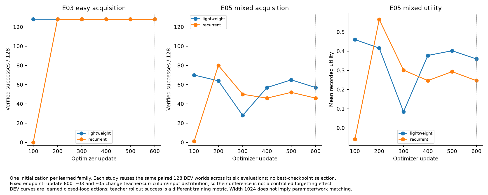
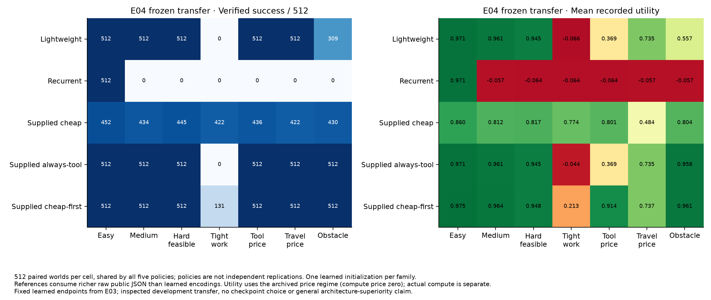
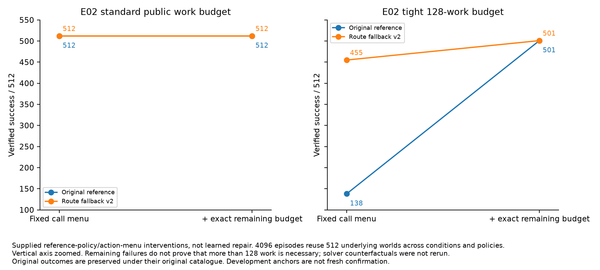

# Extended-02: learned sequences, unresolved resource allocation

Closed early at the user’s request to conserve credits. This campaign built a bounded workshop and computation protocol, acquired easy unscheduled action sequences, and localized two important learning failures. It **did not establish an evolutionary or learned metareasoning advantage**. Main population comparisons and confirmation were not reached.

## Executive evidence

| Question | Completed observation | Interpretation |
|---|---|---|
| Can a policy acquire a closed-loop tool sequence? | Both1024-wide controllers128/128 easy DEV after600 supervised updates/4800 worlds | Restricted acquisition; one initializer each; evaluation uses no gold schedule |
| Does that transfer? | Lightweight512/512 medium/hard,309/512 obstacle; recurrent0/512 in those conditions | Strong architecture/curriculum sensitivity; not a replicated recurrence conclusion |
| Is resource adaptation acquired? | Mixed curriculum final57/128 light,46/128 recurrent; endpoint calls always budget16 | Failed acquisition despite available escalation targets |
| Is the reference task solvable? | Public remaining-budget menu raises tight reference138→501/512 | Supplied interface/policy repair, not learned intelligence |
| Are neural inputs sufficient? | Constructive pairs have identical complete legacy feature histories but different public-teacher action kinds | Lossy representation hides relevant conflict/route relations |
| Can relation-only continuation repair omitted composition? | Both arms0/512 throughout; known final484 versus485/512 | No; target-node relation addressing remains limiting |
| Does evolution beat matched search? | Actual six-member PBT mechanics exercised for36 updates only | Not tested scientifically |

## Benchmark and supplied mechanisms

The structured-observation workshop requires inspection, component selection, constraint construction, bounded subset execution, result retrieval/use, routing, environmental execution and verification. Hidden world state remains evaluator-only. Typed exact solvers and immutable returns are supplied, with separate timeout, infeasibility and invalid-input semantics. A solver validating its submitted instance does not certify correct goal translation. Public problem construction is partly supplied. The world currently tests feasibility with constant item objective values; it does not establish nontrivial optimization competence.

Controllers choose actions without an evaluation-time schedule. Both use width1024: lightweight2,205,698 parameters and recurrent26,364,930 parameters with four recurrent phases. Bootstrap teachers are privileged training supervision from public-observation policies. References consume richer raw public JSON than the historical27/67 neural features, so those comparisons are not equal-information architecture tests.

## Acquisition and transfer

E03 used4800 fresh easy2×2 worlds,600 updates, one paired initializer and repeated128-world DEV panels. Both final models solved128/128; lightweight first reached this at100 updates, recurrent at200. E04 then evaluated frozen endpoints on512 fresh worlds per cell:

| Condition | Lightweight | Recurrent | Cheap | Always tool | Cheap first |
|---|---:|---:|---:|---:|---:|
| Easy |512|512|452|512|512|
| Medium |512|0|434|512|512|
| Hard |512|0|445|512|512|
| Tight |0|0|422|0|131|
| Expensive tools |512|0|436|512|512|
| Expensive travel |512|0|422|512|512|
| Obstacle |309|0|430|512|512|

The lightweight expensive-tool utility was.3686 versus.9136 for cheap-first. Success alone hides resource inefficiency. E04 compute_price was zero; actual compute is recorded separately. Lightweight obstacle failures coincide with stale-problem reuse; recurrent transfer failures include premature subset construction and verification loops. These observations are development diagnostics, not population-level architecture claims.

E05 broadened supervised training to4800 paired worlds across size, costs, budget and obstacle conditions. Final success was57/128 lightweight and46/128 recurrent, below the registered90% development criterion. Earlier checkpoints varied substantially; the final600-update endpoint was retained rather than selecting a favorable checkpoint. Independent reconstruction found1962 and2491 final calls respectively, all using16work units, often repeating after timeout.

Exact replay of the original4800-world teacher stream matches the checkpoint data hash. Its100,952 decision targets contain6,354 calls:3,597 at16,2,297 at128,421 at112,21 at1024 and18 at96. Escalations are43.39% of calls but2.73% of all decisions. Therefore escalation was not absent. Objective allocation, numerical conditioning and acquisition remain hypotheses, not established causes.

## Input-contract localization and unfinished repair

A reproducible collision proof shows that the legacy neural features omit public conflict and downstream route information relevant to teacher actions. This proves the full teacher mapping is not identifiable everywhere through that encoding. It does not measure collision prevalence or prove the observed budget errors share that cause; budget and timeout features were present.

A versioned public-tree-v2 codec and learned consumer are implemented. The codec preserves full public JSON, typed opaque handle equality, ordered relations and candidate references; it rejects capacity overflow instead of truncating. The consumer uses ordinary cross-attention and keyed reads, with a matched zero-memory control. It has **not been trained or evaluated for acquisition**. The lightweight critic still uses legacy summary context, a disclosed limitation before RL. Neither lossless input nor passing mechanical tests establishes learned semantic access.

## Supplied reference intervention

Paired512-world tests distinguish fallback behavior and remaining-budget access. Tight success improves138→455 with route fallback, and138→501 with remaining-budget call choices; combining them stays501. Eleven failures remain in restarted subset search. This is a supplied contract improvement, not proof that128 work is fundamentally insufficient or that a learned policy allocates it well.

## Parallel semantic result

RL01 used one immutable historical parent,1024 fresh training constructions and separate512 known/512 omitted development constructions. Both arms received the same1024 updates and ordered batches; one retained all-record loss, the other relation-only loss with denominator unchanged. Correct node prefixes were supplied at evaluation, never correct edges or stopping counts.

Both arms remain0/512 exact on omitted3×4 compositions. Final known recovery is484/512 versus485/512. For omitted `field:pattern`, only3/512 target-node references are correct in either arm; premature teacher-forced EOS is rare. Relation-only free-decoding validity worsens to278/512 versus389/512 all-record. The independent audit reconstructs6,912 archived rows and18 cells. This failed prospective development promotion; no confirmation was launched. See [RL01 report](semantics/RL01-report.md).

## What remains unmeasured

No replicated evolutionary advantage, adaptive curriculum advantage, confidence calibration, learned same-primitive multi-return intervention, novel primitive composition, or structural-attention advantage was demonstrated. Population inheritance/mutation/checkpoint resume and causal-return intervention infrastructure exist, but infrastructure is not behavioral evidence. The memory repair uses ordinary attention; it does not test programmable compatibility bias.

All neural results use one initializer per family or one semantic parent lineage. Repeated checkpoints/conditions share events and do not multiply independent support. These are exploratory results; no rare-error or uniform numerical reliability claim is justified. Exact supplied copying, stored payload correctness and learned consumption remain distinct.

## Verification, resources and closure

Final configured-environment CPU verification: **90 tests passed** across protocol, world, references, controllers, training, population, interventions, memory and relation modules. Earlier failed launches and the missing-fixture test attempt remain archived alongside the successful retry. Independent audits cover E02/E03/E04/E05, feature collisions and RL01. Large immutable checkpoints remain on GB10 with manifest hashes; compact predictions, targets, receipts, configs and audit bindings are committed. Some audits reconstruct archived metrics without rerunning inference; remote checkpoint-byte availability limitations remain disclosed.

Total experiment GPU occupancy is **1,337.302 seconds (22.29 minutes)**. CPU usage before the final lightweight review was **1,697.588 core-seconds (28.29 core-minutes)**; final accounting is in [budget.json](budget.json), including solver descendants, failed attempts, audits and closure; brief worker checks explicitly use conservative upper bounds. This is an early user-requested stop, not budget exhaustion. No training jobs or queued automatic continuation remain. Final process verification and review are recorded separately.

## Recommended restart

First establish that the public-memory consumer learns the exact constructive counterfactuals, then mixed workshops. Independently isolate budget escalation conditioning and decision-loss allocation using the existing matched teacher stream. Only then spend on six-member population versus equal-funded multistart/single baselines and fresh independent confirmation. Do not repeat failed relation-only continuation or describe the current campaign as evidence that evolution works. The useful result is a tested substrate and a localized gap between sequence imitation and resource allocation.

Final [independent closure review](review/campaign-closure-review.md) verifies accounting and claim boundaries. Source/tests/configs/tools whitespace checks pass; generated SVG path whitespace and preserved raw failure-log whitespace are retained. Historical research paths have no changes against baseline.
