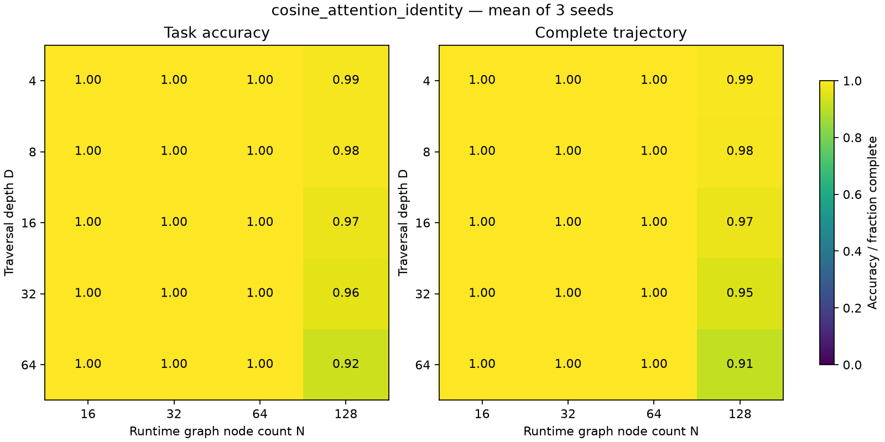
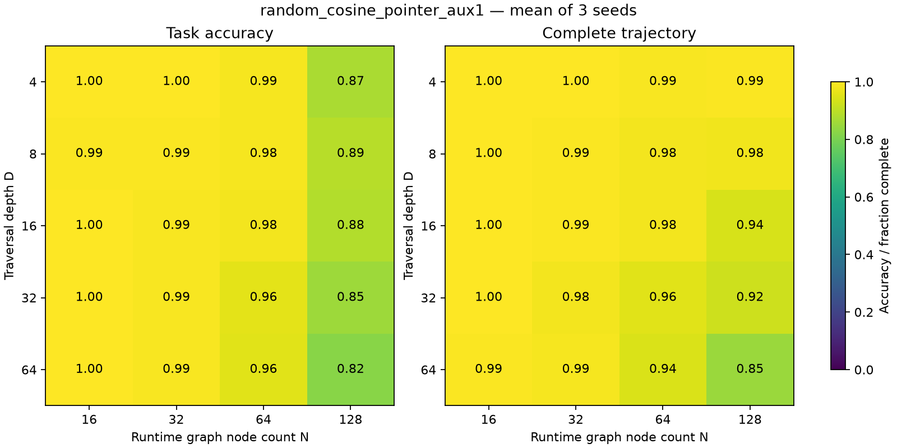

# Stage 4: stable binding substrate

**Stable binding is achievable on this task with a protected identity register, but the strongest result depends on an initialized matcher and an explicit graph-transition write.** The aligned pointer model completes every tested trajectory through depth 64 on 128 nodes, with 99.74% answer accuracy at that corner. Protected attention writes are also substantially stronger than mixed-state updates, but miss the all-seed stability gate. Randomly initialized binding becomes learnable with supervision; it still falls short of the same joint generalization target.

The main study completed **69 runs**, covering 23 variants, three paired seeds, and the full 20-cell depth × size matrix. Models train only at depths 1–4 on 16 nodes for 400 updates. Results below use the final checkpoint and 128 examples per cell per seed. Values are seed means; the [full numerical report](../../results/stage4/main/analysis/report.md) includes sample SD and individual seeds. Three seeds and finite test sets do not establish population-level guarantees.

[Methods](stage4-methods.md) · [raw metrics](../../results/stage4/main/metrics.jsonl.gz) · [resolved configuration](../../results/stage4/main/config.json) · [aggregate metrics](../../results/stage4/main/analysis/summary.json) · [learning curves and losses](../../results/stage4/main/analysis/curves.json)

## Architectural separation changes the result

Each cell below is **answer accuracy / complete grounding trajectory**, expressed as a fraction. Complete trajectories include the initial grounding and every post-hop destination, not just a correct final answer.

| Model | D4/N16 | D64/N16 | D4/N128 | D64/N128 |
|---|---:|---:|---:|---:|
| Raw-dot mixed, initial λ=4 | .958/.924 | .828/.594 | .148/.003 | .135/.000 |
| Raw-dot mixed, initial λ=8 | .878/.758 | .641/.289 | .490/.299 | .161/.000 |
| Known cosine, mixed update | .997/.997 | .966/.914 | .945/.878 | .258/.102 |
| Keyed graph-as-data, mixed update | .997/.945 | .951/.607 | .688/.198 | .156/.000 |
| Learned cosine, mixed update | .995/.987 | .948/.883 | .159/.003 | .099/.000 |
| Cosine, attention write, full-state grounding | 1.000/1.000 | 1.000/1.000 | .919/.906 | .510/.375 |
| Cosine, attention write, identity-only grounding | 1.000/1.000 | 1.000/1.000 | .987/.990 | .924/.909 |
| Cosine, explicit pointer write, identity-only grounding | 1.000/1.000 | 1.000/1.000 | .997/1.000 | .997/1.000 |
| Raw-dot, attention write, identity-only grounding | 1.000/1.000 | .982/.982 | .135/.000 | .128/.000 |

Cosine normalization alone improves deep traversal at the training graph size but does not solve the size shift. Protecting identity writes produces a much larger change. Restricting grounding reads to identity coordinates further improves the D64/N128 outcome from .510/.375 to .924/.909. Raw-dot grounding still fails at 128 nodes even with that protection. These comparisons support treating normalization, write protection, and read isolation as distinct architectural requirements in this setup.

The attention-write model overwrites identity with attention-weighted immutable memory keys while leaving content updates neural. Content can still affect ordinary attention, so this is not complete computational isolation. The pointer model instead writes `(P_query A_relation) @ entity_keys`. That explicitly programs the identity transition and bypasses token attention for identity retrieval. Its success establishes a stable structured register with learned surrounding computation; it does **not** establish superiority of logit-space graph bias over message passing. The graph-as-data control retains a mixed-state update, so it is not a matched protected-register alternative.

At N≤64, aligned protected attention stays nearly perfect throughout the matrix. At N128, complete paths decline from .990 at D4 to .984/.971/.945/.909 at D8/16/32/64. The explicit pointer model has 1.000 complete paths in all 20 cells. This is a measurable boundary for the attention-write architecture, rather than a blanket failure of longer recurrence.

## Much of the stable routing exists before training

Paired initialization evaluations prevent crediting training for an architectural prior. At D64/N128:

| Model | Initial → final task | Initial → final complete path |
|---|---:|---:|
| Known cosine | .102 → .258 | 1.000 → .102 |
| Keyed graph-as-data | .109 → .156 | .984 → .000 |
| Cosine attention write, full-state | .096 → .510 | .987 → .375 |
| Cosine attention write, identity-only | .096 → .924 | .987 → .909 |
| Cosine pointer write, identity-only | .128 → .997 | 1.000 → 1.000 |

The main positive result is therefore **preservation of initialized binding while learning useful content/readout computation**. The attention models still lose some initially correct trajectories during training; read isolation reduces that deterioration considerably. The fixed cosine matcher is insufficient when the rest of the recurrent update is allowed to damage identity. Initial answer accuracy is near chance because the readout is untrained, even where initialized trajectories are perfect.

The all-seed gate requires ≥.95 task and ≥.95 complete-path accuracy at D64/N128 in every seed. Only `cosine_pointer_identity` passes: task scores are 1.000, 1.000, .9922 and all path scores are 1.000. Protected attention has task .9922/.8516/.9297 and paths 1.000/.8047/.9219. Its means, .9245±.0705 and .9089±.0983, conceal material seed variation. A high mean or one successful seed is not the registered criterion.

## Supervision teaches cold binding, with a remaining size/depth gap

Random-projection answer-only models produce zero complete trajectories at both D4/N16 and D64/N128. Shallow answer accuracy is .211 for mixed updates, .234 for attention writes, and .201 for pointer writes. Raising only the cold attention model's initial null score from 0 to .65 gives .258 shallow answer accuracy and still zero complete paths. A null prior alone does not fix acquisition.

The supervision families below start with random projections and null score zero. “Aux” combines grounding labels with null and forward-consistency losses; “ground only” omits the latter two. Beta is the grounding-loss weight. Gamma=eta=.1 for aux and null+consistency variants.

| Cold model / objective | D4/N16 task/path | D64/N16 task/path | D64/N128 task/path |
|---|---:|---:|---:|
| Attention, aux β=.01 | .977/.969 | .948/.867 | .146/.000 |
| Attention, aux β=.1 | .984/.992 | .984/.940 | .138/.000 |
| Attention, aux β=1 | .997/.997 | 1.000/.992 | .172/.000 |
| Attention, ground only β=1 | .992/.997 | .987/.992 | .130/.010 |
| Attention, null+consistency β=0 | .781/.695 | .706/.503 | .161/.000 |
| Pointer, aux β=.01 | .984/.995 | .992/.977 | .331/.315 |
| Pointer, aux β=.1 | .995/.997 | .997/.987 | .424/.417 |
| Pointer, aux β=1 | .997/.997 | .997/.992 | .820/.849 |
| Pointer, ground only β=1 | .990/.997 | .995/.992 | .839/.862 |
| Pointer, null+consistency β=0 | .984/.990 | .984/.966 | .328/.279 |

These are real improvements from zero initial complete paths. Ground-only pointer training reaches .8385±.0239 task and .8620±.0045 complete paths at the joint corner; aux β=1 reaches .8203±.0620 and .8490±.0239. Neither clears the gate. Ground-only is slightly better on these task/path means, so the combined loss cannot be called uniformly superior.

Beta=0 with null+consistency is **not answer-only learning**: it still receives supervised real-versus-distractor labels and a consistency objective. Its strong shallow pointer result suggests explicit entity labels are not the sole workable training signal here, but this study does not isolate null supervision from consistency. The consistency target is a detached predicted forward transition, not a gold next node or inverse-edge cycle; diffuse or wrong self-consistency remains possible.

For cold aux β=1, pointer paths fall from .995 at D4/N128 to .849 at D64/N128. Task accuracy is already only .872 at D4 despite those almost-perfect paths: identity tracking is not the only remaining limitation. At D64/N128, supervised attention has .996 memory-key accuracy but only .110 average pre-hop query accuracy and no complete trajectories. The corresponding pointer has .995 key accuracy, .944 query accuracy, and .849 complete paths. The immutable-memory matcher can work while recurrent query binding fails.

Null behavior also remains incomplete. At D64/N128, distractor-null accuracy is .403 for aux-1 pointer versus .059 for ground-only pointer; the combined objective improves rejection while not improving aggregate task/path performance. The aligned pointer reaches .928. There is no query-null/release task in this benchmark, so these measurements concern distractor memory tokens, not learned release of an active binding.

## Failure persistence and identity drift

Canonical trajectories count each state once: initial grounding, then each post-hop grounding. At D64/N128, aligned protected attention completes .9089 of paths, while the product of its per-state marginal accuracies is .0288. Among transitions starting wrong, 1,279/1,290 remain wrong and 11 recover. Cold aux-1 pointer completes .8490 versus a .0214 marginal product, with 1,360/1,387 erroneous transitions remaining wrong and 27 recovering. Six and 21 examples respectively end correct after an earlier error; final recovery is not uninterrupted traversal.

This supports strongly dependent trajectory outcomes. It does not uniquely identify an attractor: variation across examples/seeds, repeated nodes, and graph reconvergence can also induce dependence. High persistence alone is insufficient evidence—near-chance cold models also remain wrong almost all the time.

Within the protected-attention corner, path failure correlates with mean post-identity Euclidean drift (r=.893), entropy (.582), lower margin (−.591), and lower identity norm (−.553). Distinct gold nodes visited has little association (.029). For cold aux-1 pointer, corresponding drift/entropy/margin correlations are .777/.416/−.541. These are descriptive pooled-seed associations using measurements throughout the trajectory, including after failure; they are not causal or prospective predictors.

The aligned pointer's mean identity norm remains .998 and its mean post-write identity drift is .0022 at the corner, versus .293 and .744 for aligned protected attention. Yet correct-destination attention mass is only .279 for the pointer: its stable identity comes from the explicit graph write, not almost-hard token attention. The matrix averages about 45.5 distinct gold nodes over 65 states at this corner; long paths include revisits rather than 64 distinct unseen entities.

The [checkpoint audit](../../results/stage4/main/checkpoint-audit.json) verifies all 69 saved state/source/config hashes. Temperature stays fixed at .05. Learned strengths remain near their initial values; mean final strength is 4.123 for cold attention aux-1 and 4.053 for cold pointer aux-1, rather than exploding into a huge routing bias. Aligned attention's mean query/key null scores move from .65/.65 to .513/.720; cold pointer aux-1 moves from 0/0 to −.085/.422. These are matcher parameters, not calibrated null probabilities or accuracy measures.

## Gated adaptive follow-up

The passed gate triggered **six separately labeled runs** on the aligned pointer architecture: three seeds each of `pointer_fixed4` and `pointer_adaptive4`. Protected attention was ineligible. The preference for attention if eligible, otherwise pointer, was recorded while partial main results were visible; it is a disclosed follow-up rule, not retroactive main-study preregistration.

Both fresh arms freeze base strength at 4, unlike the learned nonadaptive strengths in the main study. The adaptive coefficient is `4 × (1 − p_null) × (1 − H(P)/log(N+1))`. Parameters, initialization, training schedules, and evaluation data are matched. The explicit pointer identity write is unchanged: this experiment modulates structural bias in content retrieval, not the identity transition itself.

Both arms retain perfect paths in every matrix cell and reach **.9896±.0119 task accuracy at D64/N128**, with identical per-seed scores .9922/1.000/.9766. Task means are identical in 19 of 20 cells. At D4/N128, adaptive accuracy is .9948 versus .9974 fixed—a paired difference of −.0026±.0045, equivalent to one additional error across 384 examples. This supplies no evidence of an adaptive benefit.

Mean effective corner strength is 3.989 for adaptive versus 4.000 fixed: the stable matcher is already confident, so the gate barely changes its behavior. These results do not test whether confidence control can rescue uncertain binding. [Paired follow-up analysis](../../results/stage4/adaptive/analysis/adaptive-paired.json), [raw metrics](../../results/stage4/adaptive/metrics.jsonl.gz), and the [checkpoint audit](../../results/stage4/adaptive/checkpoint-audit.json) preserve the comparison. No interpreter is introduced.

## Reproducibility and practical limits

The final release suite passed **269 tests in 2.92 seconds** at `c2ca03b`, including the standalone CLI regression test. Main training source is `3b63b88fee75b45887f11837164af659dc882a2d`; the [audit](../../results/stage4/main/audit.json) verifies all expected runs and gate arithmetic. Total recorded main-run wall time is **1,062.4 seconds (17.7 minutes)**, including evaluation; optimizer work accounts for 297.8 seconds. Peak process RSS is 961.2 MiB on the linked machine using two CPU threads. That high-water figure includes accumulated process allocations and instrumentation, not isolated architecture memory. The six follow-up runs add 94.4 seconds at source `11b921a18d5f6839b11e49ca6b17db6eb8c83547`. Checkpoints remain remotely available with recorded file hashes; compressed raw metrics and standalone figures are committed.

This benchmark supplies fresh opaque keys, a known identity-coordinate convention, immutable memory, functional directed relations, and an externally scheduled instruction sequence. It does not establish binding from language, learned execution scheduling, arbitrary object graphs, mutation, aliases, or scope. The strongest model preserves a supplied routing solution; supervised cold acquisition is promising but weaker, and answer-only cold acquisition fails under this budget. Stable initialized binding is a demonstrated architectural capability here, while learning equally robust binding from scratch remains open.
