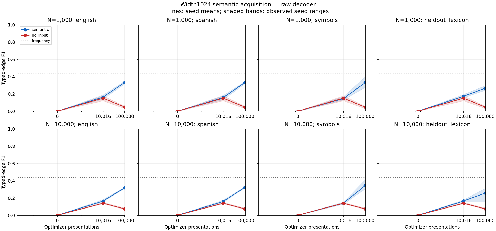
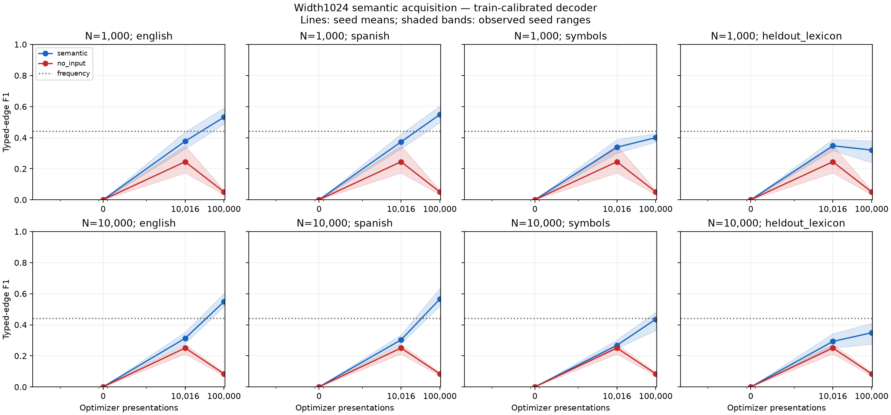

# Stage 8 semantic acquisition and exposure study

**Outcome: partial acquisition, Gate F not passed.** Meaningful optimizer exposure
improves typed and ordered graph prediction on the trained English/Spanish
renderer families. Exact canonical graph recovery remains zero; held-out lexical
and renderer transfer does not consistently exceed a simple frequency prior.
The study does not authorize runtime coupling or supervision withdrawal.

## Main results

All 12 prespecified runs completed: two corpus cardinalities, three paired seeds,
and semantic/no-input arms. Each received 100,000 presentations, with checkpoints
at initialization, 10,016 and 100,000. Total exposure was **1,200,000 presentations**
and **37,500 optimizer updates**. Every main model has an actual **1024-dimensional
workspace**, four distinct recurrent phases reused twice, and 57,861,981 parameters.
The graph is a privileged target, never an actor input; this track does not test
runtime structural-attention bias.

The table reports three-seed means on 64 fresh heldout graphs, using the
**training-only calibrated edge decoder**. Values are typed-edge F1 / ordered-edge
F1. Thresholds were fit on the same first eight training graphs in both corpora,
using a prespecified grid; no evaluation labels selected them.

| Training graphs | Presentations | English | Spanish | Unseen symbolic renderer | Renamed lexicon |
|---|---:|---:|---:|---:|---:|
| 1,000 | 10,016 | .3774 / .1834 | .3730 / .1893 | .3386 / .1114 | .3478 / .1411 |
| 1,000 | 100,000 | .5315 / .5196 | .5489 / .5333 | .4001 / .1995 | .3203 / .1408 |
| 10,000 | 10,016 | .3133 / .1619 | .3029 / .1696 | .2682 / .1092 | .2930 / .1229 |
| 10,000 | 100,000 | .5486 / .4963 | .5658 / .5165 | .4358 / .2038 | .3486 / .2026 |

Exact canonical semantic recovery is **0/64 in every model/seed/surface/checkpoint**.
At 100,000 presentations, English node-type accuracy averages .8181/.8205 and
visible-identity copy accuracy .5188/.5198 for N=1k/10k. These decompositions also
remain far from whole-graph competence.

The **frequency baseline is important**: typed-edge F1 is .4410 and ordered-edge
F1 .1255 in both corpora and all surfaces. It is stronger than the learned no-input
control, whose calibrated English scores are .0509/.0102 (N=1k) and .0845/.0116
(N=10k). Thus the gap to no-input alone overstates general semantic acquisition.
The frequency control receives 2,000/20,000 labeled surfaces, rather than the
neural arms' 100,000 presentations; its label budget and inverse-lesson weighting
are explicitly logged.

Calibration changes the conclusion for typed edges: with raw logit threshold zero,
final English typed-edge F1 is only .3331/.3195, below the frequency prior. Raw
ordered-edge F1 is .3537/.3719, above that prior. Both decoders and every threshold
search count are retained. The calibrated English typed-edge seed ranges are
[.4869,.5911] and [.5156,.6017], so the modest N=1k→10k difference is not a robust
scaling-law estimate. Extra exposure helps on known rendering families; increasing
available corpus size has mixed effects, and lexical transfer remains weak.

## Exposure, controls, and interpretation

At 10,016 presentations, the N=1k model has seen all 1,000 graphs, while N=10k has
seen **1,793 distinct graphs**, because presentations are balanced across three
lesson families. At 100,000 presentations, both arms have consumed their full
1,000/10,000 graph pools. English and Spanish presentation counts are matched.
These are corpus-cardinality and optimizer-exposure axes, not claims that each
checkpoint already consumed the full available corpus.

The shared training-only vocabulary, heldout semantic identities, renderer
schedule, initial weights, batch size and curriculum are matched across corpora.
The no-input arm retains the public copy-candidate count/normalization prior; it
is not a fully information-free oracle. The frequency baseline is reported
alongside it. Gold graph labels choose sampled loss queries but do not modify
actor hidden states. No gold size, spans or future execution traces enter the
actor.

The observed positive result is supervised learning of some canonical graph
components from the trained surfaces. It is not general language understanding,
a clean width-only comparison with Stage7, autonomous graph induction, or evidence
for runtime integration. Width, curriculum, batching, output factorization and
exposure all differ from Stage7. Whole-graph equivalence uses compiler slots,
not an unrestricted graph-isomorphism criterion. The slot-head objective limitation
below further restricts interpretation of exact/ordered graph failure.

Gate F remains **failed**: useful within-renderer learning is present, but exact
semantic recovery has no positive trend, and held-out typed-edge transfer does
not reliably exceed the simple frequency prior. Ordered-edge transfer provides a
limited positive component signal. No larger runtime, composition, or supervision
annealing was added.

## Reproducibility and artifacts

The two main manifests preserve configs, source/compiler/generator hashes, corpus
and heldout hashes, initial/final state hashes, environment, parameter counts and
actual exposures. All 12 durable checkpoint files were independently rehashed.
All 37,500 logged loss rows are finite. Independent review reconstructed all
18,944 raw prediction rows and 296 curve groups, and verified all 36 train-only
threshold vectors plus paired initialization/provenance across 12 runs. Recorded model-run walltime totals
5,202.25 seconds, of which 4,900.99 seconds are optimizer work; corpus generation
and setup add overhead. Peak CUDA allocated memory was 1,287,888,896 bytes.
BF16 autocast is matched across arms; parameters and loss logits remain FP32.
Twelve focused implementation tests passed remotely before the freeze.

- [Full per-seed and aggregate summary](../../results/stage8/semantic-analysis/summary.json)
- [Deterministic failure examples](../../results/stage8/semantic-analysis/failure-examples.json)
- [N=1k raw metrics and manifest](../../results/stage8/semantic-main-n1000/manifest.json)
- [N=10k raw metrics and manifest](../../results/stage8/semantic-main-n10000/manifest.json)
- [Prespecified resource/recipe freeze](stage8-semantic-main-freeze.json)
- [Independent audit](stage8-review.md)

Full checkpoints and corpus databases remain at
`gb10-direct:~/topoformer-stage8-semantic-full/results/stage8-semantic-main-n{1000,10000}`.
Committed raw prediction shards reconstruct every tensor field and stay below
GitHub's file limit. Reports and tools moved from `.development` to `research`
after training began; a compatibility alias preserves frozen paths. The remote
training source/config bytes were not changed by that reorganization.

## Historical implementation and acquisition probes

The remaining sections record earlier resource probes and their limitations;
they were not substituted for the complete exposure study above.

## Standard width and resource evidence

The actual recurrent workspace width is 1024 with four distinct phases, reused
twice. The first timing models had 57,861,981 parameters and used 1.224 GB peak CUDA
allocated memory. Four presentations took 0.447 s in the semantic arm and 0.135 s in
the no-text-feature arm, excluding evaluation/checkpoint work. This tiny cold
probe is not a reliable asymptotic throughput estimate.

The fixed 8-graph acquisition probe is more useful for warm serial throughput:
1000 presentations took 35.39 s training for semantic and 34.26 s for no-input;
total walltime including evaluation/checkpointing was 81.02 s and 75.51 s. Both used
width 1024 and 57,859,931 parameters (the smaller training-only value vocabulary
accounts for the parameter difference from timing). Neither used mixed precision.

Generating the shared 10k vocabulary pool plus 64 heldout graphs took 29.66 s,
requiring 30,491 generator attempts and rejecting 20,427 alpha-equivalent duplicates.
It produced all 10,064 requested unique graphs. Extracting its 10-value categorical
vocabulary took 8.09 s. These are generation feasibility measurements, not learning.

## Fixed 8-graph acquisition probe

Source frozen at 776990e; seed 0, two matched arms,1000 presentations, batch 2 via
serial gradient accumulation. Node supervision starts immediately; identity/value
at 100 presentations; edge/slot supervision at 300. The 8 graphs each have English
and Spanish forms. The 64 heldout graphs are diagnostic validation, not a test set
used to authorize semantic competence.

| Final training metric | Semantic English | Semantic Spanish | No-input |
|---|---:|---:|---:|
| Node-type accuracy |95.54%|96.68%|76.65%|
| Identity-copy accuracy |90.72%|89.80%|0%|
| Node-presence F1 |98.68%|98.11%|96.38%|
| Typed-edge F1 |18.89%|19.42%|24.72%|
| Ordered-edge F1 |15.11%|15.93%|20.34%|
| Exact graph recovery |0%|0%|0%|

The semantic model's English training edge count was 568 true positives among 5421
predictions, against 593 true edges. Thus high recall coexists with severe
false-positive decoding. On English validation, semantic typed-edge F1 was 15.48%
versus 20.88% for no-input. Exact graph recovery remained zero in all evaluated
surfaces. This probe therefore **does not establish graph acquisition**.

The node/type/copy results show partial learned acquisition; edge precision and
whole-graph recovery remain unresolved. Width alone is not sufficient under this
recipe. This does not isolate whether more optimization, edge-head expressivity,
or decoding calibration is the remaining limitation.

## Prespecified next diagnostics

The subsequent runner adds true padded minibatches and optional BF16 autocast
without reducing workspace width. CPU contract tests check batching equivalence,
public padding masks, finite mixed-precision gradients and approximate agreement
with FP32. GPU timing subsequently selected resources for the frozen main study.

Because the edge loss balances rare positives against negatives, zero logits are
not necessarily calibrated edge-presence decisions. A separate diagnostic fits
one threshold per relation using only the first 8 **training** graphs, both
languages, on the fixed grid [-6,-4,-2,0,2,4,6,8,12]. It maximizes micro-F1 per
relation over dense edge predictions with **predicted**, never gold, node presence.
The same threshold vector is applied to every heldout renderer. Raw zero-threshold
metrics and calibrated metrics are both retained. Full threshold-grid counts are
logged. Ties choose the lowest threshold, including zero-gold relations; this can
still overpredict and must not be tuned after observing heldout results.

Calibration consumes 16 privileged training label presentations even at optimizer
step 0; that additional decoder-fitting budget is explicit. Calibration is not a
new neural competence result. The failed original acquisition artifacts remain
unchanged.

## Frozen main study

The resource freeze is now committed in `stage8-semantic-main-freeze.json`; the
study completed all 12 runs without recipe changes. It uses 1k/10k available
training graphs, three paired seeds, semantic/no-text-feature arms, and one
100,000-presentation trajectory per arm with measurements at 0/10,016/100,000.
The 10k-scale measurement is explicitly **10,016**, aligned with batch32.

Optimized batch32 BF16 timing measured warm training steps of 0.1409 s for
semantic and 0.1313 s for no-input: 4.40/4.10 ms per presentation. The first steps
were 0.473/0.665 s. Removing per-field GPU synchronization and caching deterministic
CPU data changed throughput, not the mathematical per-example loss. Parameters
remain FP32; dense operations use BF16 autocast and loss logits return to FP32.
The projected serialized budget is approximately 95–110 minutes for all 1.2M
presentations, preprocessing and evaluation. This estimate is not a completion
claim.

### Diversity and genuinely fresh evaluation

The generated pool contains only four variable-binding and 120 set-operation
canonical constructions at this difficulty; the remaining accepted constructions
are unification examples. The raw N=1k and N=10k corpus distributions therefore
would change lesson mixture substantially. The main study fixes **equal lesson
presentation frequency**, independently cycling through each lesson's available
graphs and pairing English/Spanish renderings. The frequency control uses inverse
lesson-size weights to match that intended mixture. Repeated small-family examples
remain repeated examples, not new unique graphs. Actual unique counts and lesson
exposures are recorded at every checkpoint.

The main corpus uses a new data seed, 800000. Merely changing the seed was not
enough: 14 of its initial evaluation-prefix keys matched previously inspected
canonical graphs. Those keys are skipped only while reserving evaluation; they
remain eligible training examples. The final 64 heldout graphs have zero overlap
with the prior 64-key fixture, whose digest also matches Stage7's principal
heldout set. The new heldout contains 40 unification and 24 set-operation graphs.
It has **no fresh variable-binding constructions**, so this study cannot establish
variable-binding structural transfer. Both aggregate and per-lesson metrics are
required in the final interpretation.

The first eight main training graphs alone fit the edge thresholds. Neither main
heldout outcomes nor the previously inspected validation labels select thresholds.
The recipe, curriculum, sampling mixture and seeds are frozen before main learning
outcomes. No runtime composition or supervision withdrawal is authorized by this
study.

### Raw artifact representation

Raw predictions preserve every tensor field. Binary edge tensors are stored as
shape-tagged, little-endian bitmaps instead of oversized coordinate lists, with
one gzip shard per arm/seed/exposure. The historical acquisition conversion
reduced approximately 478 MB to 22 MB and verified every decoded field exactly.
Original compressed SHA256, converted SHA256 and record counts are committed;
the original is also retained in the remote durable artifact directory. Exact
historical source snapshots are committed independently of branch ancestry.

### Slot-objective capacity audit

A separate gold-only audit found a two-by-two XOR witness in each of the first
1,000 main training graphs. The ordered-slot head adds a source-specific and a
target-specific class logit. Its current loss labels sampled non-edge pairs as
“no slot,” alongside ordered slots on actual edges. Two independent ordered edges
and cross pairs labeled “no slot” can therefore require an XOR classification that this
additive head cannot satisfy with strict class margins. The audit tests absence
of an ordered slot; a cross pair can be either a non-edge or a real unordered
edge. Both receive the no-slot target when sampled. This is an irreducible
component of the slot training objective, not evidence that more data cannot help
other semantic outputs.

The independent edge head can suppress cross pairs during decoding, so the audit
does **not** prove that final graph recovery is impossible. The frozen main study
continues unchanged; any later edge-conditional slot objective would be a separate
experiment. The audit source and per-lesson counts are committed with the timing
artifacts. This limitation must accompany interpretations of ordered-edge and
whole-graph failures.
