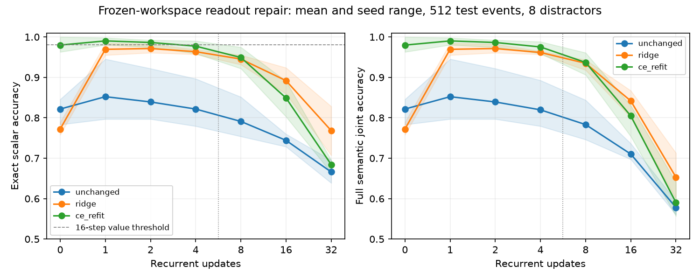

# Stage 9 return localization

Status: archived numerical reconstruction complete; frozen inference and probes pending. No return interface gate passes, no repair selected, no downstream use authorized. Workspace standard remains 1024.

## Source and evidence map

`return_memory.py` defines the learned field encoders, mixer, initial cross-attention, four recurrent workspace blocks and workspace-only decoder. `return_memory_study.py` defines deterministic regenerated evaluation batches, decoding counts, training delays and checkpoint export. `retention_data.py` constructs exact public events and disjoint supervised targets. `retention.py` implements protected storage; `thinking.py` supplies the recurrent blocks. All five current file hashes match the archived Stage 8 main manifest. The 18 immutable checkpoints remain at `gb10-direct:~/topoformer-stage8-return/results/main`.

The Stage 8 main manifest/config and 18 gzip prediction files under `research/results/stage8/return-main` support the report. `return_diagnostics.py` reconstructs 1,008 evaluation rows and 504 paired-delay comparisons from those files; this is **archived metric reconstruction, not rerun inference**. New outputs and raw file hashes are under `research/results/stage9/return-archive`.

## Pair identity and historical diagnosis

The historical runner calls `make_batch(es,512,d)` independently for every delay. That generator uses a local seeded RNG and generates return events, nonce identity keys and their targets before the distractor tensor. Thus equal data seed/batch size/distractor count implies the same ordered event batch across delays. The analysis verifies all six target arrays are equal before pairing. Historical raw records do not contain nonce hashes; deterministic source supports event identity, while frozen regeneration will add explicit hashes. Matching only the visible categorical targets would not independently establish nonce identity.

Test set, eight distractor rows, factorized persistent memory, paired one-to-sixteen updates:

| Seed | Quantity | correct→correct | correct→wrong | wrong→correct | wrong→wrong |
|---|---|---:|---:|---:|---:|
|0|scalar|363|67|9|73|
|1|scalar|425|55|14|18|
|2|scalar|398|66|5|43|
|0|non-value joint|471|40|0|1|
|1|non-value joint|498|13|0|1|
|2|non-value joint|494|15|0|3|
|0|full joint|333|97|8|74|
|1|full joint|413|66|14|19|
|2|full joint|388|73|5|46|

The net 209-example full-joint decline combines 236 deteriorations and 27 recoveries. The marginal difference is not a forgetting probability. Across seeds the same held-out event set is reused, so pooled counts are descriptive seed-replicates, not 1,536 independently sampled events.

Every field/count agrees with Stage 8. Analysis includes confusion matrices, signed/absolute scalar errors, per-value/sign/magnitude/type/primitive counts, non-value joint and scalar accuracy conditional on non-value correctness. Required argument1 excludes the explicit unary null. All original 18 retention gates remain failed; exact scalar reconstruction blocks each arm.

Persistent arms read intact encoded storage again on every recurrent update; late degradation concerns learned retrieval/representation/readout, not corruption of protected storage. The original trained lengths are0/1/2/4; sixteen and32 are recurrent-length extrapolation. Lifecycle interventions were untrained OOD. New probes must not use the inspected historical test set for selection.

## Frozen-checkpoint plan (before probes)

Capture scalar field encoding before mixing, memory after mixing, initial retrieved workspace, and workspace after1/4/16/32 updates. Use fresh, disjoint probe-training/validation/test events in the9-million seed namespace. Keep checkpoints frozen and report their original seeds0/1/2 as historical frozen replicas, not new initialization seeds. Equal-capacity probes receive1024 coordinates (zero-padding the disjoint scalar field); compare categorical linear and bounded nonlinear probes selected on validation only. Report geometry by actual value before asserting normalization removes magnitude. Oracle facet reads and exact public scalar input are explicitly privileged boundaries, not complete-interface successes.

A profile precedes a frozen full diagnostic budget. No representation repair will be selected before localization. Any later repair uses new seeds10/11/12 and untouched512-example cells. At most two repairs are permitted, with the historical exact reconstruction gate unchanged.

## Frozen probe freeze

Profile at source8838749: three64-event batches, width1024, five workspace boundaries through32updates, facet/persistent checkpoint0 took1.026seconds after load on GB10. Four mechanical tests pass, including exact state agreement with the historical forward. Full frozen matrix estimates~5–8 GPUminutes including ridge solves (18checkpoints ×3072events; no backbone optimizer). Hard ceiling10minutes pending root authorization.

Configuration `stage9-return-frozen-probes.json` fixes all18 checkpoints, all seven boundaries,2,048fresh training events,512validation and512test events (distinct9-million data seeds), eight distractors and all0/1/4/16/32delays. All33 numerical output classes belong to the training domain; this tests fresh contexts, not unseen numerical labels. Original scalar decoder is evaluated at every workspace boundary on identical events. Diagnostic ridge families are1024→33 categorical regression and1024→1 numerical regression followed by rounding/clamping to the half-unit grid. They differ in objective/output prior, so their comparison is not an equal-output-capacity architecture trial. Within each family capacity is equal across boundaries. Scalar premix is zero-padded to1024. Train-only feature standardization and validation-only selection over regularization{.01,.1,1,10}; all boundaries and failures reported. Failure of a ridge probe cannot establish information absence.

## Full scalar-grid result (privileged encoder diagnostic)

The CPU-only frozen encoder check took8.55seconds. Every one of18 scalar affine encoders supports528/528 exact half-unit-grid reconstruction with a newly fitted linear numerical readout on fresh nonce nuisance contexts. The train/test populations both cover all33 bounded labels16times; this is deliberately not numerical-label extrapolation. The isolated context is float/add with consistent operands.

Selecting the correct encoded facet remains528/528 for all six facet checkpoints. After mixed/concatenated encoding, the same linear numerical probe reaches only295–371/528 across the twelve checkpoints. This establishes weaker linear accessibility after merging nuisance fields; a failed linear probe does not establish absence of scalar information. This privileged facet selection does not bypass the historical workspace gate in reported competence decisions. Actual affine/mixed encoding pair distances and norms are saved; no magnitude-destruction claim is inferred from LayerNorm alone.

Workspace boundary probes consume `model.norm(state)[:,0]`, exactly the same normalized scalar row as the original scalar classification head. Thus the baseline/probe comparison does not conflate removal of final LayerNorm with a different decoder. Frozen capture parity is tested against the historical forward at0/1/2 mechanical steps; primary captures retain1024dimensions. Probe source finalized at`e12d546` before test inference, with per-alpha validation counts, saved coefficient hashes, event identities, configuration hash and distinct GPU allocation/process RSS/device-capacity measurements.

## Completed frozen boundary probes

All18 checkpoints finished in172.3seconds wall time; peak allocated CUDA memory488MB and process peak RSS2.04GB are distinct from device capacity. Source/config were frozen before test inference. Every original checkpoint hash matched Stage8. Probe fitting uses disjoint2,048/512/512-event train/validation/test partitions; all33 bounded numerical labels are observed during probe training. This is fresh-context diagnosis, not unseen-class transfer.

Factorized persistent memory, test exact scalar accuracy, means across the three frozen checkpoint seeds:

| Boundary | Original classifier | Categorical ridge probe | Numerical ridge probe |
|---|---:|---:|---:|
| Scalar field before mixer | — |18.55%|100.00%|
| Correct memory facet | — |81.51%|100.00%|
| Initial workspace retrieval |84.90%|94.73%|96.61%|
| One update |89.39%|98.70%|70.51%|
| Four updates |85.87%|97.79%|56.58%|
| Sixteen updates |79.56%|95.57%|43.68%|
| Thirty-two updates |69.53%|94.60%|34.77%|

The affine scalar field retains its value and the selected facet preserves numerically accessible information. The original decoder already fails after initial retrieval. At one update a newly fitted categorical linear readout substantially improves exact reconstruction from exactly the original decoder's normalized input. Thus original readout quality is a material bottleneck; its errors cannot all be attributed to absent information. A linear numerical readout becomes weak after recurrent processing while categorical recovery stays much stronger: the workspace does not preserve a simply linear numerical coordinate. Neither probe establishes absence of information when it fails.

Each probe above is trained separately at its own delay. In particular the sixteen/thirty-two-step probe receives training examples from that delay. These are **not recurrent extrapolation scores**. Late categorical probe errors remain, so stronger readout does not establish complete retention either. Raw seed-level predictions, per-value/type/primitive errors, confusion matrices and validation-selection records are preserved in `return-frozen-probes`;252 fitted probe tensors remain immutable on GB10 with hashes. Categorical ridge has33,825 fitted coefficients; numerical ridge1,025. Squared-error categorical regression is a limited diagnostic family, and its poor premix result cannot demonstrate a linear-softmax expressivity limit.

## Minimal repair selected on validation only

The validation results show the same categorical decoder opportunity (one-update exact98.44/99.22/98.63% versus original81.64/92.58/88.48%). They motivate one change: refit the scalar readout while freezing the learned workspace. No encoder, memory tokenization, recurrence, runtime, or numerical domain changes.

A paired main comparison is declared using new initialization seeds10/11/12 and three fresh Stage8-recipe backbones. Compare their unchanged scalar classifier with (1) one categorical ridge head fitted jointly on delays0/1/2/4 and (2) a cross-entropy-refitted head on exactly the same frozen features/labels. The second repair controls whether further classifier acquisition, rather than ridge specifically, explains improvement. Ridge regularization selects from the same four-value validation grid. CE starts from the original head, gets500updates×256sampled feature rows at learning rate.003, and selects the earliest best checkpoint among every50updates on pooled short-delay validation accuracy. The CE and closed-form ridge objectives/exposures/FLOPs are not equal; report this explicitly.

Both heads use2,048 fresh events×four short delays (8,192 feature rows). All readout selection uses validation, with a new untouched512-event test cohort at2/8 distractors and0/1/2/4/8/16/32delays. All six output fields, full joint correctness, exact scalar criteria and original gate thresholds remain. No readout success can override unchanged type/primitive/identity failures. Corruption controls score original and actually supplied facts separately. No lifecycle training or downstream-use experiment is added. A representative profile precedes main launch.

Readout repair profile at`4046fca` finished in2.075seconds (two backbone updates, small frozen feature/refit/evaluation path);55,854,360backbone parameters and33,825readout parameters. The CE refit now consumes exactly the same train-standardized workspace features as ridge. Its original classifier warm start is transformed algebraically to preserve logits (`W_z=W_x*scale`, `b_z=b_x+W_x*mean`) and checked numerically before training. Objectives, regularization and optimizer exposures still differ; no pure loss-function causal claim follows. Combined with the measured full frozen capture and Stage8 training timings, the three-backbone main is estimated at4–7GPUminutes, with a10minute stopping ceiling. The profile does not change the frozen main hyperparameters or select them by outcome.

## Completed minimal repair comparison

All three new width1024 backbone runs and both paired readout refits completed without recipe changes. **All nine seed/readout retention gates fail.** The six non-value predictions are not regenerated by refitting; all five non-value output arrays are exactly identical across the three readout arms on every paired example.

Test means, eight distractor rows; each seed has512 examples per cell:

| Readout | Value0 | Value1 | Value16 | Value32 | Joint16 | Joint32 |
|---|---:|---:|---:|---:|---:|---:|
| Original |82.16%|85.22%|74.41%|66.60%|71.03%|57.81%|
| Pooled categorical ridge |77.21%|96.94%|89.19%|76.82%|84.18%|65.30%|
| Pooled CE refit |97.98%|99.02%|84.90%|68.42%|80.47%|59.05%|

The pooled CE head makes short-delay acquisition substantially stronger without changing any encoded memory or recurrent state. A readout acquisition mismatch therefore explains much of the original early failure. Nevertheless its one-step improvement does not transfer robustly to sixteen/thirty-two updates. Ridge improves late exact decoding more, but reduces initial-read accuracy. No single fitted classifier in this bounded comparison meets the full acquisition/retention contract across delays.

Each seed's test exact scalar/full-joint counts at16 updates and eight distractors:

| Seed | Original | Ridge | CE refit |
|---|---:|---:|---:|
|10|373/512;357/512|440/512;410/512|411/512;386/512|
|11|389/512;377/512|457/512;444/512|437/512;425/512|
|12|381/512;357/512|473/512;439/512|456/512;425/512|

Every seed/arm fails the strict16-step validation scalar threshold in both prescribed distractor conditions. Seed10 additionally fails argument0/provenance; seed12 fails primitive and, with eight distractors, type. Those failures persist identically across head refits. Required argument1 excludes unary null only from that field's denominator. Full gates, raw counts and per-example predictions are stored in `return-readout-main/summary.json` and its three compressed raw files.

The numeric errors are not interchangeable with exact accuracy. At16 steps, scalar MAE is.269 original,.111 ridge and.380 CE. CE's higher exact accuracy coexists with larger errors on a subset of failures. No MAE improvement can satisfy the exact gate. Confusion matrices, signed errors and paired original→refit correctness outcomes are exported. Value accuracy conditional on all non-value fields being correct is separately counted.

Dropped returns yield zero full-joint accuracy in all arms at16. Wrong-value/provenance returns also destroy original-fact agreement. Wrong-type original-fact joint accuracy remains13–15%; this may reflect reconstruction from correlated available fields, not fidelity to corrupted types. All interventions additionally retain actual supplied targets and supplied-fact counts. Lifecycle release/overwrite remain only the historical OOD diagnostics; no lifecycle behavior was trained or added to this repair.

Compute:230.35seconds summed over the three new backbones/refits/evaluation runs; maximum allocated CUDA memory1.492GB, peak process RSS2.406GB. Each backbone receives32,000 fresh optimizer examples; the pooled readout uses2,048 distinct fresh events and8,192 delay-conditioned feature rows. CE receives128,000 sampled head-optimizer presentations; ridge solves from8,192 rows without iterative updates. Validation selects CE steps250/400/350 and ridge regularization.01/.1/1 for seeds10/11/12. Their differing objectives/optimization/exposure prevent attributing the comparison to loss form alone. Both have33,825 scalar coefficients and the same standardized features; the original head is preserved unchanged.

## Attribution and stopping decision

1. The supplied bounded scalar remains distinguishable before learned retrieval. The tested affine encoder and selected facet do not collapse its values.
2. Original learned readout is already unreliable at initial retrieval. New probes and a separately frozen paired refit recover much of the early error without changing the backbone.
3. Delay-specific readouts recover far more information at late steps than the original head, but do not reach the strict criterion. A single short-delay-trained readout remains brittle under recurrent-length extrapolation. These observations support both decoder mismatch and length-dependent accessibility/interference; they do not prove irreversible information loss or identify a unique recurrent mechanism.
4. Persistent storage stays exact. This is a test of neural access to an intact fact, not disappearance of that fact from the register.
5. The two permitted minimal repairs have been evaluated. Stop this track with the gate failed; do not add another encoding, recurrent gate, longer-horizon curriculum, copy bypass or downstream task to obtain a pass.

These findings concern supporting neural/runtime interfaces. No structural-attention or programmable-metric claim follows from this return experiment.
