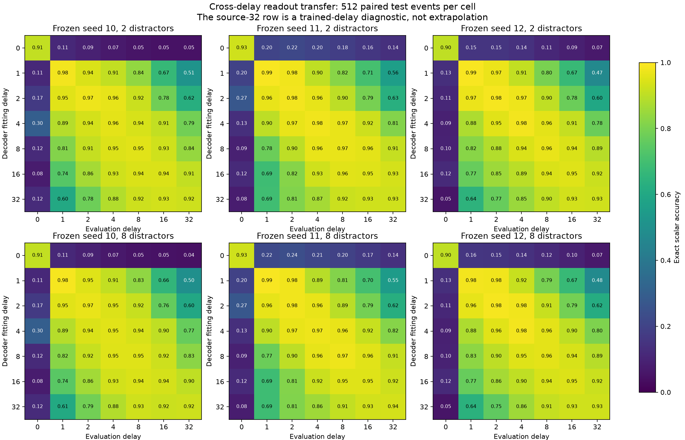
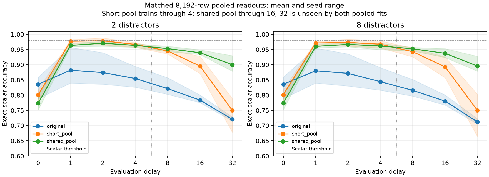

# Stage 10: cross-delay return readout

**Completed and independently audited at width 1024. All restricted scalar and inherited full-return checks fail.** The positive result is narrower: exposing one fixed readout to a wider range of frozen recurrent states improves its transfer to an unseen delay, even with matched training-row and event budgets. No backbone, encoder, runtime, or attention mechanism was changed.

## Design and provenance

The frozen Stage 9 factorized-persistent backbones use initialization seeds 10, 11, and 12. Each has 55,854,360 parameters, six workspace rows of width 1024, and six return-memory tokens allocating 6,144 coordinates. The backbone was originally trained at delays 0/1/2/4. Perfect typed return events, persistent storage and typed workspace rows are supplied architectural inputs; this experiment does not learn proposal construction or execution.

Source/configuration froze at `33e48f4`. New partitions contain 2,048 training events, 512 calibration events and 512 untouched test events, with disjoint seeds and individual event hashes. Each event is evaluated at all delays 0/1/2/4/8/16/32; distractor conditions 2 and 8 retain exactly the same event identities and targets. These repeated measurements are not independent semantic examples.

Every new decoder is a categorical ridge readout with 33,825 coefficients, operating on exactly the normalized scalar workspace row used by the original classifier. The family predicts class scores, not calibrated probabilities. Train-only standardization and calibration-only selection over `.01/.1/1/10` are fixed. A source-specific head selects its regularization using only calibration states at its own source delay. Pooled heads select only on their own covered delays; the separate source-32 diagnostic cannot select either pooled head.

The short pool covers 0/1/2/4, and the shared pool covers 0/1/2/4/8/16. Both use the same 2,048 distinct events and exactly 8,192 training feature rows. The shared pool allocates 1,366 rows each to delays 0 and 1, and 1,365 each to 2/4/8/16, using the prespecified label-blind cyclic selection. It changes delay coverage and allocation of observations, not total row count. All three seeds select regularization `.01` for both pooled heads. Each per-delay head receives 2,048 rows and is not exposure-matched to the pooled heads.

Raw predictions preserve all six fields. Only the scalar prediction is replaced, so non-value fields and joint correctness remain directly reconstructible. Float32 caches are saved once per backbone, losslessly compressed and hashed; they are not reused from Stage 9.

## The transfer matrix

Descriptive three-seed means below use the 512 paired test events with eight distractors. Rows specify the decoder's fitting delay; columns specify the evaluation delay. The source-32 row is a **trained-delay diagnostic**, not an extrapolation result.

| Fit → evaluate | 0 | 1 | 2 | 4 | 8 | 16 | 32 |
|---|---:|---:|---:|---:|---:|---:|---:|
| 0 |91.28%|16.34%|16.08%|14.00%|12.24%|10.42%|8.40%|
| 1 |14.71%|98.44%|96.81%|90.49%|81.38%|67.71%|50.65%|
| 2 |18.36%|95.83%|97.66%|96.29%|90.82%|78.06%|61.33%|
| 4 |17.38%|88.80%|95.51%|96.94%|95.31%|90.76%|79.69%|
| 8 |10.16%|80.79%|90.49%|95.38%|96.09%|93.95%|87.70%|
| 16 |10.48%|73.24%|84.57%|91.80%|94.40%|94.47%|91.60%|
| 32 |8.53%|64.52%|78.26%|86.65%|91.47%|92.64%|92.90%|

At delay 32, the one-step-trained decoder reaches 50.65%, while the decoder fitted at 32 reaches 92.90% on exactly the same target states/events. Much of the poor cross-delay score therefore reflects incompatibility of a particular readout with those states, not the inability of every tested readout to recover their scalar value. The diagonal is still an imperfect learned probe, not an oracle or proof that information is absent on its errors.

Zero-step states are particularly different under these readouts: the zero-trained head reaches 91.28% at zero but only 16.34% after one update; the one-trained head reaches 98.44% at one but 14.71% at zero. This establishes a strong functional discontinuity in transfer, without identifying a unique geometric or recurrent mechanism.

All seed-level diagonal counts for the eight-distractor test condition, each out of 512:

| Seed | 0 | 1 | 2 | 4 | 8 | 16 | 32 |
|---|---:|---:|---:|---:|---:|---:|---:|
|10|465|504|495|488|486|479|473|
|11|475|506|501|499|499|487|479|
|12|462|502|504|502|491|485|475|

## Acquisition versus fresh-context performance

Same-delay fit accuracy must not be confused with generalization. At two distractors, the diagonal training/test means are:

| Delay | Training events | Fresh test events |
|---|---:|---:|
|0|96.76%|91.28%|
|1|99.98%|98.63%|
|2|100.00%|97.92%|
|4|99.97%|97.27%|
|8|100.00%|96.16%|
|16|100.00%|94.79%|
|32|99.97%|92.64%|

The categorical ridge family does not even fit the zero-step training population perfectly. After recurrence it nearly fits the finite training populations, but late fresh-context performance remains weaker. Neither observation proves information destruction. All 33 half-unit labels are present during training; these are fresh-context/identity tests, not generalization to unseen numerical classes.

## One shared readout with matched exposure

Test means with eight distractors:

| Readout | Value 0 | Value 1 | Value 16 | Value 32 | Joint 16 | Joint 32 |
|---|---:|---:|---:|---:|---:|---:|
| Original |83.59%|88.02%|78.06%|71.22%|73.89%|61.85%|
| Short pool, through 4 |80.14%|97.14%|89.32%|75.00%|84.44%|64.58%|
| Shared pool, through 16 |77.34%|96.03%|93.75%|89.58%|88.41%|76.56%|

The shared readout improves 32-step scalar accuracy by 14.58 percentage points over the short pool without increasing distinct events or fitted row count. It never receives delay-32 fitting or calibration states. This is genuine **readout-length extrapolation** for that head. The backbone is frozen and was trained only through four updates, so broader readout coverage does not constitute broader backbone training.

Every seed shows the same direction at 32: short-pool correct counts are 340/411/401, versus shared-pool 451/475/450, all out of 512. The gains coexist with a poorer initial read and small short-delay losses; a wider-coverage linear readout does not uniformly dominate. The data allocation across delays changes, so this tests coverage under a fixed row budget, not an isolated change to recurrent dynamics.

## Gates, limitations and stopping

All 36 covered-delay shared-readout test cells fail the strict `>98%` scalar criterion. All six shared-readout 32-step test cells also fail. Each original/short/shared full-return check fails in all six seed×distractor cells at 16 steps, with 14 individual field failures per readout. Non-value predictions are exactly unchanged by construction and verified pairwise; a scalar improvement cannot repair a failed type, primitive or identity field. Historical Stage 9 gates remain unchanged.

The returned fact remains in exact persistent storage. This study measures access through a changing learned workspace and a fixed decoder. It does not distinguish all possible retrieval, representation or decoder-family causes. Random distractor rows are not a second learned cognitive process. There is no evidence here for autonomous composition, a calibrated crystallization policy, semantic-language grounding or a complete return interface.

**These experiments contain no graph-programmed attention intervention.** They diagnose a supporting return/readout interface only. Stop after the registered matrix and shared-readout comparison; no new alignment layer, larger probe, representation change or recurrent retraining is introduced.

## Reproduction and resources

Implementation: `src/topoformer/return_crossdelay.py`; configuration: `configs/stage10-return-crossdelay-main.json`. Analysis and static plots: `research/tools/stage10-return-summary.py` and `stage10-return-plots.py`. Compact raw predictions, source/config/data/checkpoint hashes, complete calibration-grid counts, row-selection hashes, paired comparisons and all seed matrices are in `research/results/stage10/return-main`.

The full study took **55.70 seconds** across three frozen backbones. Peak allocated CUDA memory was 514.6 MB; peak process RSS was 1.93 GB. Device capacity is recorded separately in the manifest. There were no backbone or head optimizer updates: each backbone supplies 36 closed-form fits, 122,880 fit-row uses, nine selected heads and only 2,048 distinct fitting events. Four mechanical tests passed. The 328.46 MB of losslessly compressed feature caches and 27 fitted heads remain immutable at `gb10-direct:~/topoformer-stage10/returns/main`, with compressed and reconstructed cache hashes. No core environment was changed.

For aggregation clarity, shared-readout 32-step counts are 1,383/1,536 (90.04%) with two distractors and 1,376/1,536 (89.58%) with eight. Pooling both conditions gives 2,759/3,072 (89.81%), but those are repeated model/condition measurements of the same 512 underlying test events. The headline 14.58-point comparison above specifically uses the eight-distractor condition, rather than this pooled descriptive figure.

Independent audit `6d0f95f` (with support clarification `a4c8288`) reconstructed all 1,029 raw rows, matrix cells, field/joint counts and calibration selections. It verified 27 fitted-head hashes and all three compressed/reconstructed cache hashes, replayed all 945 new-readout prediction rows exactly on CPU, checked train-only normalization and selected-row hashes, and confirmed individual event disjointness. This is independent metric and readout replay validation; it is not a separate backbone-training replication.
