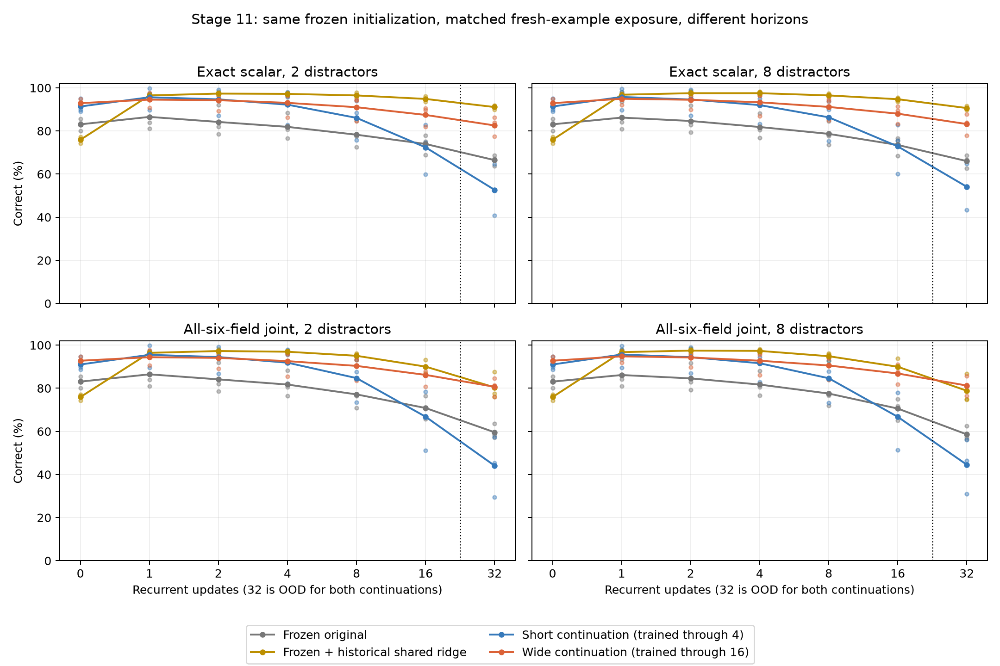

# Stage 11 return horizon study

## Status

The bounded acquisition diagnostic passes. The completed paired main study improves long-horizon access in every seed, but every full retention gate still fails. The wide arm now passes the non-value criteria at sixteen steps in all prescribed cells; exact scalar reconstruction remains insufficient. Composition remains blocked.

## Independent acquisition diagnostic

The unchanged 1024-wide factorized/persistent model, initialized from the archived Stage 8 seed-0 checkpoint, can fit 32 complete return events at every covered horizon. Both arms used a fresh AdamW optimizer, 300 updates, the same fixed events, and the registered delay schedules. The short arm first achieved 32/32 six-field joint correctness across delays 0/1/2/4 at the update-60 check. The wide arm first achieved 32/32 across 0/1/2/4/8/16 at the update-120 check. Both retained that complete fit at update 300. This passes the prespecified fixed-set acquisition gate, not a fresh-context or interface gate.

Fresh-context joint correctness remained much lower:

| Arm | Delay 0 | 1 | 2 | 4 | 8 | 16 |
|---|---:|---:|---:|---:|---:|---:|
| Short | 357/512 | 320/512 | 308/512 | 292/512 | Not evaluated | Not evaluated |
| Wide | 339/512 | 316/512 | 311/512 | 304/512 | 290/512 | 265/512 |

These are separate fresh events generated from seed 11002001. They demonstrate why fixed-set fitting is a necessary acquisition diagnostic rather than a generalization claim. They do not select or alter the prespecified fresh-example main recipe.

## Compute and provenance

Profile source fc93130 took 1.84 seconds, with measured batch-32 forward/backward/Adam times of 0.007/0.193/0.321 seconds at delays 0/4/16 and 0.121 seconds for delay-32 inference. Peak allocated CUDA memory was 2.16 GB, versus approximately 2.25 GB process RSS. These are different quantities.

The acquisition run froze source 1b2860b, verified the initial checkpoint against its archived SHA-256, and completed in 45.90 seconds. Peak allocated CUDA memory was 2.16 GB and process RSS 2.27 GB. Raw predictions, targets, event identities, per-field training losses, parameter counts and checkpoint hashes are in `research/results/stage11/return-acquisition/`. Checkpoints remain immutable on GB10. Independent audit (7ec2d70) reconstructed all 70 raw rows, both final acquisition gates, fresh counts, source hashes and both output checkpoint hashes without discrepancies.

Based on the observed acquisition runtime, the six 1,000-update fresh-example continuations should take approximately 8–15 minutes including all-field evaluation and checkpoint writes. A conservative 35-minute timeout stays below the 75-minute return-track ceiling. This estimate is published before main launch. Delay coverage changes recurrent compute; optimizer presentations are matched, FLOPs are not.

## Completed paired main comparison

Three immutable Stage 9 initializations (10/11/12) were continued for 1,000 updates each under short and wide schedules. Run IDs 30/31/32 are continuation identifiers, not new random initializations. Each arm received the same 32,000 fresh events, identical reset AdamW, unchanged six-field CE and architecture. Each seed has 32,000 actually distinct training-event hashes, paired exactly between arms; training, validation and test events do not overlap.

Short training consumed 69,280 recurrent-example microsteps; wide consumed 164,896, or 2.38 times as many. Optimizer presentations match; recurrent computation and horizon support do not. Therefore this estimates the registered timing-distribution intervention, not a horizon-coverage effect at matched FLOPs.

The following table retains every seed. Entries are exact scalar / full six-field joint correct counts, each out of 512, in the eight-distractor test condition:

| Initial seed | Arm | Delay 0 | Delay 1 | Delay 16 | Delay 32 |
|---|---|---:|---:|---:|---:|
| 10 | Frozen original | 428 / 428 | 414 / 414 | 350 / 333 | 321 / 288 |
| 10 | Frozen shared ridge | 380 / 380 | 487 / 487 | 479 / 444 | 459 / 384 |
| 10 | Short continuation | 456 / 454 | 459 / 458 | 308 / 263 | 222 / 159 |
| 10 | Wide continuation | 470 / 469 | 471 / 470 | 426 / 419 | 399 / 391 |
| 11 | Frozen original | 438 / 438 | 479 / 478 | 392 / 384 | 342 / 320 |
| 11 | Frozen shared ridge | 395 / 395 | 502 / 501 | 489 / 480 | 469 / 444 |
| 11 | Short continuation | 487 / 485 | 510 / 510 | 424 / 399 | 332 / 287 |
| 11 | Wide continuation | 471 / 471 | 489 / 488 | 458 / 449 | 430 / 418 |
| 12 | Frozen original | 410 / 410 | 431 / 431 | 387 / 367 | 351 / 292 |
| 12 | Frozen shared ridge | 391 / 391 | 498 / 498 | 487 / 458 | 464 / 383 |
| 12 | Short continuation | 460 / 459 | 502 / 501 | 387 / 363 | 277 / 238 |
| 12 | Wide continuation | 486 / 485 | 498 / 498 | 468 / 466 | 449 / 439 |

These are fresh contexts and nonce identities over the same bounded 33-label half-unit scalar domain. They are not unseen numerical labels or range extrapolation. The same 512 test events are reused across all seeds, arms, delays and distractor conditions. Summed seed counts describe repeated model evaluations, not 1,536 independent examples.

Delay sixteen is trained coverage for wide, extrapolation for short. Delay thirty-two is recurrent-length extrapolation for both. Zero remains a separate visible ingestion condition. Individual seed points accompany descriptive mean curves; every two-distractor and eight-distractor count is retained in [the raw-derived summary](../../results/stage11/return-main/summary.json).

At delay sixteen, mean test scalar accuracy improves from 72.85% short to 88.02% wide; joint improves from 66.73% to 86.85%. At thirty-two, scalar improves from 54.10% to 83.20%; joint improves from 44.53% to 81.25%. Both measures improve in all three paired seeds at both lengths. This is meaningful horizon robustness within the supplied interface, not a solved scalar decoder.

Short continuation can worsen long-delay performance relative to the frozen original despite improving short delays. More optimizer exposure alone does not guarantee long-horizon robustness. Wide is not uniformly better at every short delay: seed 11, for example, favors short at zero and one.

The frozen shared ridge reference achieves 90.62% scalar accuracy at thirty-two, above wide's 83.20%, while its full joint is 78.84% versus wide's 81.25%. Its non-value heads are frozen and had different training coverage. This reference has different supervised exposure and a different fitting objective; it is contextual, not a pure causal CE-versus-ridge comparison.

## Gate localization

All 48 complete sixteen-step gate decisions fail (four arms, three seeds, two partitions, two distractor settings). All twelve wide-arm decisions fail on scalar value alone. Its type, primitive and required identity criteria pass at sixteen in every prescribed cell. This narrower result does not pass the original interface gate.

Wide-arm sixteen-step **test** counts:

| Seed | Distractors | Value | Type | Primitive | Arg0 | Required Arg1 | Provenance | Joint |
|---|---:|---:|---:|---:|---:|---:|---:|---:|
| 10 | 2 | 420/512 | 512/512 | 512/512 | 510/512 | 409/413 | 511/512 | 413/512 |
| 10 | 8 | 426/512 | 512/512 | 512/512 | 510/512 | 409/413 | 511/512 | 419/512 |
| 11 | 2 | 459/512 | 511/512 | 512/512 | 510/512 | 408/413 | 510/512 | 450/512 |
| 11 | 8 | 458/512 | 511/512 | 512/512 | 510/512 | 408/413 | 510/512 | 449/512 |
| 12 | 2 | 464/512 | 511/512 | 511/512 | 511/512 | 413/413 | 512/512 | 461/512 |
| 12 | 8 | 468/512 | 511/512 | 512/512 | 511/512 | 413/413 | 512/512 | 466/512 |

The inherited strict thresholds remain type/primitive >99% and exact scalar/required identities >98%. Absent unary argument1 is excluded only from its required-operand denominator. Full joint remains separately visible. Wide zero-step scalar accuracy is 92.90%, so ingestion itself is not yet a ceiling-level reconstruction interface.

Paired short-to-wide outcomes also prevent interpreting marginal changes as a forgetting probability. At thirty-two in the eight-distractor test condition, scalar outcomes aggregated over the three repeated seed evaluations are 736 correct→correct, 95 correct→wrong, 542 wrong→correct and 163 wrong→wrong. Joint outcomes are 599, 85, 649 and 203 respectively. These are model-intervention comparisons on the same events, not within-model temporal transition probabilities. The complete per-seed paired table is archived.

## Compute, audit and limits

All main runs used 55,854,360 parameters, width 1024, six workspace rows and six persistent facet memory tokens. No new memory, encoding, loss or readout was introduced in either continuation. Only the timing schedule changed. The protected record stayed available; measured failures concern learned access/reconstruction, not literal disappearance of the record.

Frozen runner source 0c2332f was staged in archive 9ccadae before tests. Pair runtimes were 182.40, 182.04 and 180.79 seconds, totaling 545.23 seconds. Including profile and acquisition, this track consumed approximately 9.88 minutes, well below its 75-minute ceiling. Peak allocated CUDA memory was 2.16 GB; peak process RSS ranged 2.33–2.39 GB. Neither is total device capacity, which is recorded separately in the environment manifest.

The full manifest is [losslessly compressed](../../results/stage11/return-main/manifest.json.gz), with compressed and raw hashes in [its receipt](../../results/stage11/return-main/manifest-receipt.json). Original remote JSON and all six output checkpoints remain immutable. Raw predictions include all fields; curves preserve every registered validation checkpoint. Independent final audit (855c8f6) verified all 336 final prediction rows, 180 curve rows, 48 failed gate cells, paired outcomes, actual 32,000-event training uniqueness and split separation. It reconstructed the lossless manifest receipt and rehashed all twelve remote backbone, continuation and historical ridge files without discrepancies.

This result supports training-horizon coverage as a useful intervention for this learned return interface, jointly with its additional recurrent compute. It does not establish exact scalar competence, numerical extrapolation, autonomous composition, concurrent cognition, or a programmable-attention advantage. The bounded registered comparison is complete; no further training or recipe search is authorized by this report.
